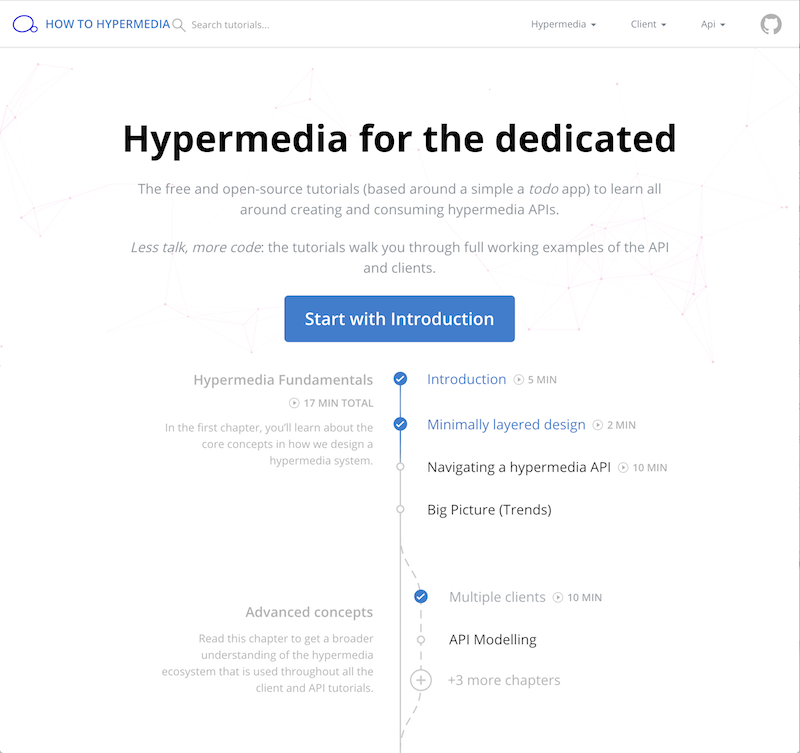

# How to Hypermedia 🎓

[How to Hypermedia](https://howtohypermedia.semanticlink.io) is a tutorial website to learn all about how you could implement a REST-style of architecture on a TODO list! All content on the site is completely free and open-source.

> Note: the layout and functionality is based on [howtographql.com](https://www.howtographql.com/) which was built by [Prisma](https://www.prisma.io) and many amazing contributors.

[](https://howtohypermedia.semanticlink.io)

## Content

The content for all tutorials is located in the  [`/content`](https://github.com/semanticlink/howtohypermedia/tree/master/content) directory. Here is an overview of all the tutorials that are available at the moment:

#### Hypermedia and the todo domain

- Fundamentals
- Advanced ideas

#### Frontend

- Vue over the API as a browser
- Vue as a rich user interaction

#### Backend

- C#/ASP.NET Core (for serverless)

## Contributions / Fixes

As the whole project is open-source, you're more than welcome to fix typos and other small issues yourself and create a PR for the fix. If you want to contribute a whole tutorial track, please [get in touch](mailto:hypermedia@semanticlink.io).

## Installation & Running locally

> Currently, this site runs on gatsby v1.0 and some older plugins. This (in all likelihood) requires running an earlier version of node. The dev team currently runs `7.9.0` via `nvm`. The source code has a `.nvmrc` doing this work if you have `nvm` installed. There is talk of upgrades to gatsby v2 (and later versions of react too).

You can run a local instance by executing the following commands in a terminal:

```sh
git clone git@github.com:semanticlink/howtohypermedia.git howtohypermedia
cd howtohypermedia
yarn install
yarn start # http://localhost:4000/
```
> Note: If you are running Node 10, you might need to downgrade (ie use `nvm`)

> Note2: If you're using Node 8, you might need to invoke `npm install -g node-gyp` before you're starting the app. More info in [gatsby issue tracker](https://github.com/gatsbyjs/gatsby/issues/1754).

## Build

Environment variables required for production build:

```
ALGOLIA_APP_ID=
ALGOLIA_API_KEY=
GA_TRACKING_ID=
```

> Note: the build script will pick up either environment variables or `.env.production` variables.

## Publish

See [deployment readme](./deployment/Readme.md).

## Being a contributor

Updates and new tutorials are encouraged. Also updates to the API are welcome when required. At this stage, all tutorial code is found in a single repository [todo-hypermedia](https://github.com/semanticlink/todo-hypermedia). That may change as needed. Instructions for contributors are in the [writing guidelines](https://github.com/semanticlink/howtohypermedia/blob/master/meta/writing-guidelines.md).
