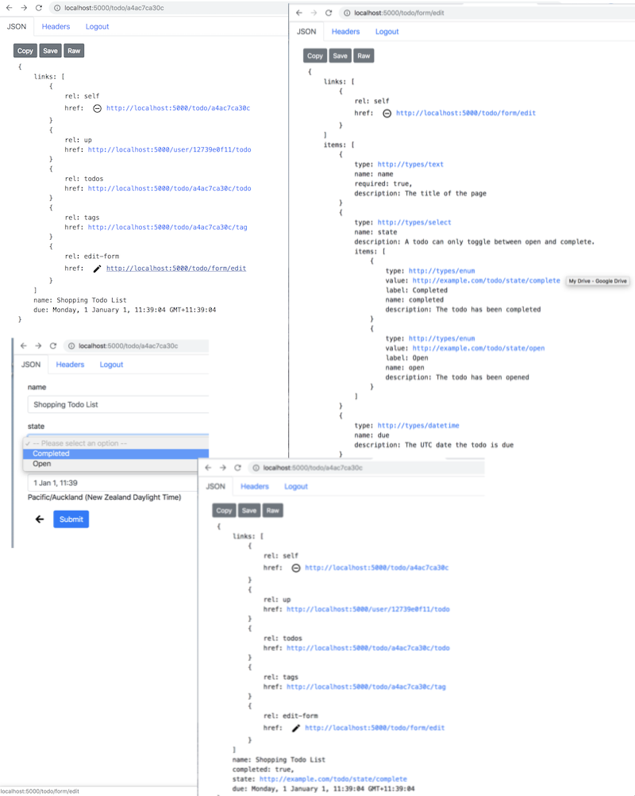

This example adds an edit form to a tag collection with different mime-types (eg `uri-list` and `application/json-patch+json`) for use to update a the resources on a collection. This example updates a tags collection. Navigate to this resource from the home via the 'me' > 'todos' > pick a todo list > 'todos' > pick a todo > 'tags'.



### Goal

* Update a collection with an `edit-form` link relation
* An introduction to `uri-list` for PUT (make the collection 'so')
* An introduction to `application/json-patch+json` for PATCH (make collection based on a series of change sets)

> Note: both are constrained versions of adding/removing tags (items) from the collection and not updating the tag resources themselves

### Anatomy of update

| Method | link rel    | associated route    | notes
| -------|-------------|---------------------|-------
| GET    |             | /todo/{id}/tag      | add `edit-form` as a link rel for each of the media types
| PUT    |             | /todo/{id}/tag      | send a `text/uri-list`
| PATCH  |             | /todo/{id}/tag      | send as a `json-patch+json document`

> Note: by convention a form can be submitted semantically. Here, because the 'edit-form' has a type, you submit back onto the originating resource's 'self' link. Note: this design requires the client to know that an 'edit-form' type of `text/uri-list` is a PUT and that an `application/json-path+json` is a PATCH operation. Furthermore, while each does have an edit form describing their contents, this redundant because these are known media types that the client already knows how to construct.

> Important: both are batching strategies that have their place.

### Anatomy of code

### Return todo (with edit-form links)

Below, you see on overview of the code, then you see the implementation.

<Instruction>

Read and start to grok the layout of the underlying code base. Note that updates to tags exist on the TodoController because tags list are in fact a todo's list of tags.

```bash
.
└── Api
    ├── Controllers
    │   └── TodoController.cs
    ├── RepresentationExtensions
    │   └── TagRepresentationExtensions.cs
    └── UriFactory
        └── TodoUriFactory.cs

```

</Instruction>

<Instruction>

Create a route in the controller that returns a list of tenants based on the user and the search criteria and includes . The current (simple) implementation returns all tenants and the 'q' value is a filter—this implementation also eager loads tenants (it is a naive implementation for demonstration purposes). Note: humans could type the 'q' param with a value in the URL but this is not a hypermedia self-describing interface (albeit a handy short cut).

```csharp(path="...todo-hypermedia/api/Api/Controllers/TodoController.cs")
using System.Collections.Generic;
using System.Threading.Tasks;
using Api.Authorisation;
using Api.RepresentationExtensions;
using Api.UriFactory;
using Api.Web;
using Domain.Models;
using Domain.Persistence;
using Domain.Representation;
using Marvin.Cache.Headers;
using Microsoft.AspNetCore.JsonPatch;
using Microsoft.AspNetCore.Mvc;
using SemanticLink;
using SemanticLink.AspNetCore;
using SemanticLink.Form;
using Toolkit;

namespace Api.Controllers
{
    /// <see cref="UserController.GetUserTodos"/> for the todo collection as they are parented on a user
    [Route("todo")]
    public class TodoController : Controller
    {

       ////////////////////////////////////////////////
        //
        //  The tags on the todo collection
        //  ===============================


        /// <summary>
        ///     Tag collection. The todo is the logical parent of a set of (global) tags.
        /// </summary>
        [HttpGet("{id}/tag/", Name = TagUriFactory.TodoTagsRouteName)]
        [HttpCacheExpiration(CacheLocation = CacheLocation.Private)]
        [HttpCacheValidation(NoCache = true)]
        [AuthoriseTodoTagCollection(Permission.Get)]
        public async Task<FeedRepresentation> GetTodoTags(string id)
        {
            var todo = await _todoStore.Get(id);

            return (await _tagStore.Get(todo.Tags))
                .ToFeedRepresentation(id, Url);
        }

        /// <summary>
        ///     Patch the tag collection on todos
        /// </summary>
        /// <remarks>
        /// <para>
        ///     Creating a patch can be useful for large collections and want to provide a difference set (patch).
        /// </para>
        /// <para>
        ///     A <see cref="FeedRepresentation"/> can't be patched using JSON Merge Patch specification because of how it
        ///     works with arrays in JSON (it is either a DELETE *the* collection or PUT on collection). We'll
        ///     need to use JSON Patch to show add or remove from collection.
        ///</para>
        /// <para>
        ///     For this collection, it is a collection of READONLY items (ie global tags). So we won't be updating details
        ///     on a resource.
        ///</para>
        /// <para>
        /// <b>Remove:</b> however, our <see cref="FeedItemRepresentation"/> needs to be able to remove items by <see cref="FeedItemRepresentation.Id"/>
        ///
        ///     In this case, we have two options based on JSON Pointer (rfc9601):
        ///
        ///    <li>implement array index '/item/0' (given that feed do not guarantee 'natural' order)</li>
        ///    <li>extended syntax (to be implemented)'/items[id="https://example.com/tag/xxxx"]'</li>
        /// Example
        ///    <code>
        ///       [
        ///          { "op": "remove", "path": "/items/0" },
        ///          { "op": "remove", "path": "/items[id='https://example.com/tag/xxxx']" },
        ///       ]
        ///     </code>
        /// </para>
        /// <para>
        ///    <b>Add:</b> is much easier but the syntax has gotchas
        ///
        ///     <li>Adding to a list include '-' </li>
        /// Example
        ///    <code>
        ///       [
        ///          { "op": "add", "path": "/items/-", "value": { id: "https://example.com/tag/yyyy" } }
        ///       ]
        ///     </code>
        /// </para>
        ///     <li>see https://tools.ietf.org/html/rfc7396 (JSON Merge Patch)</li>
        ///     <li>see https://tools.ietf.org/html/rfc6902 (JSON Patch)</li>
        ///     <li>see https://tools.ietf.org/html/rfc6901#section-7 (JSON Pointer)</li>
        ///     <li>good examples http://benfoster.io/blog/aspnet-core-json-patch-partial-api-updates</li>
        /// </remarks>
        [HttpPatch("{id}/tag/", Name = TagUriFactory.TodoTagsRouteName)]
        [Consumes(MediaType.JsonPatch)]
        [AuthoriseTodoTagCollection(Permission.Patch)]
        public async Task<NoContentResult> PatchTagCollection(
            string id,
            [FromBody] JsonPatchDocument<PatchFeedRepresentation> patch)
        {
            // A little jiggery-pokery to get around arrays not supported by JsonPatchDocument
            var document = (await GetTodoTags(id)).FromFeedRepresentation();

            patch.ApplyTo(document);

            // normalise
            await _todoStore.Update(id, todo =>
            {
                // normalise tags back to a string list
                // tags can come in various routes
                var todoTags = document.ToTags(new List<RouteAndParam>
                    {
                        new RouteAndParam {Route = TagUriFactory.TodoTagRouteName, Param = "tagId"},
                        new RouteAndParam {Route = TagUriFactory.TagRouteName, Param = "id"}
                    },
                    HttpContext);
                todo.Tags = todoTags;
            });

            return NoContent();
        }

        /// <summary>
        ///     Update the tag collection on todos
        /// </summary>
        /// <remarks>
        /// <para>
        ///    Checks that each of the Uris exist in the global collection, if not err.
        ///    Then updates the Tags list to the provided uri-list.
        /// </para>
        /// <para>
        ///    There is a need to translate between the global tag collection and references to them on todo as tag collections
        /// </para>
        /// </remarks>
        /// <param name="id">Todo</param>
        /// <param name="uriList">A todo tag uri (not a global tag uri)</param>
        [HttpPut("{id}/tag/", Name = TagUriFactory.TodoTagsRouteName)]
        [Consumes(MediaType.UriList)]
        [AuthoriseTodoTagCollection(Permission.Put)]
        public async Task<NoContentResult> PutTagCollection(string id, [FromBody] string[] uriList)
        {
            // check that global tags exist in the todo set sent through as a uriList
            var tagIds = uriList.ToTags(new List<RouteAndParam>
                {
                    new RouteAndParam {Route = TagUriFactory.TodoTagRouteName, Param = "tagId"},
                    new RouteAndParam {Route = TagUriFactory.TagRouteName, Param = "id"}
                },
                HttpContext);

            await _todoStore.Update(id, todo => { todo.Tags = tagIds; });

            return NoContent();
        }

    }
}
```

</Instruction>

<Instruction>

Create a `ToSearchFeedRepresentation` implementation as an extension method that constructs the `FeedRepresentation` with links `up` and to the `search` form. Note: that tenant resources are parented on a user.

```csharp{31}(path="...todo-hypermedia/api/Api/RepresentationExtensions/TagRepresentationExtensions.cs")
using System.Collections.Generic;
using System.Linq;
using Api.UriFactory;
using Domain.LinkRelations;
using Domain.Models;
using Domain.Representation;
using Microsoft.AspNetCore.Mvc;
using SemanticLink;
using Toolkit;

namespace Api.RepresentationExtensions
{
    public static class TagRepresentationExtensions
    {
        /// <summary>
        ///     Feed representation of tags in the context of a todo representation.
        /// </summary>
        /// <remarks>
        ///    This representation links to PUT and PATCH operations using <see cref="MediaType.UriList"/>
        ///     and <see cref="MediaType.JsonPatch"/> respectfully.
        /// </remarks>
        public static FeedRepresentation ToFeedRepresentation(this IEnumerable<Tag> tags, string todoId, IUrlHelper url)
        {
            return new FeedRepresentation
            {
                Links = new[]
                {
                    // self
                    todoId.MakeTodoTagCollectionUri(url).MakeWebLink(IanaLinkRelation.Self),

                    // up link to the referring todo
                    todoId.MakeTodoUri(url).MakeWebLink(IanaLinkRelation.Up),

                    // no create form because this is readonly collection
                    todoId.MakeTagCreateFormUri(url).MakeWebLink(IanaLinkRelation.CreateForm),

                    // create form because for text/uri-list
                    todoId
                        .MakeTagEditFormUriListUri(url)
                        .MakeWebLink(IanaLinkRelation.EditForm, type: MediaType.UriList),

                    // create form because for text/uri-list
                    todoId
                        .MakeTagEditFormJsonPatchUri(url)
                        .MakeWebLink(IanaLinkRelation.EditForm, type: MediaType.JsonPatch)
                },
                Items = tags
                    .Select(t => t.MakeTodoFeedItemRepresentation(todoId, url))
                    .ToArray()
            };
        }

        private static FeedItemRepresentation MakeTodoFeedItemRepresentation(
            this Tag tag,
            string todoId,
            IUrlHelper url)
        {
            return new FeedItemRepresentation
            {
                Id = tag.Id.MakeTodoTagUri(todoId, url),
                Title = tag.Name,
            };
        }

    }
}```

</Instruction>

<Instruction>

Create a `UriFactory` implementation as an extension method which creates a URI string based on the route as configured up in the controller. Note: the URL construction is part of the MVC framework itself and thus needs to be handed through.

```csharp(path="...todo-hypermedia/api/Api/UriFactory/TagUriFactory.cs")
using System;
using Microsoft.AspNetCore.Mvc;
using SemanticLink;

namespace Api.UriFactory
{
    public static class TagUriFactory
    {

        /// <summary>
        ///     The route name for a create form for a uri-list media type
        /// </summary>
        /// <remarks>
        ///    This is experimental as a way to describe the uri-list
        /// </remarks>
        ///  <see cref="MediaType.UriList"/>
        public const string EditFormUriListRouteName = "TagsUriListCreateForm";

        /// <summary>
        ///     The route name for an edit form for JSON patch media type
        /// </summary>
        ///  <see cref="MediaType.JsonPatch"/>
        public const string EditFormJsonPatchRouteName = "TagsJsonPatchCreateForm";

        /// <summary>
        ///     The url for a uri-list edit form resource for a tag
        /// </summary>
        ///  <see cref="MediaType.UriList"/>
        public static string MakeTagEditFormUriListUri(this string id, IUrlHelper url)
        {
            return url.Link(EditFormUriListRouteName, new {id = id});
        }

        /// <summary>
        ///     The url for a json patch document edit form resource for a tag
        /// </summary>
        ///  <see cref="MediaType.JsonPatch"/>
        public static string MakeTagEditFormJsonPatchUri(this string id, IUrlHelper url)
        {
            return url.Link(EditFormJsonPatchRouteName, new {id = id});
        }
    }
}
```

</Instruction>


### Update the resource upon submission

Below, you see on overview of the code, then you see the implementation.

<Instruction>

Read and start to grok the layout of the underlying code base

```bash
.
└── Api
│   ├── Controllers
│   │   └── TodoController.cs
│   └── UriFactory
│       └── TodoUriFactory.cs      <-- no changes because all routes have been setup
└── Domain
    └── Representation
        └── TodoCreateDataRepresentation.cs

```

</Instruction>

<Instruction>

Create a `PUT` route in the controller that accepts (`Consumes`) a `text/uri-list` of tags that are either a canonical tag URI or a tag on a todo URI and then saves those Ids on the tags. Note: below is the code underlying `ToTags` for completeness).

```csharp{39,44-49}(path="...todo-hypermedia/api/Api/Controllers/TodoController.cs")
using System.Collections.Generic;
using System.Threading.Tasks;
using Api.Authorisation;
using Api.RepresentationExtensions;
using Api.UriFactory;
using Api.Web;
using Domain.Models;
using Domain.Persistence;
using Domain.Representation;
using Marvin.Cache.Headers;
using Microsoft.AspNetCore.JsonPatch;
using Microsoft.AspNetCore.Mvc;
using SemanticLink;
using SemanticLink.AspNetCore;
using SemanticLink.Form;
using Toolkit;

namespace Api.Controllers
{
    /// <see cref="UserController.GetUserTodos"/> for the todo collection as they are parented on a user
    [Route("todo")]
    public class TodoController : Controller
    {
        /// <summary>
        ///     Update the tag collection on todos
        /// </summary>
        /// <remarks>
        /// <para>
        ///    Checks that each of the Uris exist in the global collection, if not err.
        ///    Then updates the Tags list to the provided uri-list.
        /// </para>
        /// <para>
        ///    There is a need to translate between the global tag collection and references to them on todo as tag collections
        /// </para>
        /// </remarks>
        /// <param name="id">Todo</param>
        /// <param name="uriList">A todo tag uri (not a global tag uri)</param>
        [HttpPut("{id}/tag/", Name = TagUriFactory.TodoTagsRouteName)]
        [Consumes(MediaType.UriList)]
        [AuthoriseTodoTagCollection(Permission.Put)]
        public async Task<NoContentResult> PutTagCollection(string id, [FromBody] string[] uriList)
        {
            // check that global tags exist in the todo set sent through as a uriList
            var tagIds = uriList.ToTags(new List<RouteAndParam>
                {
                    new RouteAndParam {Route = TagUriFactory.TodoTagRouteName, Param = "tagId"},
                    new RouteAndParam {Route = TagUriFactory.TagRouteName, Param = "id"}
                },
                HttpContext);

            await _todoStore.Update(id, todo => { todo.Tags = tagIds; });

            return NoContent();
        }

    }
}
```

</Instruction>

<Instruction>

Other code required found in SemanticLink.AspNetCore that wraps Microsoft.AspNetCore

```
using System;
using System.Linq;
using Microsoft.AspNetCore.Http;
using Microsoft.AspNetCore.Mvc;
using Microsoft.AspNetCore.Mvc.Infrastructure;
using Microsoft.AspNetCore.Routing;
using Microsoft.AspNetCore.Routing.Template;
using Microsoft.Extensions.DependencyInjection;

namespace SemanticLink.AspNetCore
{
    public static class UriListRepresentationExtensions
    {
        /// <summary>
        ///    Helper method to loop through all the uriList and returns a list of ids
        /// </summary>
        /// <remarks>
        ///    It normalises IDs by searching through the provided list of Routes to grok the Id from.
        /// </remarks>
        public static List<string> ToTags(
            this string[] uriList,
            IEnumerable<RouteAndParam> routeAndParams,
            HttpContext context)
        {
            return uriList
                .ToList()
                .Select(uri => routeAndParams.Select(routeAndParam =>
                        uri.GetParamFromNamedRoute(routeAndParam.Param, routeAndParam.Route, context))
                    .First(tagid => !tagid.IsNullOrWhitespace()))
                .Distinct()
                .ToList();
        }
    }

    public static class UrlExtensions
    {
        /// <summary>
        ///     Get param values from a uri based on a named route
        /// </summary>
        /// <remarks>
        ///    This is the reverse mapping of <see cref="IUrlHelper.Link"/>
        /// </remarks>
        /// <example>
        ///    [HttpGet("{id}/tag/{tagId}", "Index")]
        ///
        ///     "https://example.com/1/tag/2".GetParamFromNameRoute("tagId", "Index", HttpContext)
        ///
        ///    returns: "2"
        ///
        /// </example>
        /// <param name="uri">Absolute uri that is <see cref="Uri"/> parseable</param>
        /// <param name="routeParam">Name of the argument in the route/action</param>
        /// <param name="routeName">Name of the route as specified in the controller</param>
        /// <param name="context">Static <see cref="HttpContext"/> found on the <see cref="ControllerBase"/></param>
        /// <returns>Value of the param as a string</returns>
        public static string GetParamFromNamedRoute(
            this string uri,
            string routeParam,
            string routeName,
            HttpContext context)
        {
            return RouteMatcher.GetParam(routeParam, routeName, uri, context);
        }
    }

    /// <summary>
    /// <para>
    ///     A reverse uri to params via routename converter.
    /// </para>
    /// <para>
    ///     Takes in an absolute uri, with the Named Route returns the named param in the route template (that attributed)
    /// </para>
    /// <para>
    ///    Used as a reverse mapping for <see cref="IUrlHelper.Link"/>
    /// </para>
    /// </summary>
    /// <remarks>
    ///    Apologies, I couldn't find the proper way to do this so rolled my own
    /// </remarks>
    public static class RouteMatcher
    {
        /// <summary>
        ///     Looks for a named route and returns its route template
        /// </summary>
        /// <example>
        ///    [HttpGet("{id}", "Index")]
        ///
        ///     RouteTemplate("Index", HttpContext) --> "/{id}"
        /// </example>
        public static string RouteTemplate(string routeName, HttpContext context)
        {
            var provider = context.RequestServices.GetRequiredService<IActionDescriptorCollectionProvider>();
            return provider.ActionDescriptors
                .Items
                .Where(item => item?.AttributeRouteInfo?.Name == routeName)
                .Select(item => item?.AttributeRouteInfo?.Template)
                .FirstOrDefault();
        }

        public static RouteValueDictionary RouteParams(
            string routeName,
            string uri,
            HttpContext context)
        {
            return Match(
                RouteTemplate(routeName, context),
                new Uri(uri).PathAndQuery);
        }


        public static string GetParam(
            string param,
            string routeName,
            string uri,
            HttpContext context)
        {
            return RouteParams(routeName, uri, context).TryGetValue(param, out var val)
                ? val.ToString()
                : string.Empty;
        }

        /// <summary>
        ///     From https://blog.markvincze.com/matching-route-templates-manually-in-asp-net-core/
        /// </summary>
        public static RouteValueDictionary Match(string routeTemplate, string requestPath)
        {
            var template = TemplateParser.Parse(routeTemplate);

            var matcher = new TemplateMatcher(template, GetDefaults(template));

            var values = new RouteValueDictionary();
            matcher.TryMatch(requestPath, values);

            return values;
        }

        /// <summary>
        /// <para>
        ///    Extracts the default argument values from the template.
        /// </para>
        ///     From https://blog.markvincze.com/matching-route-templates-manually-in-asp-net-core/
        /// </summary>
        private static RouteValueDictionary GetDefaults(RouteTemplate parsedTemplate)
        {
            var result = new RouteValueDictionary();

            foreach (var parameter in parsedTemplate.Parameters)
            {
                if (parameter.DefaultValue != null)
                {
                    result.Add(parameter.Name, parameter.DefaultValue);
                }
            }

            return result;
        }
    }
}
```

</Instruction>

<Instruction>

Create a `PATCH` route in the controller that accepts (`Consumes`) a `application/json-patch+json` document of tags that are either a canonical tag URI or a tag on a todo URI and then saves those Ids on the tags. Note: look at the source code for extensions method `ToTags` that extracts ids from URIs based on the routes (MVC does this really poorly and requires too much work).

```csharp(path="...todo-hypermedia/api/Api/Controllers/TodoController.cs")
using System.Collections.Generic;
using System.Threading.Tasks;
using Api.Authorisation;
using Api.RepresentationExtensions;
using Api.UriFactory;
using Api.Web;
using Domain.Models;
using Domain.Persistence;
using Domain.Representation;
using Marvin.Cache.Headers;
using Microsoft.AspNetCore.JsonPatch;
using Microsoft.AspNetCore.Mvc;
using SemanticLink;
using SemanticLink.AspNetCore;
using SemanticLink.Form;
using Toolkit;

namespace Api.Controllers
{
    /// <see cref="UserController.GetUserTodos"/> for the todo collection as they are parented on a user
    [Route("todo")]
    public class TodoController : Controller
    {

        /// <summary>
        ///     Patch the tag collection on todos
        /// </summary>
        /// <remarks>
        /// <para>
        ///     Creating a patch can be useful for large collections and want to provide a difference set (patch).
        /// </para>
        /// <para>
        ///     A <see cref="FeedRepresentation"/> can't be patched using JSON Merge Patch specification because of how it
        ///     works with arrays in JSON (it is either a DELETE *the* collection or PUT on collection). We'll
        ///     need to use JSON Patch to show add or remove from collection.
        ///</para>
        /// <para>
        ///     For this collection, it is a collection of READONLY items (ie global tags). So we won't be updating details
        ///     on a resource.
        ///</para>
        /// <para>
        /// <b>Remove:</b> however, our <see cref="FeedItemRepresentation"/> needs to be able to remove items by <see cref="FeedItemRepresentation.Id"/>
        ///
        ///     In this case, we have two options based on JSON Pointer (rfc9601):
        ///
        ///    <li>implement array index '/item/0' (given that feed do not guarantee 'natural' order)</li>
        ///    <li>extended syntax (to be implemented)'/items[id="https://example.com/tag/xxxx"]'</li>
        /// Example
        ///    <code>
        ///       [
        ///          { "op": "remove", "path": "/items/0" },
        ///          { "op": "remove", "path": "/items[id='https://example.com/tag/xxxx']" },
        ///       ]
        ///     </code>
        /// </para>
        /// <para>
        ///    <b>Add:</b> is much easier but the syntax has gotchas
        ///
        ///     <li>Adding to a list include '-' </li>
        /// Example
        ///    <code>
        ///       [
        ///          { "op": "add", "path": "/items/-", "value": { id: "https://example.com/tag/yyyy" } }
        ///       ]
        ///     </code>
        /// </para>
        ///     <li>see https://tools.ietf.org/html/rfc7396 (JSON Merge Patch)</li>
        ///     <li>see https://tools.ietf.org/html/rfc6902 (JSON Patch)</li>
        ///     <li>see https://tools.ietf.org/html/rfc6901#section-7 (JSON Pointer)</li>
        ///     <li>good examples http://benfoster.io/blog/aspnet-core-json-patch-partial-api-updates</li>
        /// </remarks>
        [HttpPatch("{id}/tag/", Name = TagUriFactory.TodoTagsRouteName)]
        [Consumes(MediaType.JsonPatch)]
        [AuthoriseTodoTagCollection(Permission.Patch)]
        public async Task<NoContentResult> PatchTagCollection(
            string id,
            [FromBody] JsonPatchDocument<PatchFeedRepresentation> patch)
        {
            // A little jiggery-pokery to get around arrays not supported by JsonPatchDocument
            var document = (await GetTodoTags(id)).FromFeedRepresentation();

            patch.ApplyTo(document);

            // normalise
            await _todoStore.Update(id, todo =>
            {
                // normalise tags back to a string list
                // tags can come in various routes
                var todoTags = document.ToTags(new List<RouteAndParam>
                    {
                        new RouteAndParam {Route = TagUriFactory.TodoTagRouteName, Param = "tagId"},
                        new RouteAndParam {Route = TagUriFactory.TagRouteName, Param = "id"}
                    },
                    HttpContext);
                todo.Tags = todoTags;
            });

            return NoContent();
        }
    }
}
```

</Instruction>

<Instruction>

Create an incoming patch feed representation that is the list of tag URIs.

```js(path="...todo-hypermedia/api/SemanticLink-AspnetCore/PatchRepresentationExtensions.cs")
using System.Collections.Generic;

namespace SemanticLink
{
    /// <summary>
    ///     Server-side representation of a <see cref="FeedRepresentation"/> used with the <see cref="JsonPatchDocument"/>
    ///     because it does not support the use of Arrays that we have in <see cref="FeedRepresentation"/>.
    /// </summary>
    /// <remarks>
    ///    This is temporary and for demonstration purposes.
    /// </remarks>
    /// <see cref="FeedRepresentation"/>
    public class PatchFeedRepresentation
    {
        public IList<PatchFeedItemRepresentation> Items { get; set; }
    }

    /// <summary>
    ///     Server-side representation of a <see cref="FeedItemRepresentation"/> used with the <see cref="JsonPatchDocument"/>
    ///     because it does not support the use of Arrays that we have in <see cref="FeedRepresentation"/>.
    /// </summary>
    /// <remarks>
    ///    This is temporary and for demonstration purposes.
    /// </remarks>
    /// <see cref="FeedItemRepresentation"/>
    public class PatchFeedItemRepresentation
    {
        public string Id { get; set; }
        public string Title { get; set; }
    }

}
```

</Instruction>

<Instruction>

Here are the helper classes

```
using System.Collections.Generic;
using System.Linq;
using Microsoft.AspNetCore.Http;
using Toolkit;

namespace SemanticLink.AspNetCore
{
    public static class PatchRepresentationExtensions
    {
        public static PatchFeedRepresentation FromFeedRepresentation(this FeedRepresentation feed)
        {
            return new PatchFeedRepresentation
            {
                Items = feed.Items
                    .Select(item => new PatchFeedItemRepresentation
                    {
                        Id = item.Id,
                        Title = item.Title
                    })
                    .ToList()
            };
        }

        /// <summary>
        ///    Helper method to loop through all the <see cref="PatchFeedRepresentation.Items"/> (which have uris) and returns a list of ids
        /// </summary>
        /// <remarks>
        ///    It normalises IDs by searching through the provided list of Routes to grok the Id from.
        /// </remarks>
        public static List<string> ToTags(
            this PatchFeedRepresentation feed,
            IEnumerable<RouteAndParam> routeAndParams,
            HttpContext context)
        {
            return feed.Items
                .Select(item => routeAndParams
                    .Select(routeAndParam =>
                        item.Id.GetParamFromNamedRoute(routeAndParam.Param, routeAndParam.Route, context))
                    .First(tagid => !tagid.IsNullOrWhitespace()))
                .Distinct()
                .ToList();
        }
    }

    public static class UrlExtensions
    {
        /// <summary>
        ///     Get param values from a uri based on a named route
        /// </summary>
        /// <remarks>
        ///    This is the reverse mapping of <see cref="IUrlHelper.Link"/>
        /// </remarks>
        /// <example>
        ///    [HttpGet("{id}/tag/{tagId}", "Index")]
        ///
        ///     "https://example.com/1/tag/2".GetParamFromNameRoute("tagId", "Index", HttpContext)
        ///
        ///    returns: "2"
        ///
        /// </example>
        /// <param name="uri">Absolute uri that is <see cref="Uri"/> parseable</param>
        /// <param name="routeParam">Name of the argument in the route/action</param>
        /// <param name="routeName">Name of the route as specified in the controller</param>
        /// <param name="context">Static <see cref="HttpContext"/> found on the <see cref="ControllerBase"/></param>
        /// <returns>Value of the param as a string</returns>
        public static string GetParamFromNamedRoute(
            this string uri,
            string routeParam,
            string routeName,
            HttpContext context)
        {
            return RouteMatcher.GetParam(routeParam, routeName, uri, context);
        }
    }

}
```

</Instruction>
