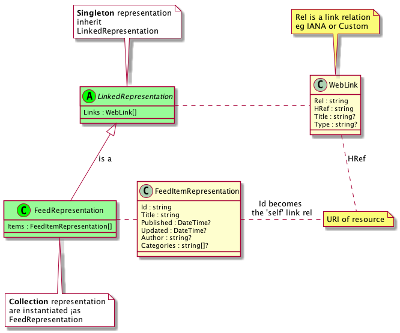

### Quick Overview of the Semantic Link model

The Semantic Link conventions on hypermedia revolve around different ways to build up resources as representations with link relations. Put differently, semantic link models in-memory representations as singetons and collections which are then serialised as across-the-wire representations (eg - Cj, HAL, SIREN, JSON-LD + hydra, UBER or ATOM-like JSON or XML)



#### Resources

* LinkedRepresentation: all representations have links (inherit `LinkedRepresentation`)
* Singleton representation: is a LinkedRepresentation because it inherits from LinkedRepresentation and is its own first-class citizen
* Collection representation: is a logical resource which is an instantiated FeedRepresentation with references to zero-to-many singleton resources
* FeedRepresentation: is a sparsely populated collection representation, where each item is populated as a FeedItemRepresentation (note: collections can also be modelled with multiple link rels of the same name)
* FeedItemRepresentation: minimal set of information to identify a resource, eg the location (URI) and title

##### Links

* Links: a set of information to identify a representation and the nature of its relationship as a `link relation` or "vocabulary" (is a set of `WebLink`s)
* Link Relation: a descriptive attribute that defines the type of link, or the relationship between the source and destination resources. These are known at design and come in at least two forms: IANA and custom (eg also Schema.org, Microformats, Dublin Core and Activity Streams)
* IANALinkRelations: a [published set](https://www.iana.org/assignments/link-relations/link-relations.xhtml#link-relations-1) of publicly, well-known link relations
* CustomLinkRelations: specific to the domain (ie todo) of the application to model singletons and collection representations

> Note: modelling representations requires links and most formal hypermedia types model collections—this is independent of the media type that is send across the wire (aka the Strategy/Representor Pattern). We cover input and output serialisers in a later tutorial

<Instruction>

Read the underlying code base. The custom link relations are specific to the application (hence in Domain) and the reused anatomy is in an external library (but inline for the tutorial!)

```bash
.
│
├── ApiResources.puml  <-- the overview diagram is <b>really important</b>
│
├── Domain
│   ├── LinkRelations
│   │   └── CustomLinkRelation.cs
└── SemanticLink
    ├── FeedItemRepresentation.cs
    ├── FeedRepresentation.cs
    ├── IanaLinkRelation.cs
    ├── LinkedRepresentation.cs
    └── WebLink.cs

```

</Instruction>

<Instruction>

In pseudo code:

```uml
abstract class LinkedRepresentation {
    Links : WebLink[]
}

class WebLink {
   Rel : string
   HRef : string
   Title : string?
   Type : string?
}

class FeedRepresentation {
    Items : FeedItemRepresentation[]
}

class FeedItemRepresentation  {
    Id : string
    Title : string
    Published : DateTime?
    Updated : DateTime?
    Author : string?
    Categories : string[]?
}

```

</Instruction>

### Actual code

This code is external to the todo app although it is found inside the repository

<Instruction>

Create a linked representation with serialisation markup. In this form, notice that the `DataContract` attributing helps with serialisation to different formats (eg "linked" helps with XML output and is not see in the JSON form, whereas "links" will be seen in both XML and JSON).

```csharp(path="...todo-aspnetcore-vue/api/SemanticLink/LinkedRepresentation.cs")
using System.Runtime.Serialization;

namespace SemanticLink
{
    [DataContract(Name = "linked")]
    public abstract class LinkedRepresentation
    {
        [DataMember(Name = "links", Order = 10, EmitDefaultValue = false)]
        public WebLink[] Links { get; set; }
    }
}
```

</Instruction>


<Instruction>

Create a web link representation.

```csharp(path="...todo-aspnetcore-vue/api/SemanticLink/WebLink.cs")
using System.Runtime.Serialization;

namespace SemanticLink
{
    /// <summary>
    ///     An agnostic content type as a means of indicating the relationship
    ///     between resources on the web. It is a subset of the Web Linking RFC 5988
    ///     see https://tools.ietf.org/html/rfc5988
    /// </summary>
    [DataContract(Name = "link")]
    public class WebLink
    {
        /// <summary>
        ///     The descriptive name name in order to define the type of link or the relationship.
        ///     This is the fundamental part of the semantic interface where a client
        ///     follows the link based on the relationship between the source and
        ///     destination resources. Example link relation types are found at
        ///     http://www.iana.org/assignments/link-relations/link-relations.xhtml
        /// </summary>
        [DataMember(Name = "rel", Order = 10, EmitDefaultValue = false)]
        public string Rel { get; set; }

        /// <summary>
        ///     The URI to the target link. See http://tools.ietf.org/html/rfc5988#section-5.1
        /// </summary>
        [DataMember(Name = "href", Order = 20, EmitDefaultValue = false)]
        public string HRef { get; set; }

        /// <summary>
        ///     Human readable label for the destination. This may from part of the semantic
        ///     interface where the link relation (rel) is insufficient or ambiguous
        /// </summary>
        [DataMember(Name = "title", Order = 30, EmitDefaultValue = false)]
        public string Title { get; set; }

        /// <summary>
        ///     The "type" parameter, when present, is a hint indicating what the
        ///     media type of the result of dereferencing the link should be.  Note
        ///     that this is only a hint; for example, it does not override the
        ///     Content-Type header of a HTTP response obtained by actually following
        ///     the link.
        /// </summary>
        [DataMember(Name = "type", Order = 40, EmitDefaultValue = false)]
        public string Type { get; set; }
    }
}
```

</Instruction>


<Instruction>

Create a feed representation. In this form, notice that the `DataContract` attributing helps with serialisation to different formats (eg "feed" helps with XML output to atom and is not see in the JSON form).

```csharp(path="...todo-aspnetcore-vue/api/SemanticLink/FeedRepresentation.cs")
using System.Runtime.Serialization;

namespace SemanticLink
{
    /// http://en.wikipedia.org/wiki/Atom_(standard)#Example_of_an_Atom_1.0_feed
    [DataContract(Name = "feed")]
    public class FeedRepresentation : LinkedRepresentation
    {
        [DataMember(Name = "items", Order = 20)]
        public FeedItemRepresentation[] Items { get; set; }
    }
}
```

</Instruction>


<Instruction>

Create a feed item representation. In this form, notice that the `DataContract` attributing helps with serialisation to different formats (eg "feed-item" helps with XML output to atom and is not see in the JSON form).

```csharp(path="...todo-aspnetcore-vue/api/SemanticLink/FeedItemRepresentation.cs")
using System;
using System.Runtime.Serialization;

namespace SemanticLink
{
    [DataContract(Name = "feed-item")]
    public class FeedItemRepresentation
    {
        /// <summary>
        ///     The canonical URI for the item.
        /// </summary>
        [DataMember(Name = "id", Order = 15, EmitDefaultValue = false)]
        public string Id { get; set; }

        [DataMember(Name = "title", Order = 20, EmitDefaultValue = false)]
        public string Title { get; set; }

        [DataMember(Name = "published", Order = 30, EmitDefaultValue = false)]
        public DateTime? Published { get; set; }

        [DataMember(Name = "updated", Order = 40, EmitDefaultValue = false)]
        public DateTime? Updated { get; set; }

        [DataMember(Name = "author", Order = 50, EmitDefaultValue = false)]
        public string Author { get; set; }

        [DataMember(Name = "categories", Order = 50, EmitDefaultValue = false)]
        public string[] Categories { get; set; }
    }
}
```

</Instruction>

### Link relations

#### IANA

The current set of IANA link relations generally used.

> Note: this is an incomplete set of IANA itself as well not containing link relations from other accepted sources.

<Instruction>

Create

```csharp(path="...todo-aspnetcore-vue/api/SemanticLink/IanaLinkRelation.cs")
namespace SemanticLink
{
    /// See http://en.wikipedia.org/wiki/Link_relation
    /// See http://www.iana.org/assignments/link-relations/link-relations.xhtml
    public static class IanaLinkRelation
    {
        /// <summary>
        ///     Conveys an identifier for the link's context.
        /// </summary>
        /// <remarks>
        ///    http://www.iana.org/go/rfc4287
        /// </remarks>
        public const string Self = "self";

        /// <summary>
        ///    Refers to a parent document in a hierarchy of documents.
        /// </summary>
        /// <remarks>
        ///    http://www.iana.org/go/rfc8288
        /// </remarks>
        public const string Up = "up";

        /// <summary>
        ///     Refers to a resource that can be used to search through the link's context and related resources.
        /// </summary>
        /// <remarks>
        ///    http://www.opensearch.org/Specifications/OpenSearch/1.1
        /// </remarks>
        public const string Search = "search";

        /// <summary>
        ///     Refers to an icon representing the link's context.
        /// </summary>
        /// <remarks>
        ///    http://www.w3.org/TR/html5/links.html#link-type-icon
        /// </remarks>
        public const string Icon = "icon";

        /// <summary>
        ///    The target IRI points to a resource where a submission form can be obtained.
        /// </summary>
        /// <remarks>
        ///    http://www.iana.org/go/rfc6861
        /// </remarks>
        public const string CreateForm = "create-form";

        /// <summary>
        ///    The target IRI points to a resource where a submission form for editing associated resource can be obtained.
        /// </summary>
        /// <remarks>
        ///    http://www.iana.org/go/rfc6861
        /// </remarks>
        public const string EditForm = "edit-form";

        /// <summary>
        ///    Designates the preferred version of a resource (the IRI and its contents).
        /// </summary>
        /// <remarks>
        ///    http://www.iana.org/go/rfc6596
        /// </remarks>
        public const string Canonical = "canonical";

        /// <summary>
        ///    Indicates a resource where payment is accepted.
        /// </summary>
        /// <remarks>
        ///    http://www.iana.org/go/rfc8288
        /// </remarks>
        public const string Payment = "payment";

        /// <summary>
        ///    Points to a resource containing the version history for the context
        /// </summary>
        /// <remarks>
        ///    http://www.iana.org/go/rfc5829
        /// </remarks>
        public const string VersionHistory = "version-history";

        /// <summary>
        ///    	Refers to a substitute for this context
        /// </summary>
        /// <remarks>
        ///    http://www.w3.org/TR/html5/links.html#link-type-alternate
        /// </remarks>
        public const string Alternate = "alternate";

        /// <summary>
        ///     Identifying that a resource representation conforms to a certain profile, without affecting the
        ///     non-profile semantics of the resource representation.
        /// <</summary>
        /// <remarks>
        ///     https://tools.ietf.org/html/rfc6906
        /// </remarks>
        public const string Profile = "profile";
    }
}
```

</Instruction>

#### Custom

These are the domain link relations contained in the one place.

<Instruction>

Create custom link relations used through the API.

```csharp(path="...todo-aspnetcore-vue/api/Domain/LinkRelations/CustomLinkRelation.cs")
namespace Domain.LinkRelations
{
    public static class CustomLinkRelation
    {
        ///************************************
        ///
        ///   Form links
        ///
        ///************************************
        public const string Search = "search";

        public const string Submit = "submit";


        ///************************************
        ///
        ///   Authentication/context links
        ///
        ///************************************

        ///<summary>
        ///    Collection of different authenticate strategies available
        /// </summary>
        public const string Authenticate = "authenticate";
        public const string Authenticator = "authenticator";

        /// <summary>
        ///     Link to the configuration of the Auth0 service
        /// </summary>
        public const string Auth0 = "auth0";

        /// <summary>
        ///     Link to the collection available to the authenticated user
        /// </summary>
        public const string Me = "me";

        /// <summary>
        ///     Tenants collection for authenticated users
        /// </summary>
        public const string Tenants = "tenants";
        public const string Tenant = "tenant";

        /// <summary>
        ///     Users collection on a tenant
        /// </summary>
        public const string Users = "users";


        ///************************************
        ///
        ///   DOMAIN links
        ///
        ///************************************
        /// <summary>
        ///     Todo collection for a user/tenant
        /// </summary>
        public const string Todos = "todos";

        /// <summary>
        ///    Tags (categories) available on a todo
        /// </summary>
        public const string Tags = "tags";
    }
}
```

</Instruction>

### Documenting/Modelling the domain (custom link relations)

For completeness, as you add new custom link relations, it means that you are extending the domain. Modelling it in the domain diagram first is __strongly__ advised. This section will provide the `puml` file that the resulting diagram for compleleness. Reference both forms back to the custom link relations.

<Instruction>

Create a puml file for the diagram.

```text(path="...todo-aspnetcore-vue/api/ApiResources.puml")
@startuml

class home as "Home/Root of the API"
home : version
' home +--|> tenant : tenants
home +--|> tag : tags
home #-left-|> todoState : states
home .--|> user : me
home +--|> user : users

class tag as "tag"
tag : name
tag +--|> todo : todos

class tenant as "tenant"
tenant : name
tenant +--|> user : users
tenant +--|> todo : todos


class todo as "todo"
todo : many
todo : state
todo +--> todo : todos
todo #--|> todoState
todo +--|> comment : comments
todo +--|> tag : tags

class comment as "comment"
comment : many
note top
  Not implemented
end note

'
' Integration Support
' ===================
'

class user as "User"
note top
  A user encapsulates the
  concept of identity in
  the system
end note
user : name
user +--|> tenant : tenants
user +--|> todo : todos


'
' Enumeration resources
' =====================
'

class todoState  as "Todo States (enum)"
todoState : name
todoState : description


@enduml
```

</Instruction>


