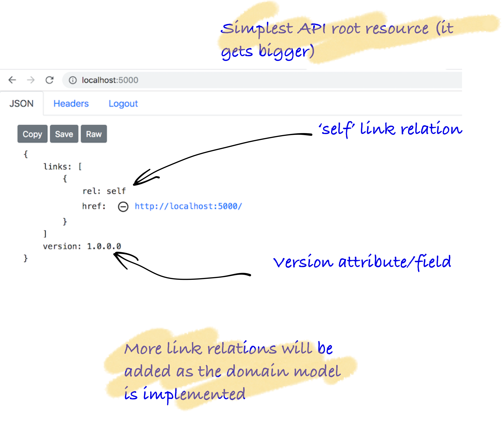
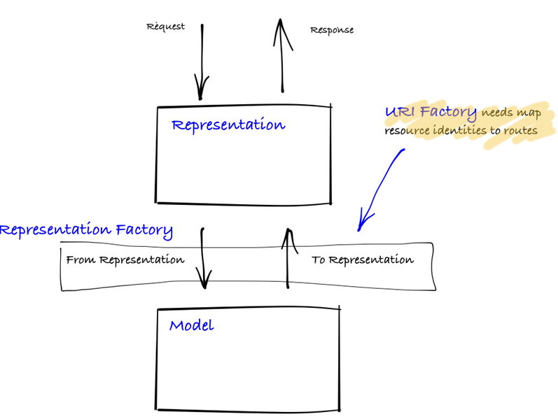
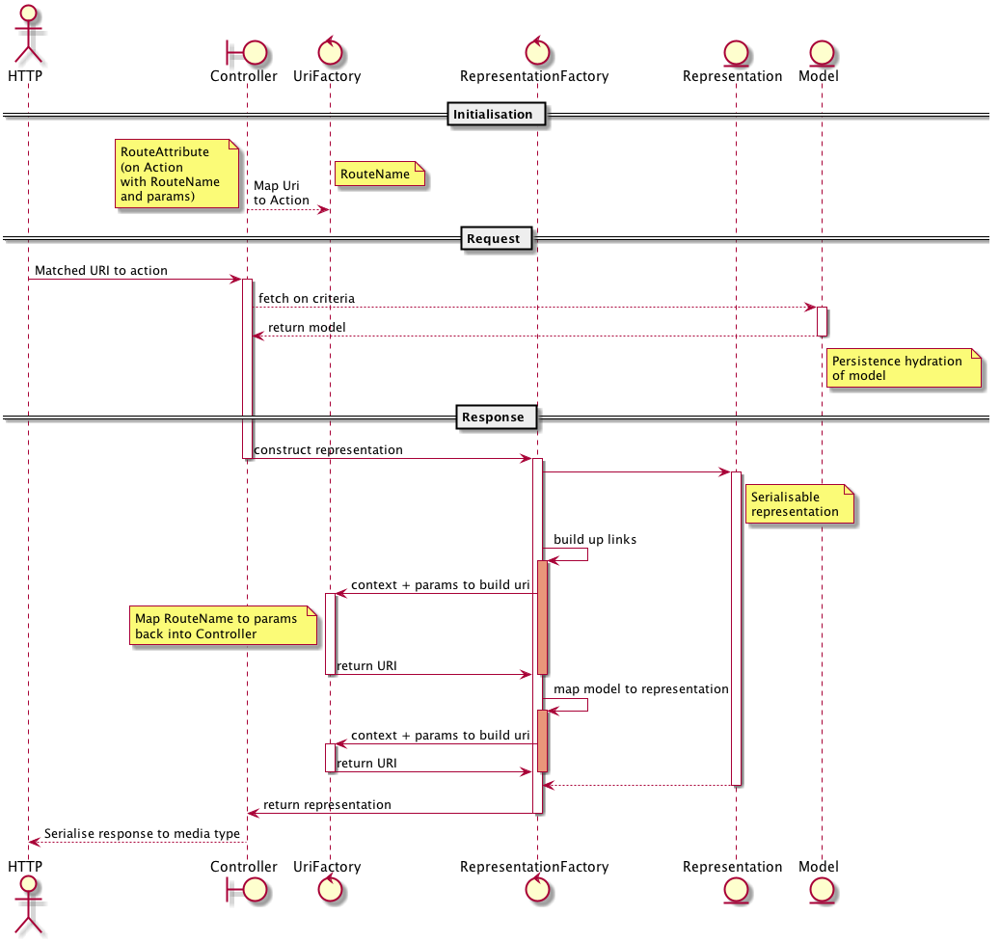

This is an introduction to core five classes required to constructing a representation from the controller, this case the root of the API because it is the simplest. This pattern is the mainstay that variation emanate from and the files *tend* to live across two projects. The tutorial provides various views:

* IDE/code structure of classes
* Block diagram
* Sequence diagram
* Actual code
* curl request/response



### Goal

* Return an unauthenticated resource on the root/home of the API (simple GET)
* Learn the code layering of the solution
* Learn about creating link relations and their URIs

> Note: this code assumes that the MVC pipeline is already setup

### Anatomy of code

Below, you see on overview of the code, then you see the implementation, finally we'll draw it again in a way to help
you start to remember it! Remember, this is essentially the pattern of code you'll use all the time with adding representations to the domain. No more, no less.

<Instruction>

Read and start to grok the layout of the underlying code base

```bash
.
├── Api
│   ├── Controllers
│   │   └── HomeController.cs
│   ├── RepresentationExtensions
│   │   └── ApiRepresentationExtensions.cs
│   └── UriFactory
│       └── HomeUriFactory.cs
└── Domain
    ├── Models
    │   └── ApiVersion.cs
    └── Representation
        └── ApiRepresentation.cs
```

</Instruction>

#### Logical Resource through a controller action

For the more visual, below is a diagram that layers between the Representation and the Model where:

* `Representation`s are serialised in and out across the request and response, respectively
* `FromRepresentation` is an incoming representation  mapped to a domain model (that may be validated and persisted, ie apply business process/rules)
* `ToRepresentation` is an outgoing representation constructed from a domain with link relations created through a `UriFactory` that maps resource identities to routes (ie back into the controller actions)
* `Model` itself are the in-memory domain objects from persistence

> Note: each of the boundaries denoted by box lines indicate potential impedance mismatch that should be understandable in the code
>
> This diagram is generalisable to most MVC frameworks and suggest that perhaps we might need to find variations of the pattern to meet hypermedia designed APIs



#### GET: sequencing request to response

Below is a way to understand the interaction of the pattern of representation request/response:




### The code

### Domain

<Instruction>

Create a domain model for the home api that has the version of the application.

```csharp(path="...todo-aspnetcore-vue/api/Domain/Models/ApiVersion.cs")
namespace Domain.Models
{
    public class ApiVersion
    {
        public string Version { get; set; }
    }
}
```

</Instruction>

<Instruction>

Create a representation for the home api including the serialisation information.

```csharp(path="...todo-aspnetcore-vue/api/Domain/Representation/ApiRepresentation.cs")
using System.Runtime.Serialization;
using SemanticLink;

namespace Domain.Representation
{
    /// <summary>
    ///     The API is a link of links to resources
    /// </summary>
    [DataContract(Name = "api")]
    public class ApiRepresentation : LinkedRepresentation
    {
        [DataMember(Name = "version", Order = 20)]
        public string Version { get; set; }
    }
}
```

</Instruction>

### Controller
<Instruction>

Create a controller (with version injected) and an method that responds to the root URI.

```csharp{30,38}(path="...todo-aspnetcore-vue/api/Api/Controllers/HomeController.cs")
using System;
using Api.RepresentationExtensions;
using Api.UriFactory;
using Domain.Models;
using Domain.Representation;
using Marvin.Cache.Headers;
using Microsoft.AspNetCore.Mvc;
using SemanticLink.AspNetCore;

namespace Api.Controllers
 {
     [Route("")]
     public class HomeController : Controller
     {
         private readonly Version _version;

         public HomeController(Version version)
         {
             // version is from the DLL version and is injected
             _version = version;
         }

         /// <summary>
         ///     The root/home of the API
         /// </summary>
         /// <remarks>
         ///    This is always unauthenticated and must not disclose information and **must** also be general enough to
         ///     everyone so that it can be publicly cacheable.
         /// </remarks>
         [HttpGet("", Name = HomeUriFactory.DefaultRoute)]
         [HttpCacheExpiration(CacheLocation = CacheLocation.Public, MaxAge = CacheDuration.Long)]
         public ApiRepresentation GetApi()
         {
             return new ApiVersion
                 {
                     Version = _version.ToString()
                 }
                 .ToRepresentation(Url);
         }

         ...

 }
```

</Instruction>


### Factories/Helpers

<Instruction>

Create a `ToRepresentation` implementation as an extension method that constructs the `ApiRepresentation` based on the incoming `ApiVersion` model and creates a mandatory 'self' link relation with the `UriFactory`.

```csharp(path="...todo-aspnetcore-vue/api/Api/RepresentationExtensions/ApiRepresentationExtensions.cs")
using Api.UriFactory;
using Domain.LinkRelations;
using Domain.Models;
using Domain.Representation;
using Microsoft.AspNetCore.Mvc;
using SemanticLink;

namespace Api.RepresentationExtensions
{
    public static class ApiRepresentationExtensions
    {
        /// <summary>
        ///     The root/home API
        /// </summary>
        public static ApiRepresentation ToRepresentation(this ApiVersion api, IUrlHelper url)
        {
            return new ApiRepresentation
            {
                Links = new[]
                {
                    // root of the api
                    url.MakeHomeUri().MakeWebLink(IanaLinkRelation.Self),

                    // the actual resource has more
                    ...
                },
                Version = api.Version
            };
        }
    }
}
```

</Instruction>

<Instruction>

Create a `UriFactory` implementation as an extension method which creates a URI string based on the route as configured up in the controller. Note: the URL construction is part of the MVC framework itself and thus needs to be handed through.

```csharp(path="...todo-aspnetcore-vue/api/Api/UriFactory/HomeUriFactory.cs")
using Microsoft.AspNetCore.Mvc;

namespace Api.UriFactory
{
    public static class HomeUriFactory
    {
        /// <summary>
        ///     The route name for home/root of the API
        /// </summary>
        public const string DefaultRoute = "Home";


        /// <summary>
        ///     The url of the home/root of the API
        /// </summary>
        public static string MakeHomeUri(this IUrlHelper url)
        {
            return url.Link(DefaultRoute, new { });
        }

    }
}

```

</Instruction>

### Request in curl

> Note: if running the todo API itself, more links will be returned.

<Instruction>

Now the API should respond to an unauthenticated root request

```bash
$ curl localhost:5000 -v

* Rebuilt URL to: localhost:5000/
*   Trying 127.0.0.1...
* TCP_NODELAY set
* Connected to localhost (127.0.0.1) port 5000 (#0)
> GET / HTTP/1.1
> Host: localhost:5000
> User-Agent: curl/7.54.0
> Accept: */*
>
< HTTP/1.1 200 OK
< Date: Mon, 19 Nov 2018 01:10:33 GMT
< Content-Type: application/json; charset=utf-8
< Server: Kestrel
< Cache-Control: public,max-age=3600
< Transfer-Encoding: chunked
< Expires: Mon, 19 Nov 2018 02:10:33 GMT
< Last-Modified: Mon, 19 Nov 2018 01:10:33 GMT
< ETag: "7E909A8AC713673962B2CAF1654FB9A7"
< Vary: Accept, Accept-Language, Accept-Encoding
<
* Connection #0 to host localhost left intact
{ "links":[ {"rel":"self","href":"http://localhost:5000/"} ], "version":"1.0.0.0"} }
```

</Instruction>
