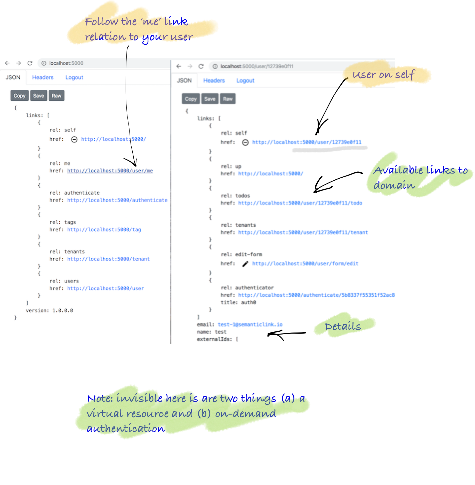

This example constructs a singleton (user) resource. Navigate to the resource from the root via the 'me' link relation.



### Goal

* Return a user resource (logically on the root/home of the API-see virtual resources)
* Practice the code layering of the solution and link relations from the previous tutorial
* See the usage of a Repository Pattern (store) for retrieving a domain model

> Note: while this tutorial creates the user singleton resource, the link to it from home is completed in the redirect page. The reason is that the home api **must** be highly cacheable and thus you don't create user specific content (ie adding the user singleton would be an example of this) and thus we create virtual resources that are not cacheable to provide redirects. This tutorial picks up after the redirect.

### Anatomy of code

Below, you see on overview of the code, then you see the implementation.

<Instruction>

Read and start to grok the layout of the underlying code base

```bash
.
├── Api
│   ├── Controllers
│   │   └── UserController.cs
│   ├── RepresentationExtensions
│   │   └── UserRepresentationExtensions.cs
│   └── UriFactory
│       ├── HomeUriFactory.cs          <-- reuse
│       └── UserUriFactory.cs
└── Domain
    ├── Models
    │   └── User.cs
    └── Representation
        └── UserRepresentation.cs
```

</Instruction>

### The code

### Domain

<Instruction>

Create a domain model for the user. Note that in this model the persistence store is DynamoDb.

```csharp(path="...todo-hypermedia/api/Domain/Models/User.cs")
using System;
using System.Collections.Generic;
using Amazon.DynamoDBv2.DataModel;

namespace Domain.Models
{
    [DynamoDBTable(TableNameConstants.User)]
    public class User
    {
        [DynamoDBHashKey] public string Id { set; get; }

        /// <summary>
        ///     User IDs held external systems (eg Auth0)
        /// </summary>
        public List<string> ExternalIds { get; set; }

        /// <summary>
        ///     The email address of the user registered in external systems
        /// </summary>
        public string Email { get; set; }

        /// <summary>
        ///     The name/title the user wants to see on the screen at first instance. It is likely
        ///     that this will at first be the email address of the user.
        /// </summary>
        public string Name { get; set; }


        public string CreatedBy { get; set; }
        public DateTime CreatedAt { get; set; }
        public string UpdateBy { get; set; }
        public DateTime UpdatedAt { get; set; }
    }
}
```

</Instruction>

<Instruction>

Create a representation for the user representation including the serialisation information.

```csharp(path="...todo-hypermedia/api/Domain/Representation/UserRepresentation.cs")
using System;
using System.Collections.Generic;
using System.Runtime.Serialization;
using SemanticLink;

namespace Domain.Representation
{
    public class UserRepresentation : LinkedRepresentation
    {
        [DataMember(Name = "email", Order = 40, EmitDefaultValue = false)]
        public string Email { get; set; }

        [DataMember(Name = "name", Order = 50, EmitDefaultValue = false)]
        public string Name { get; set; }

        [DataMember(Name = "externalIds", Order = 50, EmitDefaultValue = false)]
        public List<string> ExternalIds { get; set; }

        [DataMember(Name = "createdAt", Order = 100, EmitDefaultValue = false)]
        public DateTime CreatedAt { get; set; }

        [DataMember(Name = "updatedAt", Order = 100, EmitDefaultValue = false)]
        public DateTime UpdatedAt { get; set; }
    }
}
```

</Instruction>

### Controller
<Instruction>

Create a controller (with version injected) and an method that responds to the root URI.

```csharp(path="...todo-hypermedia/api/Api/Controllers/UserController.cs")
using System.Threading.Tasks;
using Api.Authorisation;
using Api.Web;
using Api.RepresentationExtensions;
using Api.UriFactory;
using Domain.Models;
using Domain.Persistence;
using Domain.Representation;
using Microsoft.AspNetCore.Mvc;
using Toolkit;
using Marvin.Cache.Headers;
using SemanticLink;
using SemanticLink.AspNetCore;
using SemanticLink.Form;

namespace Api.Controllers
{
    [Route("user")]
    public class UserController : Controller
    {

        /// <summary>
        ///     A user resource that parents todo lists and allows access to authentication mechanisms
        /// </summary>
        [HttpGet("{id}", Name = UserUriFactory.UserRouteName)]
        [HttpCacheExpiration(CacheLocation = CacheLocation.Private)]
        [HttpCacheValidation(NoCache = true)]
        [AuthoriseUser(Permission.Get)]
        public async Task<UserRepresentation> Get(string id)
        {
            var userId = User.GetId();

            return (await _userStore
                    .Get(userId))
                .ThrowObjectNotFoundExceptionIfNull($"User '{id}' not found")
                .ToRepresentation(Url);
        }

    }
}
```

</Instruction>


### Factories/Helpers

<Instruction>

Create a `ToRepresentation` implementation as an extension method that constructs the `UserRepresentation` based on the incoming `ApiVersion` model and creates a mandatory 'self' link relation with the `UriFactory`.

```csharp(path="...todo-hypermedia/api/Api/RepresentationExtensions/UserRepresentationExtensions.cs")
using System.Linq;
using Api.UriFactory;
using Api.Web;
using Domain.LinkRelations;
using Domain.Models;
using Domain.Representation;
using Microsoft.AspNetCore.Mvc;
using SemanticLink;
using Toolkit;

namespace Api.RepresentationExtensions
{
    public static class UserRepresentationExtensions
    {
        /// <summary>
        ///     A user representation
        /// </summary>
        public static UserRepresentation ToRepresentation(this User user, IUrlHelper url)
        {
            return new UserRepresentation
            {
                Links = new[]
                    {
                        // self
                        user.Id.MakeUserUri(url).MakeWebLink(IanaLinkRelation.Self),

                        // logical parent of user is home
                        url.MakeHomeUri().MakeWebLink(IanaLinkRelation.Up),

                        // ... links removed
                    },
                Email = user.Email,
                Name = user.Name,
                ExternalIds = user.ExternalIds
            };
        }

    }
}
```

</Instruction>

<Instruction>

Create a `UriFactory` implementation as an extension method which creates a URI string based on the route as configured up in the controller. Note: the URL construction is part of the MVC framework itself and thus needs to be handed through.

```csharp(path="...todo-hypermedia/api/Api/UriFactory/UserUriFactory.cs")
using Microsoft.AspNetCore.Mvc;

namespace Api.UriFactory
{
    public static class UserUriFactory
    {
        /// <summary>
        ///     The route name for a user resource
        /// </summary>
        public const string UserRouteName = "User";

        /// <summary>
        ///     The url for a user resource
        /// </summary>
        public static string MakeUserUri(this string id, IUrlHelper url)
        {
            return url.Link(UserRouteName, new {id = id});
        }
    }
}
```

</Instruction>

<Instruction>

Reuse the `HomeUriFactory` implementation created in the previous tutorial.

```csharp(path="...todo-hypermedia/api/Api/UriFactory/HomeUriFactory.cs")
using Microsoft.AspNetCore.Mvc;

namespace Api.UriFactory
{
    public static class HomeUriFactory
    {
        /// <summary>
        ///     The route name for home/root of the API
        /// </summary>
        public const string DefaultRoute = "Home";


        /// <summary>
        ///     The url of the home/root of the API
        /// </summary>
        public static string MakeHomeUri(this IUrlHelper url)
        {
            return url.Link(DefaultRoute, new { });
        }

    }
}

```

</Instruction>


