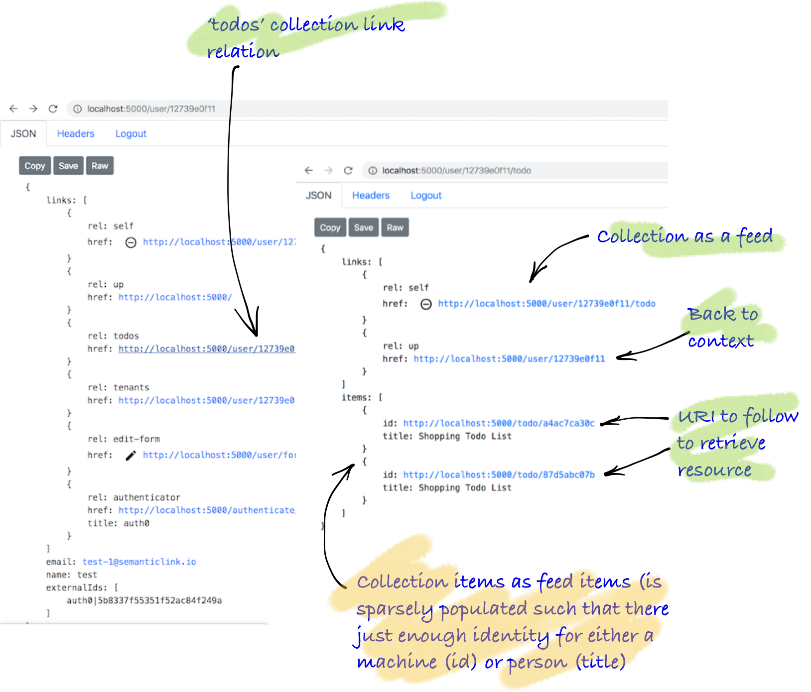

This example constructs a collection (todo) resource. Navigate to this resource from the user via the 'todos' named collection link relation.



### Goal

* Return a todo collection in the context of a user resource
* Practice the code layering of the solution and link relations from the previous tutorial
* See the usage of a Repository Pattern (store) for retrieving a domain model

### Anatomy of code

Below, you see on overview of the code, then you see the implementation.

<Instruction>

Read and start to grok the layout of the underlying code base

```bash
.
├── Api
│   ├── Controllers
│   │   └── UserController.cs                <-- a todo collection is in the context of a user
│   ├── RepresentationExtensions
│   │   └── TodoRepresentationExtensions.cs
│   └── UriFactory
│       └── TodoUriFactory.cs
└── Domain
    ├── Models
    │   └── Todo.cs
    └── Representation
        └── TodoRepresentation.cs
```

</Instruction>

### The code

### Domain

<Instruction>

Create a domain model for the home api that has the version of the application.

```csharp(path="...todo-aspnetcore-vue/api/Domain/Models/Todo.cs")
using System;
using System.Collections.Generic;
using Amazon.DynamoDBv2.DataModel;
using Domain.Representation.Enum;

namespace Domain.Models
{
    /// <summary>
    ///     Todo is polymorphic between a todo list and a todo item
    /// </summary>
    [DynamoDBTable(TableNameConstants.Todo)]
    public class Todo
    {
        [DynamoDBHashKey] public string Id { get; set; }

        /// <summary>
        ///     <para>Parent is a recursive structure for todos. A parent at the top level is a tenant</para>
        ///     <para>Note: At this stage, it is only implemented to one level deep</para>
        /// </summary>
        /// <remarks>
        ///    An empty parent is a top-level todo list. If the parent has a value it is a todo item
        /// </remarks>
        [DynamoDBProperty("Parent")]
        public string Parent { get; set; }

        public TodoType Type { get; set; }

        public string Description { get; set; }

        public string Name { get; set; }

        /// <summary>
        ///     The state machine of todo
        /// </summary>
        /// <remarks>
        ///    It is currently hardcoded although this could be dynamic
        /// </remarks>
        /// <see cref="TodoState"/>
        public string State { get; set; }

        /// <summary>
        ///     Todos can be tagged as a way of grouping.
        /// </summary>
        /// <remarks>
        ///    This is an array of hash key IDs. See <see cref="Models.Tag"/>
        /// </remarks>
        [DynamoDBProperty("Tag")]
        public List<string> Tags { get; set; }

        public DateTime Due { get; set; }

        [DynamoDBVersion] public int? VersionNumber { get; set; }

        public string CreatedBy { get; set; }
        public DateTime UpdatedAt { get; set; }
        public DateTime CreatedAt { get; set; }
    }
}
```

</Instruction>

<Instruction>

Create a representation for the home api including the serialisation information.

```csharp(path="...todo-aspnetcore-vue/api/Domain/Representation/TodoRepresentation.cs")
using System;
using System.Runtime.Serialization;
using SemanticLink;

namespace Domain.Representation
{
    public class TodoRepresentation : LinkedRepresentation
    {
        [DataMember(Name = "name", Order = 50, EmitDefaultValue = false)]
        public string Name { get; set; }

        [DataMember(Name = "completed", Order = 50, EmitDefaultValue = false)]
        public bool Completed { get; set; }

        [DataMember(Name = "state", Order = 50, EmitDefaultValue = false)]
        public string State { get; set; }

        [DataMember(Name = "due", Order = 50, EmitDefaultValue = false)]
        public DateTime Due { get; set; }
    }
}
```

</Instruction>

### Controller
<Instruction>

Create a controller (with version injected) and an method that responds to the root URI.

```csharp(path="...todo-aspnetcore-vue/api/Api/Controllers/TodoController.cs")
using System.Threading.Tasks;
using Api.Authorisation;
using Api.Web;
using Api.RepresentationExtensions;
using Api.UriFactory;
using Domain.Models;
using Domain.Persistence;
using Domain.Representation;
using Microsoft.AspNetCore.Mvc;
using Toolkit;
using Marvin.Cache.Headers;
using SemanticLink;
using SemanticLink.AspNetCore;
using SemanticLink.Form;

namespace Api.Controllers
{
    [Route("user")]
    public class UserController : Controller
    {
        /////////////////////////
        //
        // (tenant) Todo collection on a user


        /// <summary>
        ///     User todo collection
        /// </summary>
        /// <see cref="TodoController.GetById"/>
        [HttpGet("{id}/todo", Name = UserUriFactory.UserTodosRouteName)]
        [HttpCacheExpiration(CacheLocation = CacheLocation.Private)]
        [HttpCacheValidation(NoCache = true)]
        [Authorise(RightType.UserTodoCollection, Permission.Get)]
        public async Task<FeedRepresentation> GetUserTodo(string id)
        {
            return (await _todoStore
                    .GetByUser(id))
                .ToUserTodoListFeedRepresentation(id, Url);
        }

    }
}
```

</Instruction>


### Factories/Helpers

<Instruction>

Create a `ToRepresentation` implementation as an extension method that constructs the `ApiRepresentation` based on the incoming `ApiVersion` model and creates a mandatory 'self' link relation with the `UriFactory`.

```csharp(path="...todo-aspnetcore-vue/api/Api/RepresentationExtensions/TodoRepresentationExtensions.cs")
using System.Collections.Generic;
using System.Linq;
using Api.UriFactory;
using Domain.LinkRelations;
using Domain.Models;
using Domain.Representation;
using Domain.Representation.Enum;
using Microsoft.AspNetCore.Mvc;
using SemanticLink;
using Toolkit;

namespace Api.RepresentationExtensions
{
    public static class TodoRepresentationExtensions
    {
        /// <summary>
        ///     Feed representation of todo list collection parented on a user
        /// </summary>
        /// <remarks>
        ///    Todo lists are parented on a tenant, we aren't going to offer to create here (because we don't have
        ///     a tenant, although we could)
        /// </remarks>
        public static FeedRepresentation ToUserTodoListFeedRepresentation(
            this IEnumerable<Todo> todos,
            string todoListId,
            IUrlHelper url)
        {
            return new FeedRepresentation
            {
                Links = new[]
                {
                    // self (the feed of todos on a todo list)
                    todoListId.MakeUserTodosUri(url).MakeWebLink(IanaLinkRelation.Self),

                    // up link to a named todos
                    todoListId.MakeUserUri(url).MakeWebLink(IanaLinkRelation.Up),

                    // create-form - you  must create on user tenant
                },
                Items = todos
                    .Select(t => t.MakeTodoFeedItemRepresentation(url))
                    .ToArray()
            };
        }


        private static FeedItemRepresentation MakeTodoFeedItemRepresentation(this Todo todo, IUrlHelper url)
        {
            return new FeedItemRepresentation
            {
                Id = todo.Id.MakeTodoUri(url),
                Title = todo.Name,
            };
        }

    }
}
```

</Instruction>

<Instruction>

Create a `UriFactory` implementation as an extension method which creates a URI string based on the route as configured up in the controller. Note: the URL construction is part of the MVC framework itself and thus needs to be handed through.

```csharp(path="...todo-aspnetcore-vue/api/Api/UriFactory/TodoUriFactory.cs")
using Microsoft.AspNetCore.Mvc;

namespace Api.UriFactory
{
    public static class UserUriFactory
    {
        /// <summary>
        ///     The route name for a user resource
        /// </summary>
        public const string UserRouteName = "User";

        /// <summary>
        ///     The route name for a todo list resource in the context of a user
        /// </summary>
        public const string UserTodosRouteName = "UserTodoList";

        /// <summary>
        ///     The url for a user resource
        /// </summary>
        public static string MakeUserUri(this string id, IUrlHelper url)
        {
            return url.Link(UserRouteName, new {id = id});
        }
        /// <summary>
        ///     The url for a collection resource for the list of todo lists or items in the context of a user
        /// </summary>
        public static string MakeUserTodosUri(this string id, IUrlHelper url)
        {
            return url.Link(UserTodosRouteName, new {id = id});
        }
```

</Instruction>
