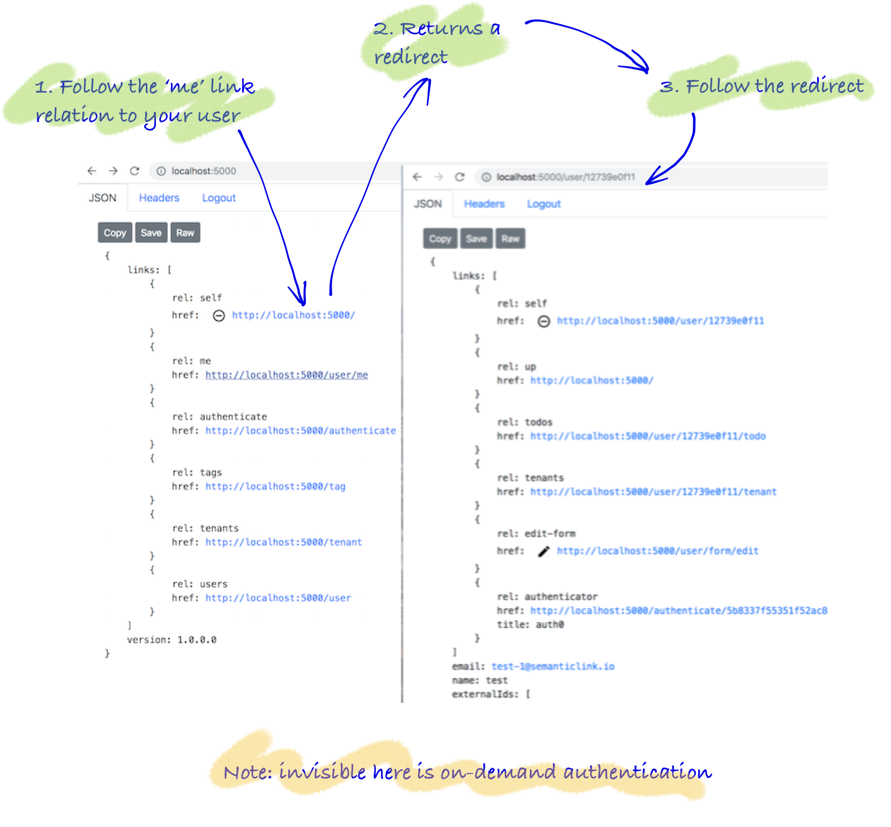

This example constructs a virtual (user) resource resource. Navigate to this resource from the home via the 'me' link relation.



### Goal

* Ensure resource cachability through using virtual resources (in this case root must be publicly cachable)
* Return a user redirect resource

### Anatomy of code

Below, you see on overview of the code, then you see the implementation.

<Instruction>

Read and start to grok the layout of the underlying code base

```bash
.
└── Api
    ├── Controllers
    │   └── UserController.cs
    ├── RepresentationExtensions
    │   └── ApiRepresentationExtensions.cs   <-- extend the home resource to include 'me' link
    └── UriFactory
        └── UserUriFactory.cs

```

</Instruction>

### The code

### RepresentationFactory

<Instruction>

Extend the root/home representation of the API to include a 'me' link relation.

```csharp{16}(path="...todo-hypermedia/api/Api/RepresentationExtensions/ApiRepresentationExtensions.cs")
public static class ApiRepresentationExtensions
{
    /// <summary>
    ///     The root/home API
    /// </summary>
    public static ApiRepresentation ToRepresentation(this ApiVersion api, IUrlHelper url)
    {
        return new ApiRepresentation
        {
            Links = new[]
            {
                // root of the api
                url.MakeHomeUri().MakeWebLink(IanaLinkRelation.Self),

                // a virtual resource that redirects to the user
                url.MakeUserMeUri().MakeWebLink(CustomLinkRelation.Me),

                ... other links as the domain extends

                },
            Version = api.Version
        };
    }
}
 ```

</Instruction>

### UriFactory

<Instruction>

Create a `UriFactory` implementation as an extension method which creates a URI string based on the route as configured up in the controller. Note: the URL construction is part of the MVC framework itself and thus needs to be handed through.

```
using Microsoft.AspNetCore.Mvc;

namespace Api.UriFactory
{
    public static class UserUriFactory
    {
        /// <summary>
        ///     The route name for the virtual resource of the user
        /// </summary>
        public const string UserMeName = "UserMeName";

        /// <summary>
        ///     The url for a virtual resource of the currently authenticated user
        /// </summary>
        /// <remarks>
        ///    The currently authenticated user can follow the redirect of this url to get their user url
        /// </remarks>
        public static string MakeUserMeUri(this IUrlHelper url)
        {
            return url.Link(UserMeName, new { });
        }
    }
}
```

</Instruction>

### Controller
<Instruction>

Create a route in the controller that uses the authenticated user's id and constructs a redirect to that URI. This URI then redirects back to the URI of a singleton user resource already created in the previous single resource tutorial.

```csharp(path="...todo-hypermedia/api/Api/Controllers/TodoController.cs")
using System.Threading.Tasks;
using Api.Authorisation;
using Api.Web;
using Api.RepresentationExtensions;
using Api.UriFactory;
using Domain.Models;
using Domain.Persistence;
using Domain.Representation;
using Microsoft.AspNetCore.Mvc;
using Toolkit;
using Marvin.Cache.Headers;
using SemanticLink;
using SemanticLink.AspNetCore;
using SemanticLink.Form;

namespace Api.Controllers
{
    [Route("user")]
    public class UserController : Controller
    {

        /// <summary>
        ///     A virtual resource to return a redirect.
        /// </summary>
        /// <remarks>
        ///     However, redirects with preflight requests do not work in Firefox less than v63.  Firefox just marked their
        ///     issue "fixed" for Firefox 63, which is currently scheduled for beta on 2018-09-05
        ///     and stable on 2018-10-23.
        ///
        ///     The test page is here, open on browsers to test functionality:
        ///
        ///         http://storage.googleapis.com/shaka-demo-assets/_bugs/cors_redirect/index.html
        ///
        ///     The best page to track this issues is here: https://github.com/google/shaka-player/issues/666
        /// </remarks>
        [HttpGet("me", Name = UserUriFactory.UserMeName)]
        [HttpCacheExpiration(CacheLocation = CacheLocation.Private)]
        [HttpCacheValidation(NoCache = true)]
        [AuthoriseRedirect]
        public IActionResult Me()
        {
            return User
                .GetId()
                .MakeUserUri(Url)
                .MakeRedirect();
        }
    }
}
```

</Instruction>


### Factories

<Instruction>

Create a `UriFactory` implementation as an extension method which creates a URI string based on the route as configured up in the controller. Note: the URL construction is part of the MVC framework itself and thus needs to be handed through.

```csharp(path="...todo-hypermedia/api/Api/UriFactory/UserUriFactory.cs")
using Microsoft.AspNetCore.Mvc;

namespace Api.UriFactory
{
    public static class UserUriFactory
    {
        /// <summary>
        ///     The route name for a user resource
        /// </summary>
        public const string UserRouteName = "User";

        /// <summary>
        ///     The url for a user resource
        /// </summary>
        public static string MakeUserUri(this string id, IUrlHelper url)
        {
            return url.Link(UserRouteName, new {id = id});
        }
    }
}
```

</Instruction>


<Instruction>

Explore the `MakeRedirect` that can be used seeing that redirect is not permanent because different users will require different redirects.

```csharp{14}(path="...todo-hypermedia/api/SemanticLink-AspnetCore/HttpRequestMessageExtensions.cs:47")
using Microsoft.AspNetCore.Http;
using Microsoft.AspNetCore.Mvc;

namespace SemanticLink.AspNetCore
{
    /// <summary>
    ///     Extension helpers for a application to return simple result codes
    /// </summary>
    public static class HttpRequestMessageExtensions
    {

        public static RedirectResult MakeRedirect(this string uri)
        {
            return new RedirectResult(uri, permanent: false /* not permanent */);
        }
    }
}
```

</Instruction>

