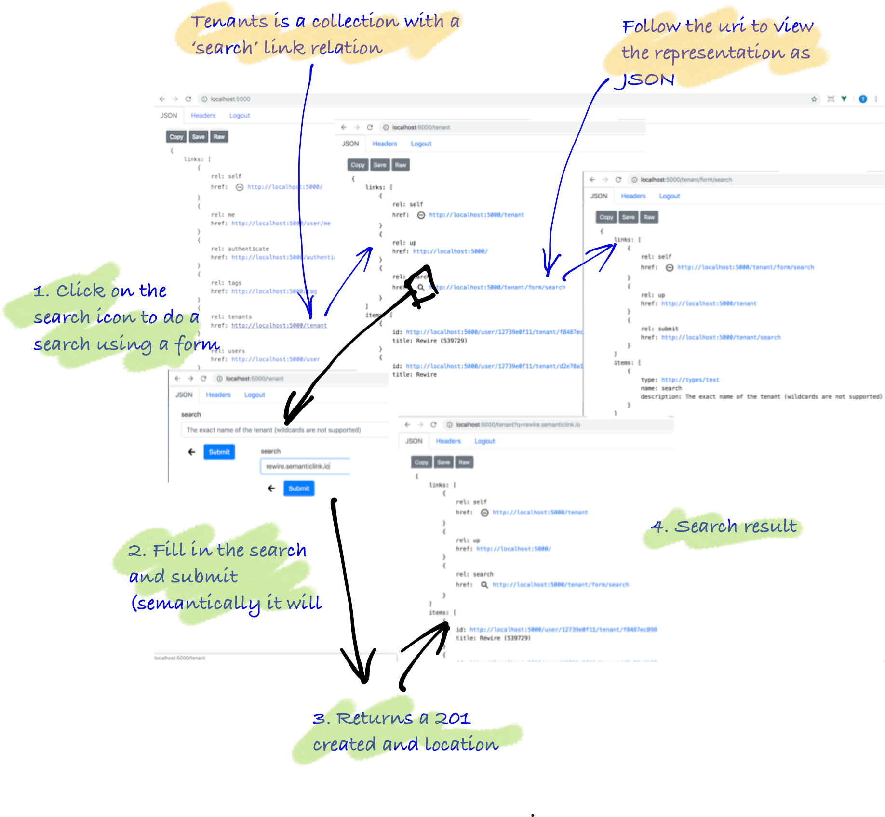

This example constructs a search form and searchable collection resource. Navigate to this resource from the home via the 'tenants' link relation. Then search back on the collection.



### Goal

* Create searches/filters on collections
* Create cachable search forms
* Demonstrate one way to process a search form to redirect back on a filterable collection

### Anatomy of search

| Method | link rel  | associated route    | notes |
| -------|-----------|---------------------|-------|
| GET    |           | /                   | start at the root of the api which has `tenants` as a link rel |
| GET    | `tenants` | /tenant/            | follow the `tenants` link to get the collection|
| GET    | `search`  | /tenant/form/search | follow the `search` form to get fields to fill in (this creates a filter in the current implementation) |
| POST   | `submit`  | /tenant/search/     | fill in the form and send back to `submit` URL. Response returns `201 Created` with `Location` header |
| GET    |           | /tenant/?q=         | follow the `Location` header returns a filtered search (feed) collection. Note: this is the same route as `tenants` link rel |

> Note: by convention a form can be submitted semantically. The `submit` link rel is usually the first option but it could be back on the originating collection. In this case, because the tenant collection is logically parented on the root rather than on a user (which it probably should but this collection is a convenient collection).

### Anatomy of code

#### Add tenants

Below, you see on overview of the code, then you see the implementation.

<Instruction>

Read and start to grok the layout of the underlying code base

```bash(path="...todo-hypermedia/api/Api")
.
└── Api
    ├── RepresentationExtensions
    │   └── ApiRepresentationExtensions.cs  <-- include 'tenants' link rel
    └── UriFactory
        └── TenantUriFactory.cs

```

</Instruction>

<Instruction>

Extend the root/home representation of the API to include a 'tenants' link relation.

```csharp{15}(path="...todo-hypermedia/api/Api/RepresentationExtensions/ApiRepresentationExtensions.cs")
public static class ApiRepresentationExtensions
{
    /// <summary>
    ///     The root/home API
    /// </summary>
    public static ApiRepresentation ToRepresentation(this ApiVersion api, IUrlHelper url)
    {
        return new ApiRepresentation
        {
            Links = new[]
            {
                ...

                //  tenant collection which has the tenant search on it
                url.MakeTenantsUri().MakeWebLink(CustomLinkRelation.Tenants),

                ...

                },
            ...
        };
    }
}
 ```

</Instruction>

<Instruction>

Create a `UriFactory` implementation as an extension method which creates a URI string based on the route as configured up in the controller. Note: the URL construction is part of the MVC framework itself and thus needs to be handed through.

```csharp(path="...todo-hypermedia/api/Api/UriFactory/TenantUriFactory.cs")
using Microsoft.AspNetCore.Mvc;

namespace Api.UriFactory
{
    public static class TenantUriFactory
    {
        /// <summary>
        ///     The route name for a logical resource that is the collection of all searchable tenants
        /// </summary>
        public const string TenantsRouteName = "Tenants";

        /// <summary>
        ///     The url for a collection resource for the list of tenants (without a search criteria).
        /// </summary>
        /// <remarks>
        ///     From a disclosure point-of-view this list is not presented via the API to
        ///     non-administrators.
        /// </remarks>
        public static string MakeTenantsUri(this IUrlHelper url)
        {
            return url.Link(TenantsRouteName, new { });
        }
    }
}
```

</Instruction>

### Return tenants collection (with search link)

Below, you see on overview of the code, then you see the implementation.

<Instruction>

Read and start to grok the layout of the underlying code base

```bash(path="...todo-hypermedia/api/Api")
.
└── Api
    ├── Controllers
    │   └── TenantController.cs               <-- new tenant collection (filterable)
    ├── RepresentationExtensions
    │   └── TenantRepresentationExtensions.cs <-- construct the collection result (including `search` link)
    └── UriFactory
        └── UserUriFactory.cs                 <-- a tenant is parented on a user

```

</Instruction>

<Instruction>

Create a route in the controller that returns a list of tenants based on the user and the search criteria and includes . The current (simple) implementation returns all tenants and the 'q' value is a filter—this implementation also eager loads tenants (it is a naive implementation for demonstration purposes). Note: humans could type the 'q' param with a value in the URL but this is not a hypermedia self-describing interface (albeit a handy short cut).

```csharp(path="...todo-hypermedia/api/Api/Controllers/TenantController.cs")
using System.Threading.Tasks;
using Api.Authorisation;
using Api.Web;
using Api.RepresentationExtensions;
using Api.UriFactory;
using Domain.Models;
using Domain.Persistence;
using Domain.Representation;
using Marvin.Cache.Headers;
using Microsoft.AspNetCore.Mvc;
using Microsoft.Extensions.Logging;
using SemanticLink;
using SemanticLink.AspNetCore;
using SemanticLink.Form;
using Toolkit;

namespace Api.Controllers
{
    [Route("tenant")]
    public class TenantController : Controller
    {

        /// <summary>
        ///     This is a logical resource which represents all tenants or a search for a single tenant (as a list)
        /// </summary>
        /// <remarks>
        ///     If the user is an administrator we could disclose the list of
        ///     all tenants. However for normal users we could disclose their
        ///     single tenant in the collection. For anonymous user the list **must**
        ///     be empty.
        /// </remarks>
        [HttpGet("", Name = TenantUriFactory.TenantsRouteName)]
        [HttpCacheExpiration(CacheLocation = CacheLocation.Private)]
        [HttpCacheValidation(NoCache = true)]
        [AuthoriseMeAsap]
        public async Task<FeedRepresentation> GetTenantsWithOptionalSearch([FromQuery(Name = "q")] string search = null)
        {
            return (!string.IsNullOrWhiteSpace(search)
                    //
                    //  Regardless of whether the caller is authenticated or not, a query with a name
                    //  will return a collection with zero or one items matched by tenant code.
                    //
                    ? (await _tenantStore.GetByCode(search)).ToEnumerable()
                    //
                    : User != null && User.Identity.IsAuthenticated
                        // If the user is authenticated, then return all tenants that the user has access to.
                        ? await _tenantStore.GetTenantsForUser(User.GetId())

                        // The user is not authenticated and there is no query, so the caller gets no tenants.
                        : new Tenant[] { })
                .ToSearchFeedRepresentation(User.GetId(), search, Url);
        }
    }
}
```

</Instruction>

<Instruction>

Create a `ToSearchFeedRepresentation` implementation as an extension method that constructs the `FeedRepresentation` with links `up` and to the `search` form. Note: that tenant resources are parented on a user.

```csharp(path="...todo-hypermedia/api/Api/RepresentationExtensions/TenantRepresentationExtensions.cs")
using System.Collections.Generic;
using System.Linq;
using Api.UriFactory;
using Domain.LinkRelations;
using Domain.Models;
using Domain.Representation;
using Microsoft.AspNetCore.Mvc;
using SemanticLink;

namespace Api.RepresentationExtensions
{
    public static class TenantRepresentationExtensions
    {
        /// <summary>
        ///    A feed representation of search results of tenants in the context of a user.
        /// </summary>
        /// <remarks>
        ///    This collection doesn't require a create form because the results are from search
        /// </remarks>
        public static FeedRepresentation ToSearchFeedRepresentation(
            this IEnumerable<Tenant> tenants,
            string userId,
            string criteria,
            IUrlHelper url)
        {
            return new FeedRepresentation
            {
                Links = new[]
                {
                    // self is a collection with the query param of the criteria
                    criteria.MakeTenantsUri(url).MakeWebLink(IanaLinkRelation.Self),

                    // home is the logical parent
                    url.MakeHomeUri().MakeWebLink(IanaLinkRelation.Up),

                    // make a search for a tenant
                    url.MakeTenantsSearchFormUri().MakeWebLink(IanaLinkRelation.Search)
                },
                Items = tenants
                    .Select(c => ToSearchFeedRepresentationItem(c, userId, url))
                    .ToArray()
            };
        }

        private static FeedItemRepresentation ToSearchFeedRepresentationItem(
            this Tenant tenant,
            string userId,
            IUrlHelper url)
        {
            return new FeedItemRepresentation
            {
                Id = userId.MakeUserTenantUri(tenant.Id, url),
                Title = tenant.Name
            };
        }

    }
}
```

</Instruction>

<Instruction>

Create a `UriFactory` implementation as an extension method which creates a URI string based on the route as configured up in the controller. Note: the URL construction is part of the MVC framework itself and thus needs to be handed through.

```csharp(path="...todo-hypermedia/api/Api/UriFactory/UserUriFactory.cs")
using Microsoft.AspNetCore.Mvc;

namespace Api.UriFactory
{
    public static class UserUriFactory
    {
        /// <summary>
        ///     The route name for a tenant resource in the context of a user
        /// </summary>
        public const string UserTenantRouteName = "UserTenant";

        /// <summary>
        ///     The url for a tenant resource in the context of a user
        /// </summary>
        /// <see cref="MakeTenantForUserUri"/>
        public static string MakeUserTenantUri(this string id, string tenantId, IUrlHelper url)
        {
            return url.Link(UserTenantRouteName, new {id = id, tenantId = tenantId});
        }

    }
}
```

</Instruction>

### Search form

Below, you see on overview of the code, then you see the implementation.

<Instruction>

Read and start to grok the layout of the underlying code base

```bash(path="...todo-hypermedia/api")
.
├── Api
│   ├── Controllers
│   │   └── TenantController.cs                    <-- add a search form route
│   ├── RepresentationExtensions
│   │   └── TenantFormRepresentationExtensions.cs  <-- generate a tenant search form representation
│   └── UriFactory
│       └── TenantUriFactory.cs
│
│ ... external but included for completeness if new to forms
│
└── SemanticLink
    ├── Form
    │   ├── SearchFormRepresentation.cs
    │   ├── FormRepresentation.cs
    │   ├── FormItemRepresentation.cs
    │   └── TextInputFormItemRepresentation.cs
    └── FormType

```

</Instruction>

<Instruction>

Create a route in the controller that returns a list of tenants based on the user and the search criteria. The current (simple) implementation returns all tenants and the 'q' value is filter. Note: humans could type the 'q' param with a value in the URL but this is not a hypermedia self-describing interface (albeit a handy short cut).

```csharp(path="...todo-hypermedia/api/Api/Controllers/TenantController.cs")
using System.Threading.Tasks;
using Api.Authorisation;
using Api.Web;
using Api.RepresentationExtensions;
using Api.UriFactory;
using Domain.Models;
using Domain.Persistence;
using Domain.Representation;
using Marvin.Cache.Headers;
using Microsoft.AspNetCore.Mvc;
using Microsoft.Extensions.Logging;
using SemanticLink;
using SemanticLink.AspNetCore;
using SemanticLink.Form;
using Toolkit;

namespace Api.Controllers
{
    [Route("tenant")]
    public class TenantController : Controller
    {

        ///////////////////////////////////////
        //
        //  tenant search
        //  =============

        /// <summary>
        ///     A simple search form resource that is publicly cacheable
        /// </summary>
        [HttpGet("form/search", Name = TenantUriFactory.TenantSearchFormRouteName)]
        [HttpCacheExpiration(CacheLocation = CacheLocation.Public, MaxAge = CacheDuration.Long)]
        [AuthoriseForm]
        public SearchFormRepresentation GetTenantsSearchForm()
        {
            return new TenantRepresentation()
                .ToTenantSearchFormRepresentation(Url);
        }
    }
}
```

</Instruction>


<Instruction>

Create a `ToTenantSearchFormRepresentation` method that generates the search form with a `submit` link rel.

```csharp(path="...todo-hypermedia/api/Api/RepresentationExtensions/TenantFormRepresentationExtensions.cs")
using Api.UriFactory;
using Domain.LinkRelations;
using Domain.Models;
using Domain.Representation;
using Microsoft.AspNetCore.Mvc;
using SemanticLink;
using SemanticLink.Form;
using Toolkit;

namespace Api.RepresentationExtensions
{
    /// <seealso cref="TenantRepresentation" />
    /// <seealso cref="TenantRepresentationExtensions" />
    public static class TenantFormRepresentationExtensions
    {
        /// <summary>
        ///     A form to describe <see cref="TenantSearchRepresentation" />
        /// </summary>
        /// <seealso cref="TenantSearchRepresentation" />
        public static SearchFormRepresentation ToTenantSearchFormRepresentation(
            this TenantRepresentation nullTenant,
            IUrlHelper url)
        {
            return new SearchFormRepresentation
            {
                Links = new[]
                {
                    url.MakeTenantsSearchFormUri().MakeWebLink(IanaLinkRelation.Self),
                    url.MakeTenantsUri().MakeWebLink(IanaLinkRelation.Up),
                    url.MakeTenantSearchUri().MakeWebLink(CustomLinkRelation.Submit),
                },
                Items = MakeSearchFormItems(),
            };
        }

        private static FormItemRepresentation[] MakeSearchFormItems()
        {
            return new FormItemRepresentation[]
            {
                new TextInputFormItemRepresentation
                {
                    Name = "search",
                    Description = "The exact name of the tenant (wildcards are not supported)"
                },
            };
        }
    }
}
```

</Instruction>


<Instruction>

Grok the Forms code that builds on form representations. Here for completeness.

```csharp(path="...todo-hypermedia/api/SemanticLink/Form")
using System.Runtime.Serialization;

namespace SemanticLink.Form
{
    /// <seealso cref = "EditFormRepresentation" />
    /// <seealso cref = "CreateFormRepresentation" />
    [DataContract(Name = "search-form")]
    public class SearchFormRepresentation : FormRepresentation
    {
    }

    [DataContract(Name = "form")]
    public class FormRepresentation : LinkedRepresentation
    {
        [DataMember(Name = "items", Order = 100)]
        public FormItemRepresentation[] Items { get; set; }
    }

    [DataContract(Name = "form-item")]
    public abstract class FormItemRepresentation
    {
        [DataMember(Name = "type", Order = 20)]
        public string Type { get; set; }

        [DataMember(Name = "id", EmitDefaultValue = false, Order = 30)]
        public string Id { get; set; }

        [DataMember(Name = "name", Order = 50, EmitDefaultValue = false)]
        public string Name { get; set; }

        [DataMember(Name = "required", EmitDefaultValue = false, Order = 50)]
        public bool Required { get; set; }

        [DataMember(Name = "description", EmitDefaultValue = false, Order = 70)]
        public string Description { get; set; }

        /// <summary>
        ///     Whether multiple of the items are available. This translates to the data type
        ///     being a collection (array).
        /// </summary>
        [DataMember(Name = "multiple", Order = 20, EmitDefaultValue = false)]
        public bool Multiple { get; set; }
    }

    [DataContract(Name = "text-input-form-item")]
    public class TextInputFormItemRepresentation : FormItemRepresentation
    {
        /// <summary>
        ///     Allow different browswer <see cref="FormType"/> to be passed through.
        /// </summary>
        public TextInputFormItemRepresentation(string type = FormType.Text)
        {
            Type = type;
        }
    }

    /// <summary>
    /// <para>
    ///    Values in representations need to be created and updated via form types. These change depending
    ///     on the client. Each type relates to the input element represents a typed data field, usually with
    ///     a form control to allow the user to edit the data.
    /// </para>
    /// <para>
    ///    Also, not all types are rendered natively on browsers eg <see cref="Group"/>, <see cref="Collection"/>, <see cref="Enum"/>
    /// </para>
    /// <remarks>
    /// <para>
    ///    Browsers tend now to implement more types eg see https://bootstrap-vue.js.org/docs/components/form-input
    ///      types: [ 'text', 'password', 'email', 'number', 'url', 'tel', 'date', `time`, 'range', 'color' ]
    /// </para>
    /// <para>
    ///     see html spec https://www.w3.org/TR/html5/single-page.html#the-input-element
    /// </para>
    /// <para>
    ///     Caveats with input types:
    /// </para>
    /// <list type="bullet">
    ///   <item><description>Not all browsers support all input types, nor do some types render in the same format across browser types/version.</description></item>
    ///   <item><description>Browsers that do not support a particular type will fall back to a text input type. As an example, Firefox desktop doesn't support date, datetime, or time, while Firefox mobile does.</description></item>
    ///   <item><description>Chrome lost support for datetime in version 26, Opera in version 15, and Safari in iOS 7. Instead of using datetime, since support should be deprecated, use date and time as two separate input types.</description></item>
    ///   <item><description>For date and time style input, where supported, the displayed value in the GUI may be different than what is returned by its value.</description></item>
    ///   <item><description>Regardless of input type, the value is always returned as a string representation.</description></item>
    /// </list>
    ///
    /// </remarks>
    /// </summary>
    public static class FormType
    {
        ///////////////////////////
        //
        // Input form types
        // ================
        //
        //  see https://www.w3.org/TR/html5/single-page.html#the-input-element
        //

        /// <summary>
        ///     Text with no line breaks
        /// </summary>
        /// <remarks>
        ///    see https://www.w3.org/TR/html5/single-page.html#text-typetext-state-and-search-state-typesearch
        /// </remarks>
        public const string Text = "http://types/text";

        ... loads of others
    }
}
```

</Instruction>

<Instruction>

Create a `UriFactory` implementation as an extension method which creates a URI string based on the route as configured up in the controller. Note: the URL construction is part of the MVC framework itself and thus needs to be handed through.

```csharp(path="...todo-hypermedia/api/Api/UriFactory/TenantUriFactory.cs")
using Microsoft.AspNetCore.Mvc;

namespace Api.UriFactory
{
    public static class TenantUriFactory
    {
        /// <summary>
        ///     The route name for a logical resource that is the collection of all searchable tenants
        /// </summary>
        public const string TenantsRouteName = "Tenants";

        /// <summary>
        ///     The route name for a logical resource that is a search collection of all searchable tenants
        /// </summary>
        public const string TenantSearchRouteName = "TenantSearch";

        /// <summary>
        ///     The route name for a tenant search form resource
        /// </summary>
        public const string TenantSearchFormRouteName = "TenantSearchForm";

        /// <summary>
        ///     The url for a collection resource for the list of tenants, given a string search criteria
        /// </summary>
        /// <remarks>
        ///     From a disclosure point-of-view this list is not presented via the API to
        ///     non-administrators.
        /// </remarks>
        public static string MakeTenantsUri(this string searchCriteria, IUrlHelper url)
        {
            return url.Link(TenantsRouteName, new {q = searchCriteria});
        }

        /// <summary>
        ///     The url for a collection resource for the list of tenants (without a search criteria).
        /// </summary>
        /// <remarks>
        ///     From a disclosure point-of-view this list is not presented via the API to
        ///     non-administrators.
        /// </remarks>
        public static string MakeTenantsUri(this IUrlHelper url)
        {
            return url.Link(TenantsRouteName, new { });
        }

        /// <summary>
        ///     The url for POSTing a search form
        /// </summary>
        /// <remarks>
        ///     This is <b>not</b> the URL of the collection as we use this for create
        ///     and we can't easily multiplex based on the POST data content
        /// </remarks>
        public static string MakeTenantSearchUri(this IUrlHelper url)
        {
            return url.Link(TenantSearchRouteName, new { });
        }

        /// <summary>
        ///     The url for the search form for locating a matched tenant for a user
        /// </summary>
        public static string MakeTenantsSearchFormUri(this IUrlHelper url)
        {
            return url.Link(TenantSearchFormRouteName, new { });
        }

    }
}
```

</Instruction>

### Make the Search

The search here is a simple technique to redirect back to the collection that takes an optional filter.

Below, you see on overview of the code, then you see the implementation.

<Instruction>

Read and start to grok the layout of the underlying code base

```bash(path="...todo-hypermedia/api")
.
└── Api
│   ├── Controllers
│   │   └── TenantController.cs
│   └── UriFactory
│       └── TenantUriFactory.cs
└── Domain
    └── Representation
        └── TenantSearchRepresentation.cs

```

</Instruction>

<Instruction>

Create an incoming tenant search representation that has the search fields (in this case, just 'search').

```csharp(path="...todo-hypermedia/api/Domain/Representation/TenantSearchRepresentation.cs")
using System.Runtime.Serialization;

namespace Domain.Representation
{
    [DataContract(Name = "tenant-search")]
    public class TenantSearchRepresentation
    {
        [DataMember(Name = "search", Order = 20)]
        public string Search { get; set; }
    }
}
```

</Instruction>

<Instruction>

Create a route in the controller that accepts the search representation and returns a redirect in the form of a created resource that the client will follow the Location header. The current (simple) implementation returns a URI with the 'q' value as the filter (that was implemented above).

```csharp(path="...todo-hypermedia/api/Api/Controllers/TenantController.cs")
using System.Threading.Tasks;
using Api.Authorisation;
using Api.Web;
using Api.RepresentationExtensions;
using Api.UriFactory;
using Domain.Models;
using Domain.Persistence;
using Domain.Representation;
using Marvin.Cache.Headers;
using Microsoft.AspNetCore.Mvc;
using Microsoft.Extensions.Logging;
using SemanticLink;
using SemanticLink.AspNetCore;
using SemanticLink.Form;
using Toolkit;

namespace Api.Controllers
{
    [Route("tenant")]
    public class TenantController : Controller
    {

        ///////////////////////////////////////
        //
        //  tenant search
        //  =============

        /// <summary>
        ///     Perform a search for a tenant. This is a highly constrained that will only disclose a single tenant
        ///     if the caller knows its code.
        /// </summary>
        /// <see cref="GetTenantsWithOptionalSearch"/>
        [HttpPost("search/", Name = TenantUriFactory.TenantSearchRouteName)]
        public IActionResult Search([FromBody] TenantSearchRepresentation criteria)
        {
            return criteria
                .ThrowInvalidDataExceptionIfNull("Invalid search form")
                .Search
                .ThrowInvalidDataExceptionIfNullOrWhiteSpace("Invalid tenant search name")
                .MakeTenantsUri(Url)
                .MakeCreated(Request, "Search resource created");
        }

    }
}
```

</Instruction>


<Instruction>

Explore the `MakeCreated` that can be used to return a `201 Created` and `Location` header.

```csharp(path="...todo-hypermedia/api/SemanticLink-AspnetCore/HttpRequestMessageExtensions.cs")
using Microsoft.AspNetCore.Http;
using Microsoft.AspNetCore.Mvc;

namespace SemanticLink.AspNetCore
{
    /// <summary>
    ///     Extension helpers for a application to return simple result codes
    /// </summary>
    public static class HttpRequestMessageExtensions
    {
        public static CreatedResult MakeCreated( this string uri, HttpRequest request, string status = "")
        {
            return new CreatedResult(
                uri,
                new
                {
                    message = "The resource has been created",
                    status,
                    id = uri
                });
        }

    }
}
```

</Instruction>

