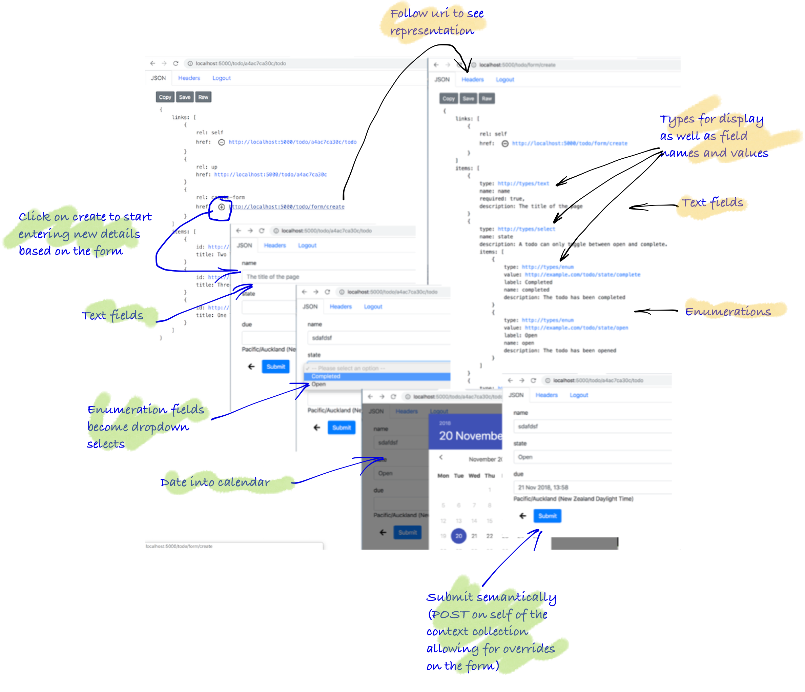

This example constructs a create form for use to create a resource on a collection. This example creates a todo item on a todo list. Navigate to this resource from the home via the 'me' > 'todos' > pick a todo list > 'todos'.



### Goal

* Create a collection with a `create-form`  link
* Create cachable create form (designed to be posted back onto the collection)

### Anatomy of search

| Method | link rel      | associated route    | notes |
| -------|---------------|---------------------|-------|
| GET    |               | /todo/{id}/todo/    | add `create-form` as a link rel to collection  |
| GET    | `create-form` | /todo/form/create   | follow the `tenants` link to get the collection|
| POST   | `self`        | /todo/{id}/todo/    | fill in the form and send back to collection. Response returns `201 Created` with `Location` header |
| GET    |               | /todo/{id}          | follow the `Location` header returns a filtered search (feed) collection. Note: this is the same route as `tenants` link rel |

> Note: by convention a form can be submitted semantically. Here, because there is `submit` link rel on the form, the forms is send back to the 'self' rel on the originating collection resource.

### Anatomy of code

### Return todo list collection (with create-form link)

Below, you see on overview of the code, then you see the implementation.

<Instruction>

Read and start to grok the layout of the underlying code base

```bash(path="...todo-hypermedia/api/Api")
.
└── Api
    ├── Controllers
    │   └── TodoController.cs
    ├── RepresentationExtensions
    │   └── TodoRepresentationExtensions.cs
    └── UriFactory
        └── TodoUriFactory.cs

```

</Instruction>

<Instruction>

Create a route in the controller that returns a list of tenants based on the user and the search criteria and includes . The current (simple) implementation returns all tenants and the 'q' value is a filter—this implementation also eager loads tenants (it is a naive implementation for demonstration purposes). Note: humans could type the 'q' param with a value in the URL but this is not a hypermedia self-describing interface (albeit a handy short cut).

```csharp(path="...todo-hypermedia/api/Api/Controllers/TodoController.cs")
using System.Collections.Generic;
using System.Threading.Tasks;
using Api.Authorisation;
using Api.RepresentationExtensions;
using Api.UriFactory;
using Api.Web;
using Domain.Models;
using Domain.Persistence;
using Domain.Representation;
using Marvin.Cache.Headers;
using Microsoft.AspNetCore.JsonPatch;
using Microsoft.AspNetCore.Mvc;
using SemanticLink;
using SemanticLink.AspNetCore;
using SemanticLink.Form;
using Toolkit;

namespace Api.Controllers
{
    /// <see cref="UserController.GetUserTodos"/> for the todo collection as they are parented on a user
    [Route("todo")]
    public class TodoController : Controller
    {
         ////////////////////////////////
        //
        // Todos on a list
        // ===============

        /// <summary>
        ///     Retrieve a todo items collection in the context of a todo list
        /// </summary>
        /// <remarks>
        ///    While the persistence of the todo is recursive the controller interface codes out the list/item structure
        /// </remarks>
        /// <see cref="TodoController.GetById"/>
        [HttpGet("{id}/todo", Name = TodoUriFactory.TodoTodoListRouteName)]
        [HttpCacheExpiration(CacheLocation = CacheLocation.Private)]
        [HttpCacheValidation(NoCache = true)]
        [AuthoriseTodo(Permission.Get)]
        public async Task<FeedRepresentation> GetTodos(string id)
        {
            return (await _todoStore
                    .GetByParent(id))
                .ToFeedRepresentation(id, Url);
        }

    }
}
```

</Instruction>

<Instruction>

Create a `ToSearchFeedRepresentation` implementation as an extension method that constructs the `FeedRepresentation` with links `up` and to the `search` form. Note: that tenant resources are parented on a user.

```csharp{31}(path="...todo-hypermedia/api/Api/RepresentationExtensions/TodoRepresentationExtensions.cs")
using System.Collections.Generic;
using System.Linq;
using Api.UriFactory;
using Domain.LinkRelations;
using Domain.Models;
using Domain.Representation;
using Domain.Representation.Enum;
using Microsoft.AspNetCore.Mvc;
using SemanticLink;
using Toolkit;

namespace Api.RepresentationExtensions
{
    public static class TodoRepresentationExtensions
    {
        /// <summary>
        ///     Feed representation of todo items collection parented on a named todo list
        /// </summary>
        /// <see cref="ToUserTodoListFeedRepresentation"/>
        public static FeedRepresentation ToFeedRepresentation(
            this IEnumerable<Todo> todos,
            string todoListId,
            IUrlHelper url)
        {
            return new FeedRepresentation
            {
                Links = new[]
                {
                    ... other links

                    // create-form - you  must create on user tenant
                    url.MakeTodoCreateFormUri().MakeWebLink(IanaLinkRelation.CreateForm)
                },
                Items = todos
                    .Select(t => t.MakeTodoFeedItemRepresentation(url))
                    .ToArray()
            };
        }

        private static FeedItemRepresentation MakeTodoFeedItemRepresentation(this Todo todo, IUrlHelper url)
        {
            return new FeedItemRepresentation
            {
                Id = todo.Id.MakeTodoUri(url),
                Title = todo.Name,
            };
        }

    }
}
```

</Instruction>

<Instruction>

Create a `UriFactory` implementation as an extension method which creates a URI string based on the route as configured up in the controller. Note: the URL construction is part of the MVC framework itself and thus needs to be handed through.

```csharp(path="...todo-hypermedia/api/Api/UriFactory/TodoUriFactory.cs")
using Microsoft.AspNetCore.Mvc;

namespace Api.UriFactory
{
    public static class TodoUriFactory
    {
        /// <summary>
        ///     The route name for a create form for a todo resource
        /// </summary>
        public const string CreateFormRouteName = "TodoCreateForm";

        /// <summary>
        ///     The url for a create form for a todo resource
        /// </summary>
        public static string MakeTodoCreateFormUri(this IUrlHelper url)
        {
            return url.Link(CreateFormRouteName, new { });
        }
    }
}
```

</Instruction>

### Create form

Below, you see on overview of the code, then you see the implementation.

<Instruction>

Read and start to grok the layout of the underlying code base

```bash(path="...todo-hypermedia/api")
.
├── Api
│   ├── Controllers
│   │   └── TenantController.cs                    <-- add a search form route
│   ├── RepresentationExtensions
│   │   └── TenantFormRepresentationExtensions.cs  <-- generate a tenant search form representation
│   └── UriFactory
│       └── TenantUriFactory.cs
│
│ ... external but included for completeness if new to forms
│
└── SemanticLink
    ├── Form
    │   ├── CreateFormRepresentation.cs
    │   ├── FormRepresentation.cs
    │   ├── FormItemRepresentation.cs
    │   ├── TextInputFormItemRepresentation.cs
    │   ├── DateInputFormItemRepresentation.cs
    │   ├── SelectFormItemRepresentation.cs
    │   ├── SelectOptionItemRepresentation.cs
    │   └── SelectOptionValueItemRepresentation.cs
    └── FormType

```

</Instruction>

<Instruction>

Create a route in the controller that returns a list of tenants based on the user and the search criteria. The current (simple) implementation returns all tenants and the 'q' value is filter. Note: humans could type the 'q' param with a value in the URL but this is not a hypermedia self-describing interface (albeit a handy short cut).

```csharp(path="...todo-hypermedia/api/Api/Controllers/TodoController.cs")
using System.Collections.Generic;
using System.Threading.Tasks;
using Api.Authorisation;
using Api.RepresentationExtensions;
using Api.UriFactory;
using Api.Web;
using Domain.Models;
using Domain.Persistence;
using Domain.Representation;
using Marvin.Cache.Headers;
using Microsoft.AspNetCore.JsonPatch;
using Microsoft.AspNetCore.Mvc;
using SemanticLink;
using SemanticLink.AspNetCore;
using SemanticLink.Form;
using Toolkit;

namespace Api.Controllers
{
    /// <see cref="UserController.GetUserTodos"/> for the todo collection as they are parented on a user
    [Route("todo")]
    public class TodoController : Controller
    {

        /// <summary>
        ///     A public stateless create form that is fully cacheable.
        /// </summary>
        [HttpGet("form/create", Name = TodoUriFactory.CreateFormRouteName)]
        [HttpCacheExpiration(CacheLocation = CacheLocation.Public, MaxAge = CacheDuration.Long)]
        [AuthoriseForm]
        public CreateFormRepresentation GetCreateForm()
        {
            return Url.ToTodoCreateFormRepresentation();
        }

    }
}
```

</Instruction>


<Instruction>

Create a `ToTodoCreateFormRepresentation` method that generates the create form (without a `submit` link rel).

```csharp(path="...todo-hypermedia/api/Api/RepresentationExtensions/TodoFormRepresentationExtensions.cs")
using Api.UriFactory;
using Domain.Representation;
using Domain.Representation.Enum;
using Microsoft.AspNetCore.Mvc;
using SemanticLink;
using SemanticLink.Form;

namespace Api.RepresentationExtensions
{
    /// <seealso cref="TodoRepresentation" />
    /// <seealso cref="TodoRepresentationExtensions" />
    public static class TodoFormRepresentationExtensions
    {

        /// <summary>
        ///     Get the create form to describe to clients of the API how to
        ///     modify instances on the resource
        /// </summary>
        /// <seealso cref = "Domain.Representation.TodoCreateDataRepresentation" />
        public static CreateFormRepresentation ToTodoCreateFormRepresentation(this IUrlHelper url)
        {
            return new CreateFormRepresentation
            {
                Links = new[]
                {
                    // this collection
                    url.MakeTodoCreateFormUri().MakeWebLink(IanaLinkRelation.Self),

                    // no submit to make it cacheable
                },
                Items = MakeFormItems()
            };
        }

        private static FormItemRepresentation[] MakeFormItems()
        {
            return new FormItemRepresentation[]
            {
                new TextInputFormItemRepresentation
                {
                    Name = "name",
                    Description = "The title of the page",
                    Required = true
                },
                new SelectFormItemRepresentation
                {
                    Name = "state",
                    Description = "A todo can only toggle between open and complete.",
                    Required = false,
                    Multiple = false,
                    Items = new SelectOptionItemRepresentation[]
                    {
                        new SelectOptionValueItemRepresentation
                        {
                            Type = FormType.Enum,
                            Description = "The todo has been completed",
                            Label = "Completed",
                            Value = TodoState.Complete,
                            Name = "completed",
                        },
                        new SelectOptionValueItemRepresentation
                        {
                            Type = FormType.Enum,
                            Description = "The todo has been opened",
                            Label = "Open",
                            Value = TodoState.Open,
                            Name = "open",
                        },
                    }
                },
                new DateTimeInputFormItemRepresentation
                {
                    Name = "due",
                    Description = "The UTC date the todo is due"
                },
            };
        }

    }
}
```

</Instruction>


<Instruction>

Grok the Forms code that builds on form representations. Here for completeness.

```csharp(path="...todo-hypermedia/api/SemanticLink/Form")
using System.Runtime.Serialization;

namespace SemanticLink.Form
{
    /// <seealso cref = "EditFormRepresentation" />
    /// <seealso cref = "SearchFormRepresentation" />
    [DataContract(Name = "create-form")]
    public class CreateFormRepresentation : FormRepresentation
    {
    }

    [DataContract(Name = "form")]
    public class FormRepresentation : LinkedRepresentation
    {
        [DataMember(Name = "items", Order = 100)]
        public FormItemRepresentation[] Items { get; set; }
    }

    [DataContract(Name = "form-item")]
    public abstract class FormItemRepresentation
    {
        [DataMember(Name = "type", Order = 20)]
        public string Type { get; set; }

        [DataMember(Name = "id", EmitDefaultValue = false, Order = 30)]
        public string Id { get; set; }

        [DataMember(Name = "name", Order = 50, EmitDefaultValue = false)]
        public string Name { get; set; }

        [DataMember(Name = "required", EmitDefaultValue = false, Order = 50)]
        public bool Required { get; set; }

        [DataMember(Name = "description", EmitDefaultValue = false, Order = 70)]
        public string Description { get; set; }

        /// <summary>
        ///     Whether multiple of the items are available. This translates to the data type
        ///     being a collection (array).
        /// </summary>
        [DataMember(Name = "multiple", Order = 20, EmitDefaultValue = false)]
        public bool Multiple { get; set; }
    }

    [DataContract(Name = "text-input-form-item")]
    public class TextInputFormItemRepresentation : FormItemRepresentation
    {
        /// <summary>
        ///     Allow different browswer <see cref="FormType"/> to be passed through.
        /// </summary>
        public TextInputFormItemRepresentation(string type = FormType.Text)
        {
            Type = type;
        }
    }

    [DataContract(Name = "date-input-form-item")]
    public class DateInputFormItemRepresentation : FormItemRepresentation
    {
        public DateInputFormItemRepresentation()
        {
            Type = FormType.Date;
        }
    }

    [DataContract(Name = "select-form-item")]
    public class SelectFormItemRepresentation : FormItemRepresentation
    {
        public SelectFormItemRepresentation()
        {
            Type = FormType.Select;
        }

        /// <summary>
        ///     A collection of groups or values.
        /// </summary>
        [DataMember(Name = "items", Order = 100)]
        public SelectOptionItemRepresentation[] Items { get; set; }
    }

    [DataContract(Name = "select-option-form-item")]
    public abstract class SelectOptionItemRepresentation : FormItemRepresentation
    {
        [DataMember(Name = "selected", Order = 10, EmitDefaultValue = false)]
        public bool Selected { get; set; }
    }

    /// <summary>
    ///     A value for a selection (menu)
    /// </summary>
    [DataContract(Name = "select-option-form-item")]
    public class SelectOptionValueItemRepresentation : SelectOptionItemRepresentation
    {
        [DataMember(Name = "value", Order = 30, EmitDefaultValue = false)]
        public string Value { get; set; }

        [DataMember(Name = "label", Order = 30, EmitDefaultValue = false)]
        public string Label { get; set; }
    }

    /// <summary>
    /// <para>
    ///    Values in representations need to be created and updated via form types. These change depending
    ///     on the client. Each type relates to the input element represents a typed data field, usually with
    ///     a form control to allow the user to edit the data.
    /// </para>
    /// <para>
    ///    Also, not all types are rendered natively on browsers eg <see cref="Group"/>, <see cref="Collection"/>, <see cref="Enum"/>
    /// </para>
    /// <remarks>
    /// <para>
    ///    Browsers tend now to implement more types eg see https://bootstrap-vue.js.org/docs/components/form-input
    ///      types: [ 'text', 'password', 'email', 'number', 'url', 'tel', 'date', `time`, 'range', 'color' ]
    /// </para>
    /// <para>
    ///     see html spec https://www.w3.org/TR/html5/single-page.html#the-input-element
    /// </para>
    /// <para>
    ///     Caveats with input types:
    /// </para>
    /// <list type="bullet">
    ///   <item><description>Not all browsers support all input types, nor do some types render in the same format across browser types/version.</description></item>
    ///   <item><description>Browsers that do not support a particular type will fall back to a text input type. As an example, Firefox desktop doesn't support date, datetime, or time, while Firefox mobile does.</description></item>
    ///   <item><description>Chrome lost support for datetime in version 26, Opera in version 15, and Safari in iOS 7. Instead of using datetime, since support should be deprecated, use date and time as two separate input types.</description></item>
    ///   <item><description>For date and time style input, where supported, the displayed value in the GUI may be different than what is returned by its value.</description></item>
    ///   <item><description>Regardless of input type, the value is always returned as a string representation.</description></item>
    /// </list>
    ///
    /// </remarks>
    /// </summary>
    public static class FormType
    {
        ///////////////////////////
        //
        // Input form types
        // ================
        //
        //  see https://www.w3.org/TR/html5/single-page.html#the-input-element
        //

        /// <summary>
        ///     Text with no line breaks
        /// </summary>
        /// <remarks>
        ///    see https://www.w3.org/TR/html5/single-page.html#text-typetext-state-and-search-state-typesearch
        /// </remarks>
        public const string Text = "http://types/text";

        /// <summary>
        ///     A date and time (year, month, day, hour, minute, second, fraction of a second) with timezone offset
        /// </summary>
        /// <remarks>
        ///    see https://www.w3.org/TR/html5/single-page.html#element-statedef-input-localdatetime
        /// </remarks>
        public const string DateTime = "http://types/datetime";


        ///////////////////////////
        //
        // Selection form types
        //

        /// <summary>
        ///     Mutually exclusive selection
        /// </summary>
        public const string Select = "http://types/select";


        /// <summary>
        /// <para>
        ///     Some values are part of a static set of values (enumeration) eg in a select.
        /// </para>
        /// <example>
        ///
        ///   Used as part of <see cref="Select"/>. In this case, between two options: open, complete
        ///
        /// <code>
        ///   new SelectFormItemRepresentation
        ///        {
        ///            Name = "state",
        ///            Description = "A todo can only toggle between open and complete.",
        ///            Required = false,
        ///            Multiple = false,
        ///            Items = new SelectOptionItemRepresentation[]
        ///            {
        ///                new SelectOptionValueItemRepresentation
        ///                {
        ///                    Type = FormType.Enum,
        ///                    Description = "The todo has been completed",
        ///                    Label = "Completed",
        ///                    Value = TodoState.Complete,
        ///                    Name = "completed",
        ///                },
        ///                new SelectOptionValueItemRepresentation
        ///                {
        ///                    Type = FormType.Enum,
        ///                    Description = "The todo has been opened",
        ///                    Label = "Open",
        ///                    Value = TodoState.Open,
        ///                    Name = "open",
        ///                },
        ///            }
        ///        },
        /// </code>
        /// <para>
        /// We can also represent media types using enums (eg the 'op' in <see cref="MediaType.JsonPatch"/>).
        /// </para>
        /// </example>
        /// </summary>
        /// <remarks>
        ///    An enum is a value type compared with the reference type of <see cref="Collection"/>
        /// </remarks>
        public const string Enum = "http://types/enum";


        ... loads of others
    }
}
```

</Instruction>

### Create the resource upon submission

Below, you see on overview of the code, then you see the implementation.

<Instruction>

Read and start to grok the layout of the underlying code base

```bash(path="...todo-hypermedia/api")
.
└── Api
│   ├── Controllers
│   │   └── TodoController.cs
│   └── UriFactory
│       └── TodoUriFactory.cs      <-- no changes because all routes have been setup
└── Domain
    └── Representation
        └── TodoCreateDataRepresentation.cs

```

</Instruction>

<Instruction>

Create an incoming tenant search representation that has the search fields (in this case, just 'search').

```csharp(path="...todo-hypermedia/api/Domain/Representation/TodoCreateDataRepresentation.cs")
using System.Runtime.Serialization;

namespace Domain.Representation
{
    public class TodoCreateDataRepresentation
    {
        [DataMember(Name = "name", Order = 50, EmitDefaultValue = false)]
        public string Name { get; set; }

        [DataMember(Name = "state", Order = 50, EmitDefaultValue = false)]
        public string State { get; set; }

        [DataMember(Name = "due", Order = 50, EmitDefaultValue = false)]
        public DateTime Due { get; set; }
    }
}
```

</Instruction>

<Instruction>

Create a route in the controller that accepts the the create representation and returns a `201 Created` with `Location` header to the canonical resource. Also included is the route for that canonical resource

```csharp(path="...todo-hypermedia/api/Api/Controllers/TodoController.cs")
using System.Collections.Generic;
using System.Threading.Tasks;
using Api.Authorisation;
using Api.RepresentationExtensions;
using Api.UriFactory;
using Api.Web;
using Domain.Models;
using Domain.Persistence;
using Domain.Representation;
using Marvin.Cache.Headers;
using Microsoft.AspNetCore.JsonPatch;
using Microsoft.AspNetCore.Mvc;
using SemanticLink;
using SemanticLink.AspNetCore;
using SemanticLink.Form;
using Toolkit;

namespace Api.Controllers
{
    /// <see cref="UserController.GetUserTodos"/> for the todo collection as they are parented on a user
    [Route("todo")]
    public class TodoController : Controller
    {

        /// <summary>
        ///     Create a todo item on a todo list
        /// </summary>
        /// <seealso cref="UserController.CreateTodo"/>
        [HttpPost("{id}/todo", Name = TodoUriFactory.TodoTodoListRouteName)]
        [AuthoriseTodo(Permission.Post)]
        public async Task<CreatedResult> CreateTodo(string id, [FromBody] TodoCreateDataRepresentation data)
        {
            var userId = User.GetId();

            return (await _todoStore.Create(
                    userId,
                    userId, // context is the userId
                    data
                        .ThrowInvalidDataExceptionIfNull("Invalid todo create data")
                        .FromRepresentation(id,TodoType.Item),
                    Permission.FullControl,
                    CallerCollectionRights.Todo
                ))
                .MakeTodoUri(Url)
                .MakeCreated();
        }

        /// <summary>
        ///     A todo list or item
        /// </summary>
        [HttpGet("{id}", Name = TodoUriFactory.TodoRouteName)]
        [HttpCacheExpiration(CacheLocation = CacheLocation.Private)]
        [HttpCacheValidation(NoCache = true)]
        [AuthoriseTodo(Permission.Get)]
        public async Task<TodoRepresentation> GetById(string id)
        {
            return (await _todoStore
                    .Get(id))
                .ThrowObjectNotFoundExceptionIfNull("todo not found")
                .ToRepresentation(User.GetId(), Url);
        }

    }
}```

</Instruction>


<Instruction>

Explore the `MakeCreated` that can be used to return a `201 Created` and `Location` header.

```csharp(path="...todo-hypermedia/api/SemanticLink-AspnetCore/HttpRequestMessageExtensions.cs")
using Microsoft.AspNetCore.Http;
using Microsoft.AspNetCore.Mvc;

namespace SemanticLink.AspNetCore
{
    /// <summary>
    ///     Extension helpers for a application to return simple result codes
    /// </summary>
    public static class HttpRequestMessageExtensions
    {
        public static CreatedResult MakeCreated(this string uri)
        {
            return new CreatedResult(
                uri,
                new
                {
                    message = "The resource has been created",
                    id = uri
                });
        }

    }
}
```

</Instruction>

