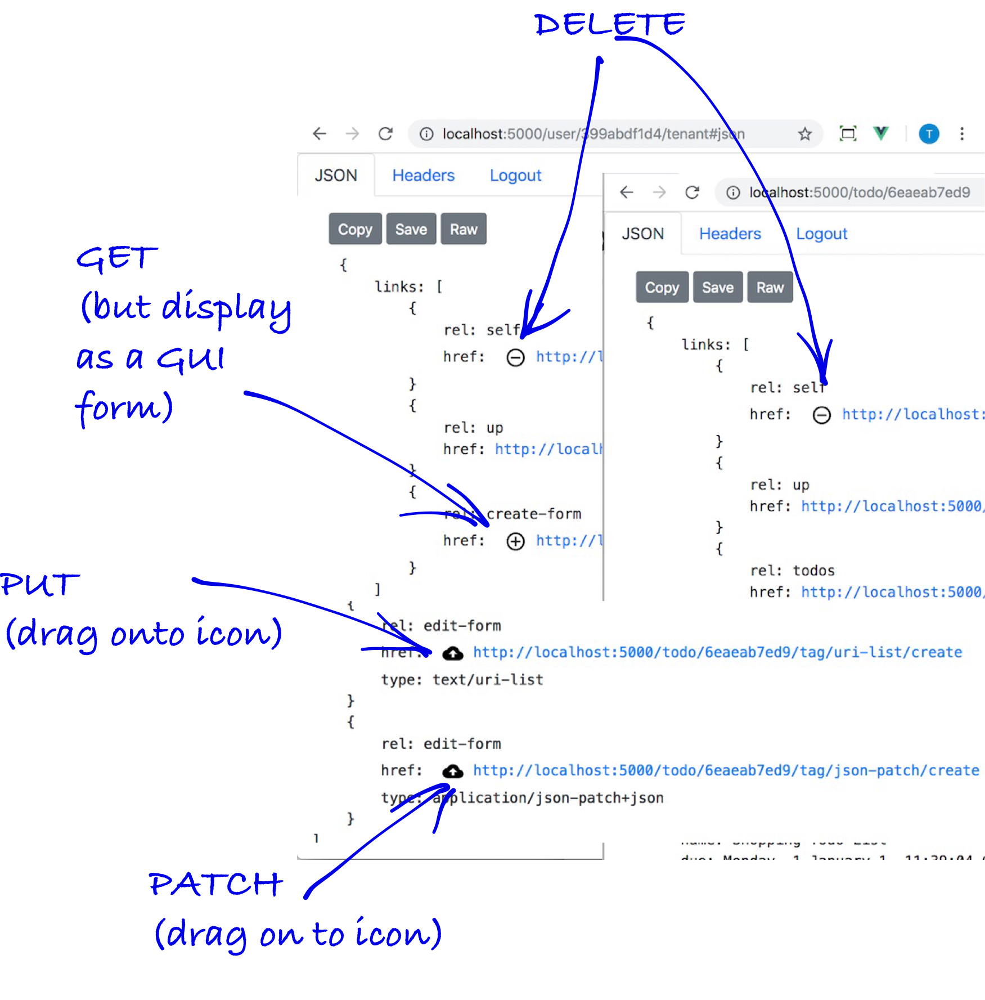

Once the across-the-wire representation (application/json) arrives, the API browser (in pretty print mode) creates an improved, human readable and interactable display. In short, URIs are made clickable, and and button are added to link relations are.

The purpose of this part of the tutorial isn't to explain the HTML markup per se (you can look at the implementation and usage of third-party libraries). Rather it is to demonstrate how hypermedia makes it possible to have a generalised client.

### The basic additions

1. `self` has a delete button (to perform DELETE)
2. `create-form` loads up the a create form for values to be entered (to perform a POST)
2. `edit-form` loads up the an edit form and includes the current representation values to be changed (to perform a PUT)
3. `edit-form` with a media type `text/uri-list` creates a drop target via HTML5 of a URI or `uri-list` (to perform a PUT of media type `text/uri-list`)
5. `edit-form` with a media type `application/json-patch+json` creates a drop target via HTML5 of a URI or `uri-list` (to perform a PATCH of media type `application/json-patch+json`)



<Instruction>

Read the code below to see the top-level implementation of these additions in `Resource.vue`. It retrieves the resource and then parses it to display it as html (but look like a stripped down JSON) and then adds the buttons and drop targets.

```js{73-127}(path=".../todo-apnetcore-vue/client/src/components/api/Resource.vue")
// Resource.vue
<script>

    import axios from 'axios';
    import {linkifyToSelf} from '../../filters/linkifyWithClientRouting';
    import {LinkedRepresentation} from 'semantic-link';
    import {log} from 'logger';

    // making the buttons and drop targets
    import Vue from 'vue';
    import FormAction from './FormAction.vue';
    import FormDragDrop from './FormDragDrop.vue';

    export default {

        props: {
            apiUri: {type: String},
        },

        data() {
            return {
                /**
                 * Linkify HTML template string constructed from {@link representation}. Vue then mounts this.
                 * @type {string}
                 */
                htmlRepresentation: null,
            }
        },

        created() {
            this.getRepresentation();
        },

        methods: {

            /**
             * GET the resource and layout the JSON as html with update, created and remove
             * return {Promise<LinkedRepresentation | never>}
             */
            getRepresentation() {

                log.debug(`[Resource] Fetching representation ${this.apiUri}`);

                return axios
                    .get(this.apiUri)
                    .then(/** @type {AxiosResponse} */response => {

                        ...

                        // creates the clickable links and makes the data into an html form (third-party library)
                        this.htmlRepresentation = linkifyToSelf(response.data);

                        this.$nextTick(() => {

                            /**
                             * Now that we have the resource loaded, wait for the render (ie nextTick) and attach
                             * all the actions we want onto the links relations.
                             *
                             * Below is a list of all the different actions available:
                             *   - buttons (ie forms that are filled out by the user
                             *   - drop (and drag) targets
                             *
                             * These will get placed in-line as components. You should be able to register
                             * more as you go. Hopefully, this pluggable approach is readable and workable.
                             *
                             * Add components dynamically is a well known approach
                             * @see see https://css-tricks.com/creating-vue-js-component-instances-programmatically/
                             */

                            const ButtonComponent = Vue.extend(FormAction);
                            const DropTargetComponent = Vue.extend(FormDragDrop);

                            [
                                ['edit-form', undefined, new ButtonComponent({
                                    propsData: {
                                        type: 'Edit',
                                        onClick: this.getForm,
                                        rel: 'edit-form',
                                        title: 'Update existing'
                                    }
                                })],
                                ['search', undefined, new ButtonComponent({
                                    propsData: {
                                        type: 'Search',
                                        onClick: this.getForm,
                                        rel: 'search',
                                        title: 'Enter search'
                                    }
                                })],
                                ['create-form', undefined, new ButtonComponent({
                                    propsData: {
                                        type: 'Add',
                                        onClick: this.getForm,
                                        rel: 'create-form',
                                        title: 'Add new'
                                    }
                                })],
                                ['self', undefined, new ButtonComponent({
                                    propsData: {
                                        type: 'Delete',
                                        onClick: this.tryDelete,
                                        rel: 'self',
                                        title: 'Delete'
                                    }
                                })],
                                ['edit-form', 'text/uri-list', new DropTargetComponent({
                                    propsData: {
                                        method: 'put',
                                        representation: this.representation,
                                        map: this.toUriList,
                                        mediaType: 'text/uri-list',
                                        accept: 'text/uri-list',
                                        title: 'Drag a uri to create (via PUT uri-list)'
                                    }
                                })],
                                ['edit-form', 'application/json-patch+json', new DropTargetComponent({
                                    propsData: {
                                        method: 'patch',
                                        representation: this.representation,
                                        map: this.toPatchDocument,
                                        mediaType: 'application/json-patch+json',
                                        accept: 'text/uri-list',
                                        title: 'Drag a uri to create (via PATCH)'
                                    }
                                })],
                            ].forEach(([rel, mediaType, component]) => findLinkRel(rel, mediaType)
                                .forEach(el => el && el.insertBefore(component.$mount().$el, el.firstChild)));

                        });

                      })

            },

        }
    }
</script>

```
</Instruction>


