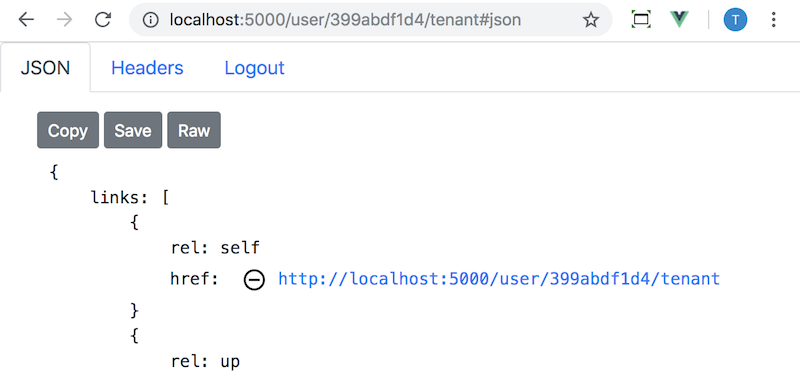

All resources have DELETE available through HTTP. Any client can make that request and the server responds appropriately. This client makes DELETE available on 'self' links. The server may have implemented an OPTIONS approach but this case we haven't implemented this on the current client.



### Some general rules about try DELETE

1. try DELETE using 'self' on any/all resources (so that there is cache invalidation on the correct URI)
2. DELETE on a singleton should just work (and invalidate caches because of rule 1)
3. DELETE on a collection item just should work particularly because it should not have side effects (and invalidate caches because of rule 1)
4. DELETE on a collection usually fails because the collection needs to empty so that collection items don't have cache poisoning (which means following rule 3 first but then it is an empty collection and unlikely to be 'deleted')

Please note that APIs that implement batch delete are likely to break these rules—we may look to implement 'batching' from a user perspective because that is a good user experience but still implement it as per those rules in the client implementation. What is that rule about types of optimisation as the root of problems?

<Instruction>

Resource.vue deletes the 'self' link URI on the representation (using `link.delete`) and then does some checking to confirm it is deleted before redirecting

```js{33}(path=".../todo-apnetcore-vue/client/src/components/api/Resource.vue")
// Resource.vue
<script>
    import axios from 'axios';
    import * as link from 'semantic-link';
    import {log} from 'logger';

    export default {

        data() {
            return {
                /**
                 * In memory representation based on the apiUri
                 * @type {LinkedRepresentation}
                 */
                representation: null,
            }
        },

        methods: {

            /**
             * Try and delete a representation. Because all 'self' links have a delete option, we'll try and then if
             * successful move the user back to the 'up' link relation of the deleted resource or if it failed (ie this
             * isn't an available option) show the message to the user.
             *
             * TODO: note this could try OPTIONS first
             *
             * @param {string} rel
             * @return {Promise}
             */
            tryDelete(rel) {

                return link.delete(this.representation, rel)
                    .then(/** @type {AxiosResponse|Error} */response => {

                        // appropriate repsonses from a deleted resource
                        // see https://stackoverflow.com/questions/2342579/http-status-code-for-update-and-delete
                        if (response.status === 204 || response.status === 200 || response.status === 202) {

                            // 202 is that is accepted to be processed (TODO: retry mechanism that isn't immediate)
                            if (response.status === 202) {
                                this.$notify({type: 'info', text: 'Resource marked for deletion. Confirming deletion'})
                            }

                            // check that it has in fact been deleted
                            return link.get(this.representation, /^self$/)
                            // it is an error if it succeeds
                                .then(() => this.$notify({
                                    type: 'error',
                                    text: 'This item was unable to be deleted and still exists'
                                }))
                                .catch(/** @type {AxiosResponse} */response => {
                                    // success if it isn't found or no content
                                    if (response.status === 404 || response.status === 204) {

                                        const uri = link.getUri(this.representation, /up/) || '/';

                                        this.$notify({
                                            type: 'success',
                                            title: 'Item successfully deleted.',
                                            text: `Redirecting to <a href="${uri}">item</a>`

                                        });

                                        setTimeout(() => {
                                            window.location.href = uri;
                                        }, 3000);


                                    } else {
                                        log.warn('Request is in weird state');
                                    }
                                });
                        } else {
                            this.$notify({
                                type: 'error',
                                title: response.statusText || response.message || '',
                                text: 'This should be fixed'
                            });
                        }

                    })
                    .catch(/** @type {AxiosResponse|*} */response => {
                        this.$notify({
                            title: response.statusText,
                            text: 'You can\'t delete this.',
                            type: 'error'
                        });
                    });
            },
        }
    }
</script>

```
</Instruction>

