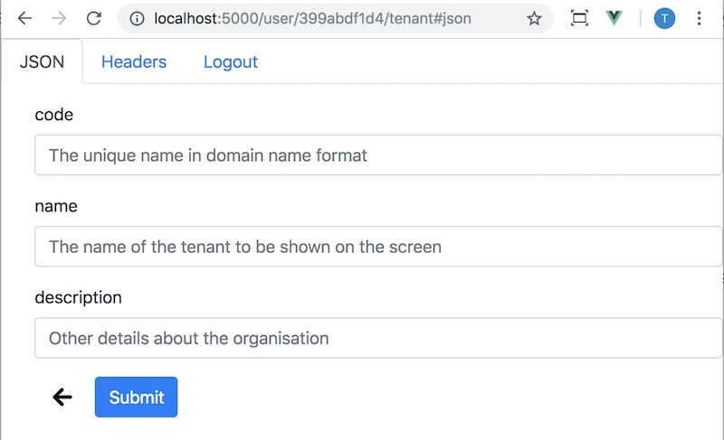

Using forms is about allowing the API to describe to the client what the client needs to send back in its request. What the form has is beyond this part of the tutorial but at this stage the simple answer is that the guidelines of HTML semantics are used. Rather this tutorial describes how we wire up the rules of what a form contains.



### Some key guidelines

* `edit-form` is a PUT
* `create-form` is a POST
* `search` is POST (because it is just a create)
* `submit` may be present on a form and should be used for submission when present
* `self` of the form should never be used
* `self` of the originating resource can be used when `submit` on the form is not present
* a form can override a verb by including a 'type' on the `submit`

Remember, that the designer of the API is

* unlikely have an `edit-form` on collection (you add/remove items to a collection rather than update the collection per se)
* unlikely to have a `create-form` on a collection item
* unlikely to see a `create-form` on singleton (the `edit-form` will have attributes that allow adding/removing)


<Instruction>

Add a submit to the form.


```js(path="...todo-hypermedia/client/src/components/api/Resource.vue")

<template>

    <b-form @submit="submit">

        ...

        <b-button variant="primary" @click="submit">{{ submitTitle }}</b-button>
    </b-form>

</template>

<script>

    import FormService from "../../lib/FormService";
    import {log} from 'logger';

    export default {

        computed: {
            /**
             * Defaults to 'Submit' and is overriden by the link relation 'submit' name value
             * @example { rel: 'submit', name: 'Search', href: ...
             * @type {string}
             */
            submitTitle() {
                // KLUDGE: only support one/first submit link rel d
                const [link] = filter(this.formRepresentation, /^submit$/);
                return (link || {}).title || 'Submit';
            }
        },

        methods: {
            /**
             * On all the fields are entered then either make a PUT (edit/update) or POST (create, search) based on
             * the referring representation
             */
            submit() {

                log.debug(`[Form] submit ${getUri(this.representation, 'self')}`);

                return FormService.submitForm(this.formObj, this.formRepresentation, this.representation)
                    .then(/** @type {AxiosResponse} */response => {

                        this.$notify({
                            title: `${response.statusText} <a href="${response.headers.location}">item<a>`,
                            text: 'Redirecting ...',
                            type: 'success'
                        });

                        log.debug(`[Form] return [${response.status}] `);

                        // on success if updated return to item (204) otherwise go to new (201)
                        const returnUri = response.status === 201
                            ? response.headers.location
                            : getUri(this.representation, 'self');

                        setTimeout(() => {
                            window.location = returnUri;
                        }, 2000)

                    })
                    .catch(/** @type {AxiosResponse|string} */err => {
                        if (this.onFailure) {
                            this.onFailure(err)
                        } else {
                            const message = err.statusText || err.message || '';
                            this.$notify({title: 'Error submitting', text: message, type: 'error'});
                        }
                    });

            },
        }
    }
</script>

```

</Instruction>

<Instruction>

Read the code below to see the semantics of form submission and that values supplied are matched against the values in a form before submission.


```js(path="...todo-hypermedia/client/src/lib/FormService.js")
import axios from 'axios';
import * as link from 'semantic-link';
import {log} from 'logger';

/**
 * A form has the job to POST to a collection or PUT to an item (this is by convention).
 *
 * The semantics of the form are that:
 *
 * In terms of the display label:
 * ==============================
 *
 *  1. Default value is 'Submit'
 *  @example { rel: 'submit' }
 *
 *  2. Override default if the link rel 'submit' has name attribute use that for display
 *  @example { rel: 'submit', name: "Search" }
 *
 * In terms of form values:
 * ========================
 *
 *  1. In the case of POST, start with a new object and fill out values (based on the form)
 *  2. In the case of PUT, clone a new object based on the  existing item (ie prepopulate) and
 *     update values (based on the form)
 *
 * In terms of where and how to send forms:
 * ========================================
 *
 * 1. Default verb is POST when 'submit' is present
 * @example { rel: 'submit', href:"https://example.com/collection/"}
 *
 * 2. PUT verb if no link rel 'submit' OR method='PUT'
 * @example { rel: 'self', href: 'http://example.com/some/form"} <-- no submit
 *
 * 3. Set verb when link rel 'method'  is explicitly set
 * @example { rel: 'submit', method: 'PUT', href:"https://example.com/item"}
 * @example { rel: 'submit', method: 'POST', href:"https://example.com/collection"}
 *
 * 4. send to uri in named href if explicit
 * @example { rel: 'submit', href:"https://example.com/collection/"}
 *
 * 5. send to referring resource if omitted
 * @example { rel: 'self', href: 'http://example.com/some/form"} <-- no submit
 * @example { rel: 'submit'}
 *
 */
export default class FormService {

    /**
     * @param {FormRepresentation} form
     * @return {boolean}
     */
    static hasSubmitLinkRel(form) {
        return link.matches(form, /^submit$/);
    }

    /**
     *
     * @param {*} data
     * @param {FormRepresentation}form
     * @param {LinkedRepresentation|CollectionRepresentation} collection
     * @param {?string=undefined} mediaType
     * @returns {Promise<AxiosResponse<LinkedRepresentation>>}
     */
    static submitForm(data, form, collection, mediaType) {
        /**
         * A form will use 'submit' rel 'type' if explicitly set
         * A form will POST if the parent resource is a collection (has 'items')
         * A form will PUT if the parent resource is not a collection
         * @param {FormRepresentation} form
         * @param {LinkedRepresentation|CollectionRepresentation} contextRepresentation
         * @return {Function} semantic link function type
         **/
        function verb(form, contextRepresentation) {
            const [weblink] = link.filter(form, /^submit$/);

            if (weblink) {
                // if it has a web link type use explicit if know type
                if (weblink.type) {
                    switch (weblink.type.toLowerCase()) {
                        case 'put':
                            return link.put;
                        case 'post':
                            return link.post;
                        case 'delete':
                            return link.delete;
                        case 'patch':
                            return link.patch;
                        default:
                    }
                }
            }

            if ('items' in contextRepresentation) {
                log.debug('[Form] using POST on collection');
                return link.post;
            } else {
                log.debug('[Form] using PUT on resource');
                return link.put;
            }
        }

        /**
         * Only send back the fields from the data that are matched to the fields on the form
         */
        function pickFieldsFromForm(data, form) {

            const fields = form.items.map(item => item.name);
            // es6 version of underscore/lodash pick
            return Object.assign({}, ...fields.map(key => ({ [key]: data[key] })));
        }

        const rel = FormService.hasSubmitLinkRel(form) ? 'submit' : 'self';
        const links = FormService.hasSubmitLinkRel(form) ? form : collection;
        const http = verb(form, collection);
        const obj = pickFieldsFromForm(data, form);

        return http(links, rel, mediaType, obj);
    }

}
```

</Instruction>