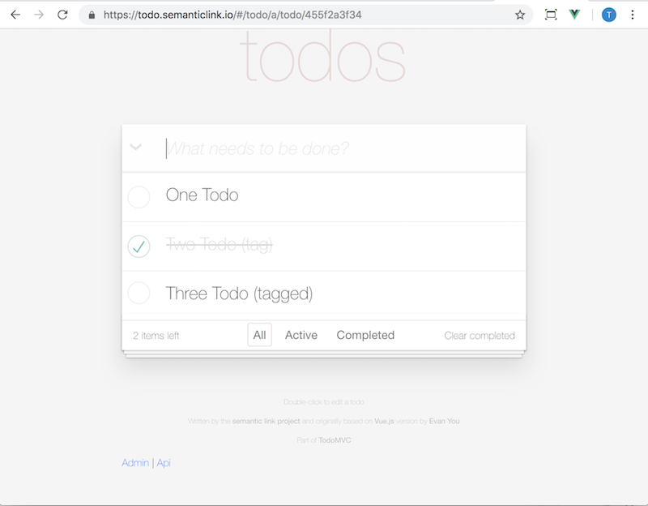

Before learning about how to write a todo client across the hypermedia API, let's start by running the existing one.

The live demo:

* [api.todo.semanticlink.io](https://api.todo.semanticlink.io)
* credentials (`test-1@semanticlink.io` with password `1234qwerZXCV`)



### Run demo server and client

#### Install dependencies

<Instruction>

Clone the git repo and install dependencies

```bash{.../todo-rest-api}
git clone git://github.com/semanticlink/todo-rest-api
```

</Instruction>

All dependencies are documented [in this Readme](.../Readme.md) and include:

</Instruction>

* Docker
* Rider (api)
* WebStorm (client)
* [.NET Core 2.1 SDK v.2.1.401](https://www.microsoft.com/net/download)
* [nodejs](https://nodejs.org/en/) (>= 10.0.0)
* [yarn](https://yarnpkg.com/latest.msi) (1.6.0 or above)

#### Start applications

1. Start the database.

<Instruction>

Start the database in a docker container

```bash
docker run -p 8000:8000 -it --rm instructure/dynamo-local-admin`
```
</Instruction>

You can view this in a browser on `http://localhost:8000`

2. Build and run the project with the following environment variables.

```
    ASPNETCORE_ENVIRONMENT: Development
    ASPNETCORE_URLS: http://localhost:5000
```

<Instruction>

Restore the package dependencies with `dotnet` commandline (or through the IDE)

```bash
cd api
dotnet restore
```

</Instruction>

<Instruction>

Run the `Api` project through the IDE (eg Rider)

    Exec Path: Api/bin/Debug/netcoreapp2.1/Api.dll
    Working Directory: ./api/Api
    Environment Variables: ASPNETCORE_ENVIRONMENT=Development;ASPNETCORE_URLS=http://localhost:5000

</Instruction>

3. Build and run the `client` commandline with `yarn` (or through the IDE, eg WebStorm).

<Instruction>

Run the client

```
cd client
yarn install
yarn dev
```

</Instruction>

It will open a browser in `http://localhost:8080`

At some stage, you will need to authenticate. The credentials are at the top of the page.
