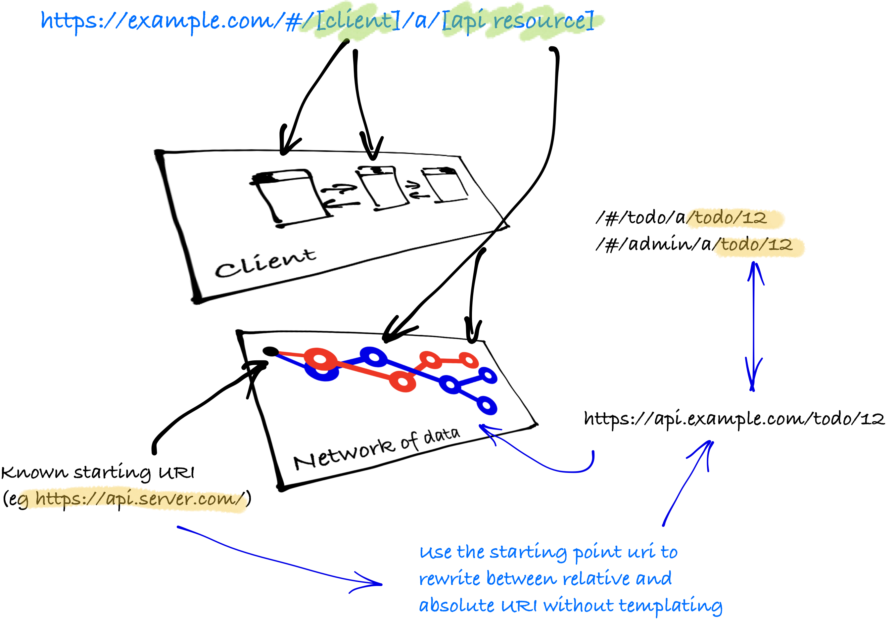

### Bookmarkable URL holding state

Client URLs need to be able to hold state—that is, you can put them in the clipboard and open in a new browser window and get exactly the same view. They key is that the client needs to be able to render a particular layout against a data. There are multiple parts to doing this:

* url fragment: `/#/` marks that it is all client side
* **client** view: in a client there is the client 'view' (component) to be rendered
* pivot point: `/a/` is just a short marker
* **api resource**: the resource that is being loaded from the API. Also, for readability the API resource is likely to have a reduced form that removes the base entry. For example, the entry point of the API is `https://api.example.com/` and we are loading `https://api.example.com/todo/5` then on the bookmarkable URL we will map `todo/5` back to the original url.
* client-side filtering: can be added also as a query (this is used on the todo app)

> Note: this approach is not HTML5 because it does not return to the server for server-side rendering of the page. This means that the entire URL is the 'state' and is only known to the client.



### Some general guidelines

* the starting url is in the HTML page as a link rel (eg `<link rel="api" href="http://localhost:5000/"/>` in `<head>`)
* never do URL construction, but URL mapping is useful for shortening
* mapping will need to be able to move back and forth between client and API forms

<Instruction>

Initialise the starting URL and the mappers (include the router which is created below and the uriMapper implementation directly below)

```js(path="...todo-hypermedia/client/src/app.js")
import Vue from 'vue';
import router from './router';
import {log} from 'logger';
import {uriMapping} from 'semantic-link-utils/UriMapping';
import {filter} from 'semantic-link';
import App from './App.vue';

/**
 * Bootstrap the application
 */
new Vue({
    el: '#app',
    router,
    template: '<App/>',
    components: {App},
    created() {

        /**
         * Get the starting URL from the base HTML
         * <head>
         *  <title>Todo App</title>
         *  <link rel="api" href="http://localhost:5000/"/>
         * </head>
         */
        const [api,] = filter('HEAD', 'api');
        const apiUri = api.href;
        const clientUri = window.location.href;

        log.info(`[App] Client uri: '${clientUri}'`);
        log.info(`[App] Api uri: '${apiUri}'`);

        uriMapping(clientUri, apiUri);

    }
});
```

</Instruction>

<Instruction>

Initialise the starting URL and the mappers

```js(path="...todo-hypermedia/client/src/lib/semantic-link-utils/UriMapping.js")
import {log} from 'logger';

let instance;

/**
 * This is trivial proof-of-concept implementation of client
 * side URI mapping.
 *
 * It is known NOT to work if the api URI is not prefixed
 * with the base api uri (which will happen if the api supports
 * distributed serving of content from multiple Uris).
 *
 * @example
 *
 *  clientUri: https://app.example.com
 *  apiUri:    https://api.example.com
 *
 *  We are currently on the the "home" page for a user who is tenanted to "4",
 *  thus we would see in the browser location a simplified version that is human readable.
 *
 *  --> https://app.example.com/home/a/tenant/4
 *
 *  This location is "stateless" because it contains enough information to reconstruct
 *  client-side state for the user. In long form, it is actually:
 *
 *  --> https://app.example.com/home/a/https://api.example.com/tenant/4
 *
 *  This maps to:
 *
 *  client-side view in router:  /home/a/ --> eg Home (as a component/view)
 *  api: it will fetch https://api.example.com/tenant/4
 *
 *  Two things about the routing:
 *
 *  1. '/home/a/' uses the convention of '/a/' so that we have a small delimiter to
 *     be able to pivot between the client and api state
 *
 *  2. Because routing is regex-based, we need to extend the syntax out to capture a
 *     parameter that is the api uri
 *
 *     --> /home/a/:apiUri
 *
 *  The result is that we need to read routing as:
 *
 *    ---> /[client-side view]/a/[apiUri]
 *
 *  The problem this class solves is the mapping between the entry and
 *  exit from clients-side views. We need to intercept at point marked ** below:
 *
 *  Entry:
 *
 *      1. Incoming Uri
 *      2. Router matches route, spread across params
 *      3. ** need to expand apiUri
 *      4. Consume in view (eg hydrate network of data)
 *
 * @example
 *
 *      https://client.example.com/home/a/tenant/4
 *
 *      beforeEntry(to...){
 *          { apiUri: makeAbsolute(to.params.apiUri)
 *      }
 *
 *      View has apiUri: https://api.example.com/tenant/4 to retrieve
 *
 *  Exit:
 *
 *      1. Outgoing link (eg route.$go)
 *      2. ** Need to construct Uri to include contracted apiUri
 *      3. Hand back off to router to match entry above
 *
 *  @example
 *
 *       User needs to be redirected to their home page and we
 *       know that they are https://api.example.com/tenant/4
 *
 *       route.go(toSitePath("http://api.example.com/tenant/4", "/home/a"))
 *
 * Other limitations. --Most-- All implementations client-side routers do not
 * deal with the issue of server-side (api) state as part of client state. This
 * implementation is basic, but works. These examples are independent of router
 * implementations (Vue, Angular) and could be further extracted.
 *
 * This class is implemented as a singleton. It allows for straightforward
 * injection in es6 code. This is particularly used in routers (eg vue-router)
 * and rather than use an independent IOC container (eg vue-injector) we
 * can use the es6 imports. This should simplify the code.
 *
 * This class will need to be instantiated with the Api URI once the DOM
 * has loaded from the link relation.
 *
 * @class UriMapping
 * @param {string} clientUri uri of serving out the client application (html)
 * @param {string} apiUri uri of the api being consumed by the  client (ie known link rel)
 */
class UriMapping {
    constructor(clientUri, apiUri) {

        if (!instance) {
            this.initialise(clientUri, apiUri);
            instance = this;
        }

        return instance;
    }

    /**
     * Used to (re)set the client and api Uri values. This is rarely used in an application setting. But
     * it is useful for tests.
     *
     * @param {string} clientUri uri of serving out the client application (html)
     * @param {string} apiUri uri of the api being consumed by the  client (ie known link rel)
     */
    initialise(clientUri, apiUri) {
        this.clientUri = clientUri;
        this.apiUri = apiUri;
    }

    /**
     * Remove the scheme and the authority and just return the path.
     *
     * @param {string} anApiUri a URI in the api namespace
     * @param {string} sitePrefix the client side routing part of the URL
     * @return {string} path from a uri
     */
    toSitePath(anApiUri, sitePrefix) {
        const apiPathSuffix = anApiUri.replace(this.apiUri, '');
        if (apiPathSuffix) {
            const sitePrefixWithoutTrailingSlash = sitePrefix.replace(/\/$/, '');
            if (/^\//.test(apiPathSuffix)) {
                return sitePrefixWithoutTrailingSlash + apiPathSuffix;
            } else {
                return sitePrefixWithoutTrailingSlash + '/' + apiPathSuffix;
            }
        } else {
            return sitePrefix;
        }
    }

    /**
     * Takes an Api Uri and strips the original Api Uri and ensures that it doesn't
     * have a leading slash
     *
     * @param {string} anApiUri absolute uri
     * @return {string} relative path or empty if nothing
     */
    makeRelative(anApiUri) {
        const apiPathSuffix = anApiUri.replace(this.apiUri, '');
        if (apiPathSuffix) {
            if (/^\//.test(apiPathSuffix)) {
                return apiPathSuffix.substring(1);
            } else {
                return apiPathSuffix;
            }
        } else {
            return '';
        }
    }

}


/**
 *
 * @param {string} clientUri uri of serving out the client application (html)
 * @param {string} apiUri uri of the api being consumed by the  client (ie known link rel)
 * @return {UriMapping} singleton instance of UriMapping
 */
export function uriMapping(clientUri, apiUri) {
    new UriMapping(clientUri, apiUri);
    return instance;
}

export default UriMapping;

```

</Instruction>

<Instruction>

Create a router mechanism and inject it into Vue

```js(path="...todo-hypermedia/client/src/router.js")
import Vue from 'vue';
import VueRouter from 'vue-router';
import {makeAbsolute, toSitePath} from 'semantic-link-utils/UriMapping';
import Todo from './components/app/Todo.vue';
import SelectTodo from './components/app/SelectTodo.vue';
import * as link from 'semantic-link';

Vue.use(VueRouter);

/**
 * Resolves the short-form in-browser-location Api Uri to CurrentUri on the component.
 *
 * Note: each component explicitly must add a 'props' to the component.vue. We then get the
 *       property on `this.apiUri`.
 *
 *  @example:
 *
 *  export default {
 *     props: {
 *         apiUri: {type: String}
 *     },
 *     methods: {
 *         goHome(){
 *            this.$router.push(toSitePath(this.apiUri, '/home/a/'));
 *         }
 *    }
 *  }
 *
 *  Then it can be used in a component:
 *
 *  @example
 *
 *      this.$router.push(toSitePath(this.currentUri, '/about/a/'));
 *    --> #/home/a/tenant/4
 *
 *  Note: you can use the router internal mechanism resolve the view but it will URL encode
 *  the URI. The recommended solution is to use above. See https://github.com/vuejs/vue-router/issues/787
 *
 *  @example
 *
 *      this.$router.push({ name: 'About', params: { apiUri: makeRelative(this.currentUri) }});
 *    --> #/home/a/tenant%2F4
 *
 *  TODO: we could clean this up and centralise the mapping between a view name and site prefix
 *        eg Home --> /home/a/
 *
 * @param {Route} route vue router
 * @return {{apiUri: string}} absolute uri of the current api
 */
function resolve(route) {
    if (route.params.apiUri) {
        return {apiUri: makeAbsolute(route.params.apiUri)};
    }
}

/**
 * Basic construction of the prefix for client-side of the uri that pivots on the '#' and the api uri
 *
 * @example https://example.com/#/todo/a/tenant/1
 *
 * We need to construct the `/todo/a/` part being the client prefix. The input is simply the unique
 * client-side routing, in this case 'todo'. In other cases of nested resources it will be more complex (eg `tenant/todo`)
 *
 *
 * @param clientPath
 * @returns {string}
 */
const makePrefix = clientPath => `/${clientPath}/a/`;

/**
 * Basic construction of routing path that concatenates the client-side view state with a wildcard that allows
 * us to get access to the api uri.
 *
 * @example https://example.com/#/todo/a/tenant/1
 *
 * We need to construct a `/todo/a/:apiUri(.*)` so that routing matches the client-side component and then passes in the
 * api uri (in this case `tenant/1` which is in turn mapped back the absolute api uri {@link resolve})
 *
 * @param clientPath
 * @returns {string}
 */
const makePath = clientPath => `${makePrefix(clientPath)}:apiUri(.*)`;

/**
 * Available routes for the client
 * @type {{Todo: string, Home: string, Admin: string}}
 */
export const routeName = {
    Todo: 'Todo',
};

/**
 * Available client views
 * @type {{Home: string, Admin: string, Todo: string}}
 */
export const clientPath = {
    ...

    // bookmarkable stateless paths (without leading slash)
    Todo: 'todo',
};

const router = new VueRouter({
    routes: [
        ...
        {
            path: makePath(clientPath.Todo),
            name: routeName.Todo,
            component: Todo,
            props: resolve
        }
    ]
});

const redirect = (representation, path, query = {}) =>
    router.push({...{path: toSitePath(link.getUri(representation, /self/), path)}, ...query});

export default router;

```

</Instruction>