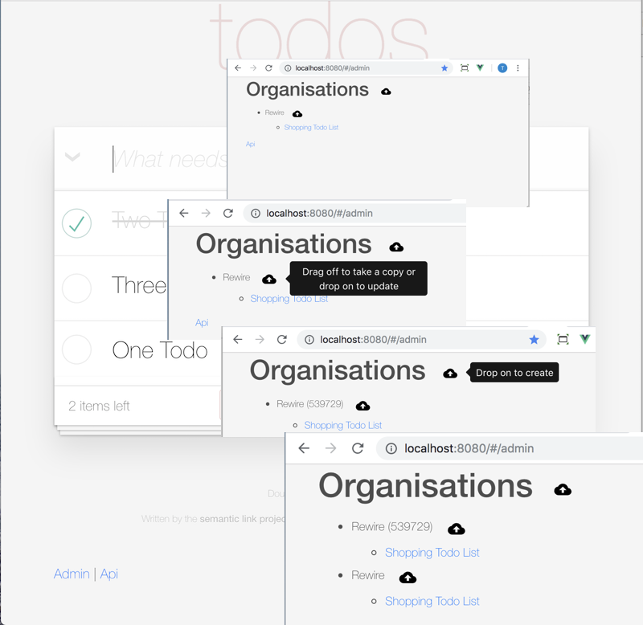
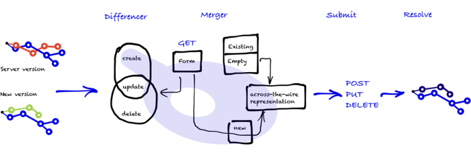

The are lots of ways to walk the API: the todo app displays it with a user interface; the general api browser walks and allows simple updates. Cloning resources extends the general purpose client and programmatically makes it possible to deal with complicated updates—its purpose is to make copies in bulk without people intervention. One easy example is the business problem of moving data between environments (eg between test to another test environment, or bringing production data back into another environment or from a production staging/testing into production).

All of this is made possible because hypermedia uses forms to instruct the client.

### Getting started: Admin

<Instruction>

Load up the admin view on the todo app. Click Admin (bottom left), drag 'Rewire' onto the drop target next to Organisations. A Rewire will be created (note: you might need to refresh the page)



</Instruction>

### Simple general principles

* have a client version that is the desired version
* match this against server version
* resolve differences and submit appropriate actions



#### Two examples:

1. Update existing resource: your client version is a copy of the server and all resource identities are the same; the only change is to remove some items and change a couple of attributes. This solution would do a mixture of DELETE and PUT requests.
2. Clone a resource: your client version has a different root parent (ie it has an identitity that does not yet exists). The change is significant that the resources below to root need to be re-parented (or put differently a part of the tree is copied and grafted into a new parent). This solution would require POST throughout but also match new resource against the old ones (ie substitutions).

All of this done using the semantic link cache library and the purpose of this tutorial is show how it is used (not how to build it) and the mental model it requires.

> Note: the drag'n'drop is just user-sugar to make the interaction practical. Again, if you want to understand the mechanics drag'n'drop look at the code (but the issue is that HTML5 API here is the right thing to do).

### Update existing

1. Drag the organisation off onto the desktop (that will get a copy as JSON, aka hydrate)
2. Update the JSON
3. Drag back onto the same

The instructions below are to process this

<Instruction>

Load (fully hydrate) the selected tenant on drag. Note: there is magic in here that the drag event is listening for an event because you can't communicate between events with promises.

```js{10,64}(path="...todo-aspnetcore/client/src/components/app/Admin.vue")
<template>
    <div class="hello">
        <h1>Organisations
            <drag-and-droppable-model
                    :model="this.$root.$api"
                    :context="this.$root.$api"
                    media-type="application/json"
                    :dropped="createTenantOnRoot">
                <b-button
                        variant="outline"
                        v-b-tooltip.hover.html.right
                        title="Drop on to create">
                    <add w="22px" h="22px"/>
                </b-button>
            </drag-and-droppable-model>
        </h1>
        <ul>
            <li v-for="tenant in tenantCollection" v-cloak>
                <span>{{ tenant.name }}</span>
                <drag-and-droppable-model
                        :model="tenant"
                        :async="true"
                        media-type="application/json"
                        :dropped="createOrUpdateTenant">
                    <b-button
                            @mousedown="hydrateTenant(tenant)"
                            variant="outline"
                            v-b-tooltip.hover.html.right
                            title="Drag off to take a copy or drop on to update"
                    >
                        <add w="22px" h="22px" title="Drag"/>
                    </b-button>
                </drag-and-droppable-model>

                <ul v-if="tenant && tenant.todos">
                    <li v-for="todo in tenant.todos.items" v-cloak>
                        <b-link @click="gotoTodo(todo)">{{ todo.name }}</b-link>
                    </li>
                </ul>

            </li>
        </ul>
    </div>
</template>

<script>
    import {_} from 'underscore';
    import {getUri} from 'semantic-link';
    import {log} from 'logger';
    import {redirectToTodo} from 'router';
    import DragAndDroppableModel from '../DragAndDroppableModel.vue'
    import {syncTenant} from '../../domain/tenant';
    import bButton from 'bootstrap-vue/es/components/button/button';
    import bLink from 'bootstrap-vue/es/components/link/link';
    import Add from 'vue-ionicons/dist/md-cloud-upload.vue';
    import bTooltip from 'bootstrap-vue/es/components/tooltip/tooltip'
    import {eventBus} from 'semantic-link-utils/EventBus';
    import {getTenantsOnUser, getUserTenant} from 'domain/tenant';
    import {getTodosWithTagsOnTenantTodos} from 'domain/todo';
    import {isCollectionEmpty, normalise} from 'semantic-network/utils/collection';


    export default {
        components: {DragAndDroppableModel, bButton, Add, bTooltip, bLink},
        data() {
            return {
            
                /**
                 * Tenants available for the user
                 */
                tenants: {},
            };
        },
        computed: {
            tenantCollection() {
                return this.tenants.items ? this.tenants.items : [];
            }
        },
        created: function () {

            log.info(`Loading tenants for user`);

            /**
             * Strategy One: use the first tenant from a provided list (when authenticated)
             * @param {ApiRepresentation} apiResource
             * @param {CacheOptions?} options
             * @returns {Promise|*}
             */
            const loadTenantsWithTodoLists = (apiResource, options) => {

                return getTenantsOnUser(apiResource, options)
                    .then(tenants => {

                        if (isCollectionEmpty(tenants)) {
                            this.$notify({
                                title: "You no longer have any organisation to belong to",
                                type: 'info'
                            });
                            log.info('No tenants found');
                        }

                        // need to bind the api into the vm data so that
                        // UI renders with the tree
                        this.tenants = tenants;

                        return tenants;
                    })
                    .then(tenants => getTodosWithTagsOnTenantTodos(tenants, options))
                    .catch(err => {
                        this.$notify({
                            text: err,
                            type: 'error'
                        });
                        log.error(err);
                    });
            };

            return loadTenantsWithTodoLists(this.$root.$api, this.$root.options);

        },
        methods: {

            /**
             * Helper that when a tenant is on start drag that the entire graph is hydrated. Once that is done
             * it hands back off with an event that needs to be listened for.
             *
             * Note: communicating between events async requires this approach
             *
             * @param {TenantRepresentation} tenant user's tenant
             */
            hydrateTenant(tenant) {
                getUserTenant(tenant)
                    .then(() => eventBus.$emit('resource:ready'))
                    .catch(err => {
                        this.$notify({type: 'error', title: 'Could not load up the tenant'});
                        log.error(err);
                    });
            },

        },
    };
</script>
```

</Instruction>

<Instruction>

Implement a hydration strategy across the API.

```js(path="...todo-aspnetcore/client/src/domain/tenant.js")
import {getUri} from 'semantic-link';
import {log} from 'logger';
import {get, uriMappingResolver, sync} from 'semantic-network';
import {getTodosWithTagsOnTenantTodos} from 'domain/todo';


/***********************************
 *
 * Retrieve tenant information
 * ===========================
 */


/**
 * Get the tenants that an authenticated user has access to (sparsely populated by default)
 *
 * Context: (api)
 * Access: -(me)-[tenants...]
 *
 * @param {ApiRepresentation} apiResource
 * @param {CacheOptions?} options
 * @returns {Promise<TenantCollectionRepresentation>}
 */
export const getTenantsOnUser = (apiResource, options) =>
    get(apiResource, /me/, options)
        .then(user => get(user, /tenants/, options));

/**
 * Get the users that exist on a user tenant
 *
 * @param userTenantsCollection
 * @param {CacheOptions?} options
 * @returns {Promise<CollectionRepresentation>}
 */
export const getTenantUsers = (userTenantsCollection, options) =>
    get(userTenantsCollection, /users/, {includeItems: true, ...options});

/**
 * Loads up a tenant to be copied with todos and users
 *
 * @param {TenantRepresentation} tenant
 * @param {CacheOptions?} options
 * @returns {Promise<TenantRepresentation>}
 */
export const getUserTenant = (tenant, options) =>
    Promise.all([getTodosWithTagsOnTenantTodos(tenant.todos, options), getTenantUsers(tenant, options)])
        .then(() => tenant);

```

</Instruction>

<Instruction>


```js{12,65}(path="...todo-aspnetcore/client/src/components/app/Admin.vue")
<template>
    <div>
         <ul>
            <li v-for="tenant in tenantCollection" v-cloak>
                <span>{{ tenant.name }}</span>
                <drag-and-droppable-model
                        :model="tenant"
                        :async="true"
                        media-type="application/json"
                        :dropped="createOrUpdateTenant">
                    ...
                </drag-and-droppable-model>
            </li>
        </ul>
    </div>
</template>

<script>
    import {log} from 'logger';
    import DragAndDroppableModel from '../DragAndDroppableModel.vue'
    import bButton from 'bootstrap-vue/es/components/button/button';
    import bTooltip from 'bootstrap-vue/es/components/tooltip/tooltip'
    import Add from 'vue-ionicons/dist/md-cloud-upload.vue';
    import {eventBus} from 'semantic-link-utils/EventBus';
    import {getTenantsOnUser, getUserTenant, getTodosWithTagsOnTenantTodos} from 'domain/tenant';

    export default {
        components: {DragAndDroppableModel, bButton, add, bTooltip},
        computed: {
            tenantCollection() {
                return this.tenants.items ? this.tenants.items : [];
            }
        },
        methods: {
            /**
             * Update an existing tenant with existing (or new) todo lists with tags)
             * @param tenantDocument
             */
            createOrUpdateTenant(tenantDocument) {

                syncTenant(this.$root.$api, tenantDocument, this.$root.options)

            },

        },
    };
</script>
```

</Instruction>

<Instruction>

Implement a sync strategy across the API. Note: the implementation of `pooledTagResourceResolver` follows

```js{93}(path="...todo-aspnetcore/client/src/domain/tenant.js")
import {getUri} from 'semantic-link';
import {log} from 'logger';
import {get, uriMappingResolver, sync} from 'semantic-network';
import {getTodosWithTagsOnTenantTodos} from 'domain/todo';

/***********************************
 *
 * Sync
 * ====
 */

/**
 * Clone a graph of aTenant todo lists
 *
 * Context: (api)-(me)-[tenants]
 * Access: [todos...]-[todos...]-[tags]
 * Pool: (api)-[tags]
 *
 * @param {ApiRepresentation} apiResource
 * @param {TenantRepresentation} aTenant
 * @param {CacheOptions?} options
 * @returns {Promise<TenantCollectionRepresentation>}
 */
export const syncTenant = (apiResource, aTenant, options) => {

    if (!aTenant) {
        throw new Error('Tenant is empty');
    }

    log.debug(`[Tenant] start create ${aTenant.name} ${aTenant.code}`);

    return getTenantsOnUser(apiResource, options)
        .then(userTenants => {
            log.debug(`[Tenant] users loaded ${getUri(userTenants, /self/)}`);
            return sync({
                resource: userTenants,
                document: aTenant,
                strategies: [syncResult => sync({
                    ...syncResult,
                    rel: /todos/,
                    strategies: [syncResult => sync({
                        ...syncResult,
                        rel: /todos/,
                        strategies: [({resource, document, options}) => sync(
                            {
                                resource,
                                rel: /tags/,
                                document,
                                options: {...options, batchSize: 1}
                            }),]

                    })],
                }),
                ],
                options: {
                    ...options,
                    resolver: uriMappingResolver
                }
            });
        });

};
```

</Instruction>

### Create or Update?

What is the difference between the two in the context of hypermedia? How to know whether to call create or update? You don't. The question the code asks of the data is the difference in state. Do you exist? Are you different?

In the sample, you can force a create by changing the root resource identity. This requires two changes, remove the 'self' link and change the 'name' attribute.

<Instruction>

Force create a new tenant

```js{13-7 }(path="...todo-hypermedia/client/src/components/app/Admin.vue")
        methods: {
            /**
             * Create a new tenant and clones existing lists/tags onto this tenant
             *
             * Note: demo version just creates its own new tenant with random numbers
             *
             * @param tenantDocument
             * @param apiResource
             */
            createTenantOnRoot(tenantDocument, apiResource) {

                // Ensure the survey name and code are 'unique' (To Be Deleted)
                tenantDocument.name = `${tenantDocument.name || 'New tenant'} (${Date.now() % 1000000})`;
                tenantDocument.code = `${Date.now() % 1000000}.${tenantDocument.code }`;
                if ('links' in tenantDocument) {
                    delete tenantDocument.links;
                }

                this.$notify('Starting create new tenant');

                this.createOrUpdateTenant(tenantDocument);
            },

```

</Instruction>

<Instruction>

Alternatively, drag the tenant into a JSON file and change the JSON

```text
{
  <del>"links": [                         <b><---- Update here by deleting</b>
    {
      "rel": "self",
      "href": "http://localhost:5000/user/933bcca4e2/tenant/9e27499f9a"
    },
    {
      "rel": "canonical",
      "href": "http://localhost:5000/tenant/9e27499f9a"
    },
    {
      "rel": "edit-form",
      "href": "http://localhost:5000/tenant/form/edit"
    }
  ],</del>
  "name": "Rewire [new]",                 <b><---- Update here (create unique)</b>
  "code": "[new]rewire.semanticlink.io",  <b><---- Update here</b>
  "description": "A sample tenant (company/organisation)",
  "todos": {
    "links": [
      {
        "rel": "self",
        "href": "http://localhost:5000/user/933bcca4e2/todolist"
      },
      {
        "rel": "create-form",
        "href": "http://localhost:5000/todolist/form/create"
      }
    ],
    "items": [
      {
        "links": [
          {
            "rel": "self",
            "href": "http://localhost:5000/todolist/1dedfe1c43"
          }
        ],
        "name": "Shopping Todo List"
      }
    ]
  }
}
```

</Instruction>

<Instruction>

Here's the diff file of above

```diff
@@ -1,20 +1,6 @@
 {
-  "links": [
-    {
-      "rel": "self",
-      "href": "http://localhost:5000/user/933bcca4e2/tenant/9e27499f9a"
-    },
-    {
-      "rel": "canonical",
-      "href": "http://localhost:5000/tenant/9e27499f9a"
-    },
-    {
-      "rel": "edit-form",
-      "href": "http://localhost:5000/tenant/form/edit"
-    }
-  ],
-  "name": "Rewire",
-  "code": "rewire.semanticlink.io",
+  "name": "Rewire [new]",
+  "code": "[new]rewire.semanticlink.io",
   "description": "A sample tenant (company/organisation)",
   "todos": {
     "links": [

```

</Instruction>