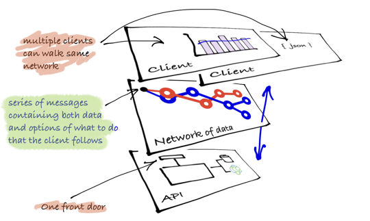

## Practice: different clients use the same Api in the same for different ends

Let's now see how there are always multiple types of clients for an Api.

1. Single resource: the client requests resources as needed (and discards)
2. Combination resource: the client requests resources tends cache resources and allow for rich processing
3. Resource processing: the clients needs to perform business processes with a high level of automation

## Examples

### Single resource

### Combination resource

### Processing resources

