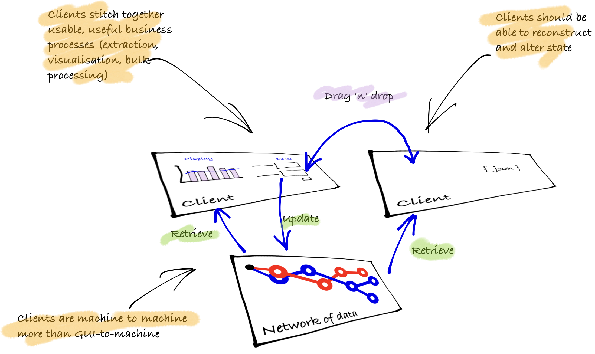
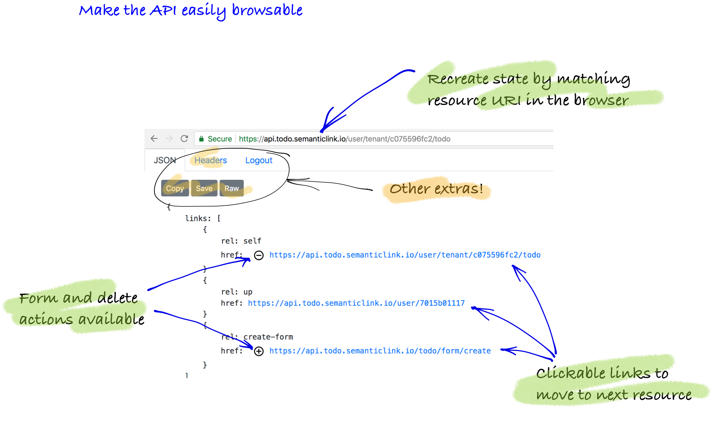
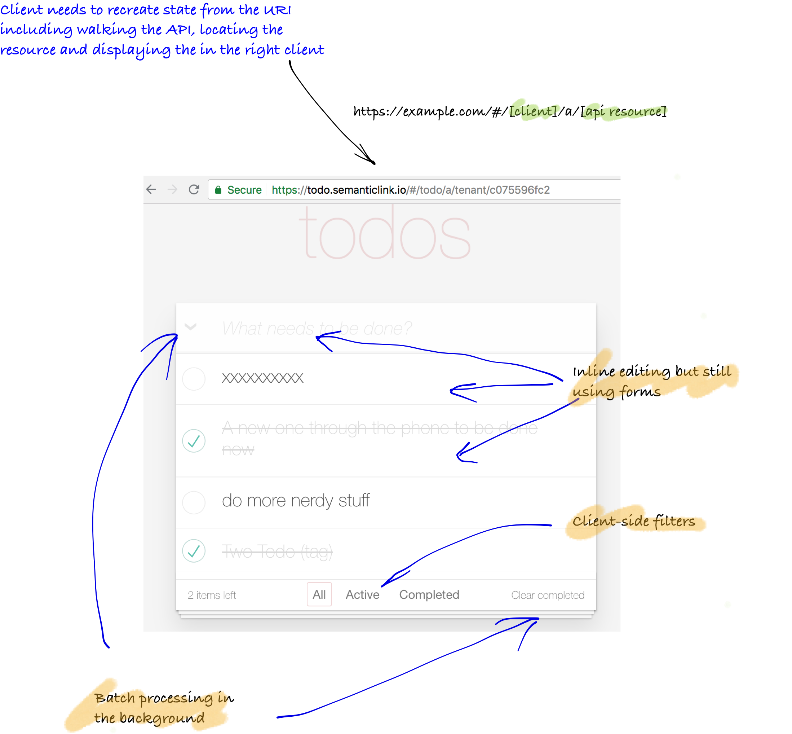
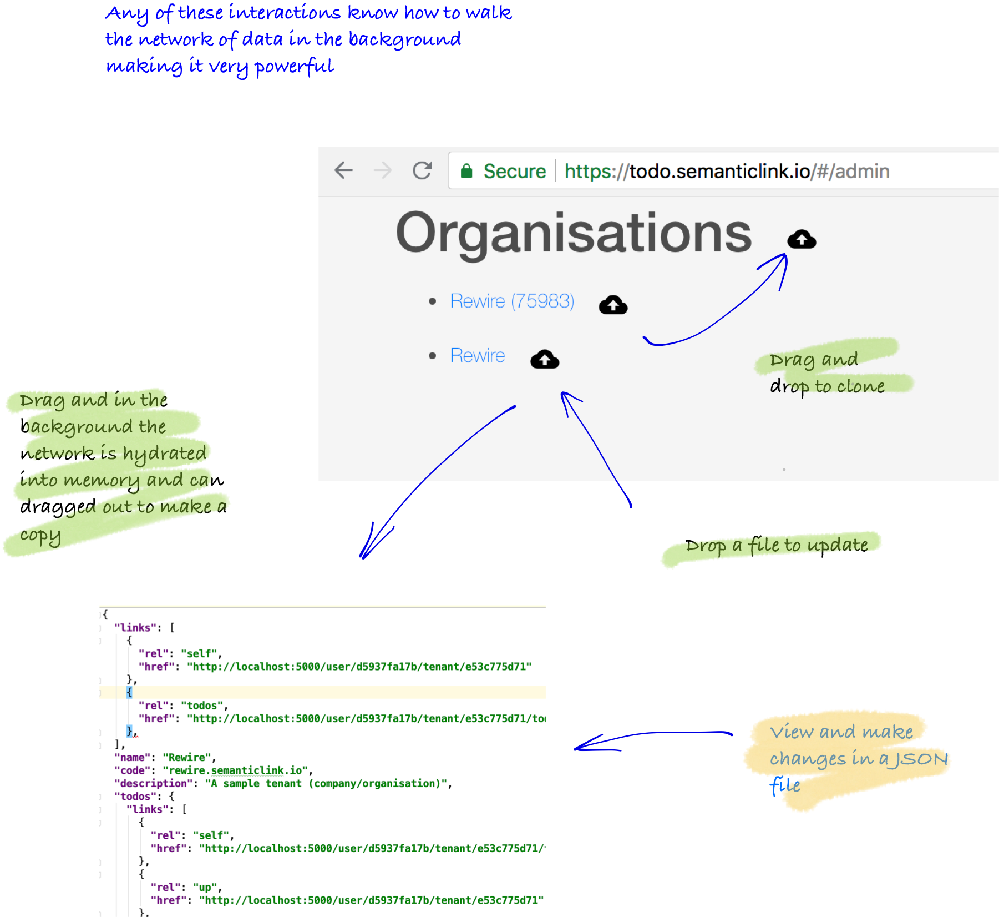

There are multiple types of clients that can walk across the API. Earlier solutions were concerned with different devices and languages (eg mobile vs desktop, browser vs native, React vs Vue) and what could be termed GUI-to-machine. In moving forward, hypermedia also aids the additional concerns of machine-to-machine and application-to-api concerns. The underlying design in this approach is how can the client reconstruct state and get the server to converge on a new state, whilst at the same time not require human interpretation/intervention?

**How to Hypermedia** has code samples for three different types of clients. This chapter gives context of how each of these clients are different. 

### Summary of clients

* **Single resource:** the client requests resources as needed and discards (independent representations across requests or between routes/views/controllers)
* **Combination resource:** the client requests resources and caches allowing for rich processing across requests (eg single-page application with cache across routes/views)
* **Resource processing:** the clients needs to perform business processes with a high level of automation (cache + synchronisation across multiple requests)

### Client one: single resource

In the samples, this is the general purpose client that is used to view the API itself. It is code that can make a single request/response display cycle. Primarily all it needs to be able to do is know mime type to convert it into a in-memory representation and find the `links` and then bind it to a generalised HTML view. It doesn't tend to scale well, nor does it need to. This example is the API browser code that can be shipped on every HTML representation of a resource.

### Client two: combination resource

In the samples, this is the 'todo' app with its rich interface and easy editing. The code makes many requests to build up a cache of representations that are then bound to the user interface. This approach can then streamline the user experience across a business process.

### Client three: processing resources

In the samples, this is the __admin__ function inside the todo app. The goal of the admin code is the clone or update entire data structures without intervention. The code is able to synchronise an entire network using only link relations (which hints for depth and width processing). In practice, this is used in multiple ways: as an export function, an bulk-processing update or to move data across environments. The purpose of this type of client is to perform bulk processing of the resources on the client (not on the server) without the need to batch process.

