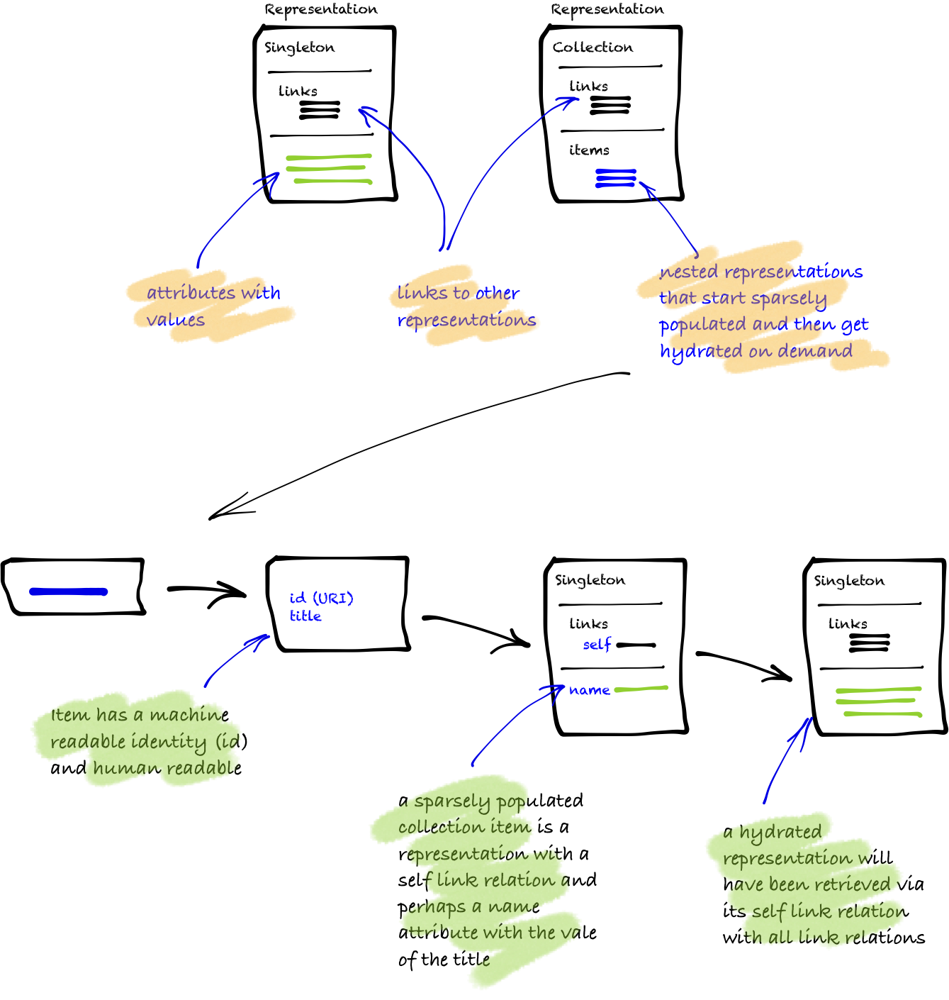

### Introduction

How To Hypermedia models the API based on collections and is not specific to any microformat (eg HAL, Collection+JSON, SIREN, JSON-LD + hydra, UBER or ATOM). This chapter explains the names/objects used throughout the tutorials for reference. Understanding this will help with understanding the approach to forms and the diagram representation of the TODO domain. Note: the collection always needs to be serialised to or deserialised from the across-the-wire format that the client requests. Most implementations will require multiple mime types and thus this tutorial sees those types as orthogonal and can be dealted with via programming patterns (eg Representator/Strategy) within the runtime framework pipeline.




###  Overview of the Semantic Link model

The Semantic Link conventions on hypermedia revolve around different ways to build up resources as representations with link relations.

* A **representation** has `links` to other representations and the attributes of the representation itself.

Representations are generally referred to as a singleton or collection resource. A collection has a number of items each of which in turn are a representation. In any representation the link relations can also refer to another representation.

<Instruction>

Structurally

```bash
.
└── Representation
    ├── Singleton
    └── Collection
            └── Items
```

</Instruction>

### Concrete implementation of the Semantic Link model

The next step is that the implementation has a slightly different abstraction. Singleton representations are concrete LinkedRepresentations and Collection representations are FeedRepresentations where its items become LinkedRepresentations. These abstractions align with building the way the Web works.

#### Resources

* **LinkedRepresentation:** all representations have links (inherit `LinkedRepresentation`)
* **Singleton representation:** is a LinkedRepresentation because it inherits from LinkedRepresentation and is its own first-class citizen
* **Collection representation:** is a logical resource which is an instantiated FeedRepresentation with references to zero-to-many singleton resources
* **FeedRepresentation:** is a sparsely populated collection representation, where each item is populated as a FeedItemRepresentation (note: collections can also be modelled with multiple link rels of the same name)
* **FeedItemRepresentation:** minimal set of information to identify a resource, eg the location (URI) and title


##### Links

* **Links:** a set of information to identify a representation and the nature of its relationship as a `link relation` or "vocabulary" (is a set of `WebLink`s)
* **Link Relation:** a descriptive attribute that defines the type of link, or the relationship between the source and destination resources. These are known at design and come in at least two forms: IANA and custom (eg also Schema.org, Microformats, Dublin Core and Activity Streams). _IANA Link Relations_ are a [published set](https://www.iana.org/assignments/link-relations/link-relations.xhtml#link-relations-1) of publicly, well-known link relations. _Custom Link Relations_ are specific to the domain (ie todo) of the application to model singletons and collection representations (see next tutorial page)

> Note: modelling representations requires links and most formal hypermedia types model collections—this is independent of the media type that is send across the wire (aka the Strategy/Representor Pattern). Input and output serialisers are covered in a later chapter.

<Instruction>

In pseudo code:

```uml
abstract class LinkedRepresentation {
    Links : WebLink[]
}

class WebLink {
   Rel : string
   HRef : string
   Title : string?
   Type : string?
}

class FeedRepresentation {
    Items : FeedItemRepresentation[]
}

class FeedItemRepresentation  {
    Id : string
    Title : string
    Published : DateTime?
    Updated : DateTime?
    Author : string?
    Categories : string[]?
}

```

</Instruction>

### Diagrams: representating singletons, collections and links

This diagram is one way to view the domain at its highest level. It should indicate the main groupings domain objects and their custom link relations. It should show the navigation of link relations to move around collections. It tends to not have the IANA link relations because clutter this view. Developers will need this when reasoning about the domain. The next view below this is the API itself (or some static view of the API if need be—in practice, the static view currently practiced for endpoints and attributes falls by the wayside and becomes an unnecessary overhead). Currently, there is no tooling to extract this view from the code base but wouldn't be hard.

Look at the model below to understand that:

* Home singleton (root of the network of data)
* `tags` link rel to a collection of `tag` representations in the items
* `users` link rel to a collection of `user` representations in the items
* `me` link rel to a specific `user` representation (in this case this is also a virtual resource redirecting to another user representation)

This diagram can be read as, the root (which has a version number) links to two collections and also a virtual resource to an item in one of those collections.


#### Diagram Key

- yellow box: singleton representation
- line with circle: named collection representation based on the link relation where the joining representation is an item
- line only: singleton representation through the link relation
- dotted line: virtual resource through the link relation


<Instruction>

The model written in [`puml`](http://plantuml.com/class-diagram)

```bash
class home as "Home/Root of the API" <<H, #00FF00) >>
home +--|> tag : tags
home .--|> user : me
home +--|> user : users
```

</Instruction>
