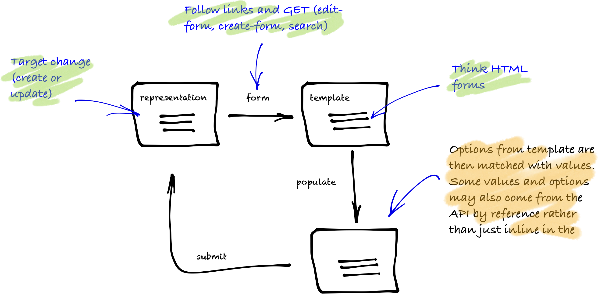

Hypermedia benefits from affordances. These are hints from the server about what the client is able to ask the server to do. The most underutilised affordance is forms. Forms are templates and in practice are based on HTML forms. In the context of a resource, a form provides message framing details about how to send information back to the server and in what form.

Forms can also provide information to the client on how to display the information when there is human input required.



There are a number of situations that use forms:

* create a resource on a collection
* update a resource
* search (which is to create a resource on a collection)
* change membership in a collection

<Instruction>

Semantic Link has these three top-level pre-baked forms

```bash
.
└── Form
    ├── CreateFormRepresentation
    ├── EditFormRepresentation
    └── SearchFormRepresentation
```

</Instruction>

When modelling hypermedia, resources are modelled as nouns. In these tutorials, forms are usually modelled as links through verbs (eg pay, payment, search) or through the ubiquitious edit-form or create-form. This is in contrast to some microformats that embed the forms in the resource itself (eg HAL-FORMS as `_templates` attribute).

Finally, the implementation of forms in Semantic Link is based on the collection abstraction. A form representation is a linked representation and, like a collection, will have `items`.

### Heads up! forms need to cater for

HTML forms model most aspects of a hypermedia form:

- field: type, name, value, validations (eg text, password, email, number, url, tel, date, time, range, color—see [html spec](https://www.w3.org/TR/html5/single-page.html#the-input-element))
- single (by value)
- enumeration (by value) (eg select)

<Instruction>

Here are the main types of fields found:

```bash
.
└── Form
    ├── CheckInputFormItemRepresentation
    ├── DateInputFormItemRepresentation
    ├── DateTimeInputFormItemRepresentation
    ├── EmailInputFormItemRepresentation
    ├── PasswordInputFormItemRepresentation
    ├── SelectFormItemRepresentation
    ├── SelectOptionItemRepresentation
    ├── TextInputFormItemRepresentation
    └── UriInputFormItemRepresentation
```

</Instruction>


But HTML also needs a bit more modelling:

- groups
- values/enumerations by reference (that is not inline but found somewhere else via link relations)

<Instruction>

Here are the main types of fields found:

```bash
.
└── Form
    ├── CollectionInputFormItemRepresentation
    ├── GroupFormItemRepresentation
    ├── JsonPointerInputFormItemRepresentation
    ├── SelectOptionGroupItemRepresentation
    ├── SelectOptionItemRepresentation
    └── SelectOptionValueItemRepresentation
```
</Instruction>

<Instruction>

In pseudo code:

```uml
abstract class LinkedRepresentation {
    Links : WebLink[]
}

class WebLink {
   Rel : string
   HRef : string
   Title : string?
   Type : string?
}

class FormRepresentation : LinkedRepresentation {
    Items : FormItemRepresentation[]
}

abstract class FormItemRepresentation  {
    // NOTE: clients bind local controls to this type
    Type : string  // 'text', 'password', 'email', 'number', 'url', 'tel', 'date', `time`, 'range', 'color'

    Id : string
    Name : string
    Required : string
    Description : string
    Multiple : bool
}

class CreateFormRepresentation : FormRepresentation
class EditFormRepresentation : FormRepresentation
class SearchFormRepresentation : FormRepresentation

class CheckInputFormItemRepresentation : FormItemRepresentation
class DateInputFormItemRepresentation : FormItemRepresentation
class DateTimeInputFormItemRepresentation : FormItemRepresentation
class EmailInputFormItemRepresentation : FormItemRepresentation
class PasswordInputFormItemRepresentation : FormItemRepresentation
class SelectOptionItemRepresentation : FormItemRepresentation
class TextInputFormItemRepresentation : FormItemRepresentation
class UriInputFormItemRepresentation : FormItemRepresentation
class CollectionInputFormItemRepresentation : FormItemRepresentation
class JsonPointerInputFormItemRepresentation : FormItemRepresentation


class GroupFormItemRepresentation : FormItemRepresentation {
    Items: FormItemRepresentation[]
}
class SelectFormItemRepresentation : FormItemRepresentation{
    Items: SelectOptionItemRepresentation[]
}
class SelectOptionItemRepresentation : FormItemRepresentation {
    Selected: bool
}
class SelectOptionGroupItemRepresentation : SelectOptionItemRepresentation {
    Link: WebLink
    Items: SelectOptionItemRepresentation[]
}
class SelectOptionValueItemRepresentation  : SelectOptionItemRepresentation{
    Value: string
    Label: string
}

```

</Instruction>

<Instruction>

Psuedo code example construction of a (create) form

```
CreateFormRepresentation
    {
        Links = []
        {
            // self link to this form
            url.MakeTodoCreateFormUri().MakeWebLink(IanaLinkRelation.Self)
        }
        Items = FormItemRepresentation[]
            {
                TextInputFormItemRepresentation
                {
                    Name = "name"
                    Description = "The title of the page"
                    Required = true
                }
                SelectFormItemRepresentation
                {
                    Name = "state"
                    Description = "A todo can only toggle between open and complete."
                    Required = false
                    Multiple = false
                    Items = SelectOptionItemRepresentation[]
                    {
                        SelectOptionValueItemRepresentation
                        {
                            Type = FormType.Enum
                            Description = "The todo has been completed"
                            Label = "Completed"
                            Value = TodoState.Complete
                            Name = "completed"
                        }
                        SelectOptionValueItemRepresentation
                        {
                            Type = FormType.Enum
                            Description = "The todo has been opened"
                            Label = "Open"
                            Value = TodoState.Open
                            Name = "open"
                        }
                    }
                }
                DateTimeInputFormItemRepresentation
                {
                    Name = "due"
                    Description = "The UTC date the todo is due"
                }
            }
    }
```

</Instruction>

### Forms submission

Forms are submitted semantically. That is, there are a series of rules/conventions that allow the client to converge on a decision of where and how to submit. Some microformat require explicit rules. An alternative way to look at the problem is to see that (those explicit) rules are merely higher priority and that the client needs a range of options to fallback on. Some of this is because of the design to separate out forms from the originating resource.

Key designs:

* forms are linked from the resource and thus have their own identity
* forms are ideally highly cachable thus by default provide no submission information
* forms are submitted in the context of the orginating resource
* forms can provide override behaviours

Conventions because we are modelling in collections which all submit back on the 'self' link on originating resource:

* edit-form is an update of a singleton: PUT
* create-form is a new resource on a collection: POST
* edit-form with type 'text/uri-list' is an update on items on a collection: PUT
* edit-form with type 'application/json-patch+json' is an update on items in a collection: PATCH

> Note: this is a highly constrained implementation. Also, DELETE is assumed to never use forms and to DELETE items on a collection is DELETE a singleton which also removes it from the collection. A PUT/PATCH only updates the collection membership.

The form may be marked up with overrides in the 'submit' link relation:

* HRef is an explicit resource to submit to
* Type is an explicit mime-type to submit using
* Method is an explicit override (POST, PUT, PATCH)