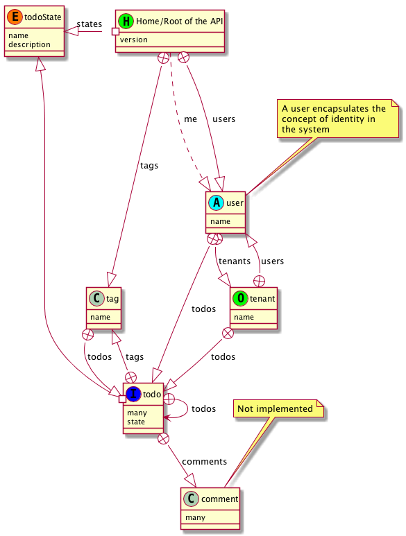

### Modelling the API (via collections)

Below is a diagram of the Todo domain that is the API. The key point of this diagram is to be able to reason about the context and paths of resources. Its goal is not to see everything but rather to see the essential complexity of the domain. Link relations like self, up and even edit-form, create-form and submit are accidental complexity at this level of abstraction.

This model is best understood in the context of a working knowledge with the network of data itself (and the attributes of resources)—which is why the API needs a general purpose client to make browsing the API part of the discovery (and learning process) of the domain. Browse the [API here](https://api.todo.semanticlink.io).

> Note: this diagram is a logical model of the domain and contains the heart of the domain including future resources. It also doesn't contain authorisation/authentication aspects.



<Instruction>

Create your own 'puml' file (based on dot notation) here from the network of data.

```dot
class home as "Home/Root of the API" &lt;&lt;H, #00FF00) >>
home : version
' home +--|> tenant : tenants
home +--|> tag : tags
home #-left-|> todoState : states
home .--|> user : me
home +--|> user : users

class tag as "tag"
tag : name
tag +--|> todo : todos

class tenant as "tenant"  &lt;&lt;O, #00FF00) >>
tenant : name
tenant +--|> user : users
tenant +--|> todo : todos


class todo as "todo"   &lt;&lt;I, #0000FF) >>
todo : many
todo : state
todo +--> todo : todos
todo #--|> todoState
todo +--|> comment : comments
todo +--|> tag : tags

class comment as "comment"
comment : many
note top
  Not implemented
end note

'
' Integration Support
' ===================
'

class user as "User"  &lt;&lt;A, #00FFFF) >>
note top
  A user encapsulates the
  concept of identity in
  the system
end note
user : name
user +--|> tenant : tenants
user +--|> todo : todos


'
' Enumeration resources
' =====================
'

class todoState  as "Todo States (enum)" &lt;&lt;E, #FF7700) >>
todoState : name
todoState : description

```

</Instruction>

### Future extensions

Currently, this approach is manual and not generated from the API itself. In a public API (ie one that you don't control both the API and the client(s)), you may want use the 'home' link relation at the root of the API (see [json-home](https://mnot.github.io/I-D/json-home/)).