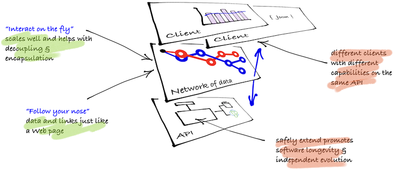

### Hypermedia: follow you nose

It has become increasingly common to use HTTP for applications as well just browsing the Internet. There have been various incarnations of using "HTTP APIs" to integrate processes on disparate systems to make information available across machines. Early versions used HTTP as transport protocol (eg SOAP) whereas later ones layer across HTTP as an application protocol. By using HTTP as an application protocol, these applications realise a number of benefits, including caching, message framing, and in practice a well-defined semantics that are approachable, easy to understand and easy to use.

In the first attempts of these applications, a set of known URIs were set up as the contract between clients and servers. This approach is still dominant and creates an early binding between clients and servers that makes certain types of changes difficult because both sides must change at the same time. It is made all the more difficult when APIs are built for certain types of clients or client environments. So in practice, we need ways to remain stable as APIs evolve and change whether through extension or drift.

In looking for solutions, the Web itself offers one way to address these issues, using links to navigate between states. A link-driven application discovers relevant resources at run time, using a shared vocabulary of link relations and internet media types to support a “follow your nose” style of interaction–just as a Web browser does to navigate the Web. This can be understood as an approach to hypermedia.

Later approaches to applications using HTTP have followed this hypermedia approach. One key difference to earlier approaches is that the client does not know in advance what a URI will be. In fact, the client should never care. Rather a client can decide which resources to interact with "on the fly" based upon its own capabilities (that is, the link relations that it understands). In this way, the server can safely add new resources or extend current resources) without disturbing clients that are not yet aware of them.

> Building HTTP applications based on hypermedia is building on the way the Web works

### Why *How to Hyperemdia*?

Hypermedia does feel like it is for the dedicated. These tutorials have grown out of a frustration that there aren't enough examples making concrete discussion quite hard around the pros and cons of designs. Examples are notoriously hard to get right in the sweetspot between simplicity and complexity. There are at least two other trends that align with hypermedia remaining niche:

- __too many microformats__: the fundamentals of hypermedia are pretty straightforward and many of the conventions found in microformats confuse understanding design issues of hypermedia. Because each microformats solves its own underlying issue, the tutorials should help you better assess what you need.
- __not enough tooling__: mainstream adoption has been hindered because of tooling. Tooling has been hindered because of understanding. Understanding has been hindered because of lack of examples. There is a lack of adoption because there aren't enough examples (out in the wild). Get the picture? These examples may help with adoption.

### Approach

**How to Hypermedia** is a series of tutorials structured to guide you through code extracts from the samples. Each tutorial is code heavy as to provide clear examples of different implementations in different languages across both the API and client. These tutorials are for developers wanted to know how some has coded out an approach. Because the code samples are working samples, the tutorials guide you through the essential complexity of the solution relative to producing and consuming hypermedia. The writers of tutorials have done their best to put to the aside accidental complexity in the solutions because these parts will change with frameworks and solutions (yet, it is all there if you need it by checking out the repositories).

### The `todo` application as the example

Examples that show just the right level of complexity are difficult. Previous books in this area have already covered coffee ordering system, shopping carts and task processing. In the area of tutorials and comparisons for languages and framworks, [TodoMVC](http://todomvc.com/) has proved effective. How to hypermedia has used this as a basis for GUI-based clients for ease of implementation. However, a todo list by itself does not have enough complexity to demonstrate some of the key aspects of an application. The todo app is hoped to add enough complexity that people can grok without being overwhelmed by the domain. The application required tenanting, child collections, static collections and some recursive structures too!

If you want to understand more about design then the Hypermedia fundamentals and advanced should be read by clicking of go to next chapter below. Otherwise, go straight for the code!

### Samples: `API` and `client` structure

Tutorials are split between the API and the client. The api is the thing that we work against—it needs to replace the database in our thinking as 'the' integration point of solutions. The client is something that can work against the api and there can multiple clients to an api, be developed at a different rate to the api development and consume the api to varying levels of complexity and scale.

All tutorial code can be cloned and are outlined in each Getting Started section.