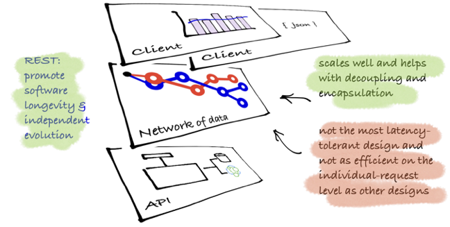

> It is becoming increasingly common to use HTTP [RFC7230] for applications other than traditional Web browsing. Such “HTTP APIs” are used to integrate processes on disparate systems, make information available to machines across the Internet, and as part of the implementation of “microservices.”
>
> By using HTTP, these applications realise a number of benefits, from message framing to caching, and well-defined semantics that are broadly understood and useful.
>
> Often, these applications of HTTP are defined by documenting static URLs that clients need to know and servers need to implement. Any interaction outside of these bounds is uncharted territory.
>
> For some applications, this approach brings issues, especially when the interface changes, either due to evolution, extension or drift between implementations. Furthermore, implementing more than one instance of interface can bring further issues, as different environments have different requirements.
>
> The Web itself offers one way to address these issues, using links [RFC3986] to navigate between states. A link-driven application discovers relevant resources at run time, using a shared vocabulary of link relations [RFC5988] and internet media types [RFC6838] to support a “follow your nose” style of interaction – just as a Web browser does to navigate the Web.
>
> A client can then decide which resources to interact with “on the fly” based upon its capabilities (as described by link relations), and the server can safely add new resources and formats without disturbing clients that are not yet aware of them.
>
> Doing so can provide any of a number of benefits, including:
>
> - Extensibility - Because new server capabilities can be expressed as link relations, new features can be layered in without introducing a new API version; clients will discover them in the home document. This promotes loose coupling between clients and servers.
> - Evolvability - Likewise, interfaces can change gradually by introducing a new link relation and/or format while still supporting the old ones.
> - Customisation - Home documents can be tailored for the client, allowing different classes of service or different client permissions to be exposed naturally.
> - Flexible deployment - Since URLs aren’t baked into documentation, the server can choose what URLs to use for a given service.
> - API mixing - Likewise, more than one API can be deployed on a given server, without fear of collisions.
> Whether an application ought to use links in this fashion depends on how it is deployed; generally, the most benefit will be received when multiple instances of the service are deployed, possibly with different versions, and they are consumed by clients with different capabilities.
>

From https://mnot.github.io/I-D/json-home/

How to Hypermedia is a  series of tutorials are a place to unlock some of fundamental techniques in building these applications using a REST-style of architecture: flexibility, scale, standardisation, loose coupling and most importantly understanding of the business domain. These tutorials should provide clear examples of different implementations in different languages across both the api and client.

> Building applications based on hypermedia is building on the way the web works.

### Real business issues

Hypermedia solutions should solve real business problems and not be the technology wagging the business tail. Real issues that fit are:

- model business processes while deferring graphical elements (GUI workflow is device dependent but the underlying engine is the same)
- easily expose customers' data to them whilst retaining fine-grained security
- be able to copy/move data around between contexts (often this is a provisioning issue for the business)

### Barriers to adoption

- __too many microformats__: the fundamentals of hypermedia are pretty straightforward and many of conventions found in microformats confuse understanding design issues. All of the microformats have to solve an underlying issue—the tutorials will help you understand this.
- __not enough tooling__: adoption has been hindered because of tooling. Tooling has been hindered because of understanding. Understanding has been hindered because of lack of examples. There is a lack of adoption because there aren't enough examples (out in the wild). Get the picture? These examples may help with adoption.

### The `todo` application as the example

Examples that show just the right level of complexity are notoriously hard. In this area, we've already had a business systems (eg coffee ordering system, shopping carts), GTDs (eg task processing). In the area of tutorials and comparisons, [TodoMVC](http://todomvc.com/) has proved effective. How to hypermedia has used this as a basis for GUI-based clients for ease of implementation. However, a todo list by itself does not have enough complexity to demonstrate some of the key aspects of an application. The todo app is hoped to add enough complexity that people can grok without being overwhelmed by the domain. The application required tenanting, child collections, static collections.

### Samples: `api` and `client` structure

Tutorials are split between the api and the client. The api is the thing that we work against—it needs to replace the database in our thinking as 'the' integration point of solutions. The client is something that can work against the api and there can multiple clients to an api, be developed at a different rate to the api development and consume the api to varying levels of complexity and scale.
