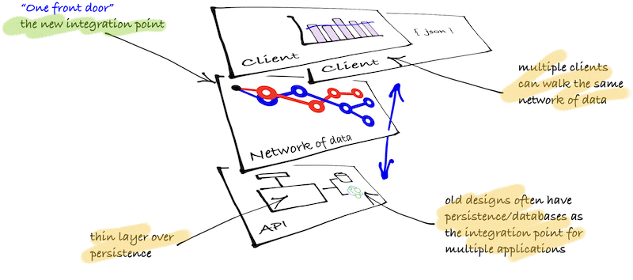

Think of a hypermedia solution as three logical layers rather than two. A traditional approach to layers is two: client/server, backend/frontend. This approach as described in the previous page tends towards designs that couple the client too tightly with the server, particularly through static URLs.

Because of the follow-your-nose approach of hypermedia, this third layer contains a series of messages including both data and options of what is available to the client. This 'network of data' layer is now the integration point regardless of the type of client and ensures that HTTP is used an application protocol to help with message framing. Unlike designs where persistence is the integration point from multiple applications, this design has one, and only one, front door.

The tutorials contain code samples that show how the API code is only a thin, but necessary, layer over the persistent that connects resources as linked set of data. The tutorials also show that how multiple types of clients can walk the same of network of data to different effect.

In all, the business value of hypermedia is to expose the available business functions though a Web browser that are broadly understood and useful because it allows people to browse the domain and incrementally build up knowledge about the specifics and limits of the current domain.