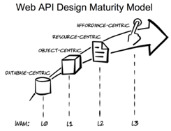
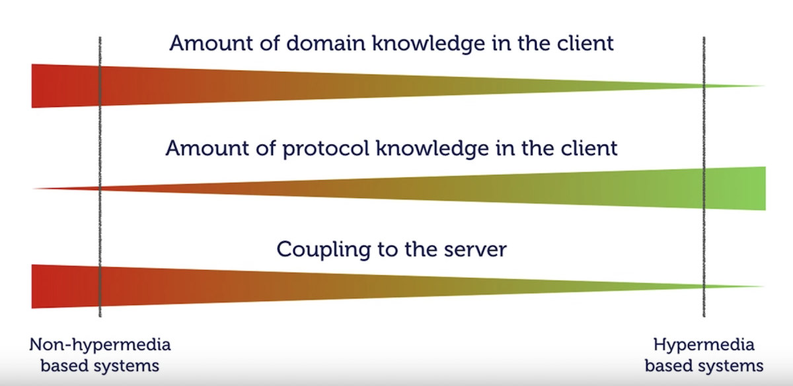

It is generally accepted that the mechanics of writing a client for a hypermedia Api is currently harder than writing the Api itself. This tutorial series is all about working with this problem by providing examples to known problems. The hypothesis is that because hypermedia Apis are not mainstream we still don't have enough people working on the tooling thus making the bootstrap process too time consuming and ridden with newby mistakes.

### Key concept: reduce coupling

A client that consumes a hypermedia Api binds primarily to the link relation. Currently, this is the "brittle" aspect because it must be coded a design time. A less brittle aspect are the attributes of the resource. If you need attribute checking there are ways to get design time support (eg IDE/compile checking).

A more formal way to understand this is explained in the diagram below showing the constrast with non-hypermedia clients (watch from [here](https://youtu.be/NdZqeAAIHzc?t=2172) for more details)

Source: [DDD & REST - Domain Driven APIs for the web - Oliver Gierke](https://youtu.be/NdZqeAAIHzc?t=2506)
