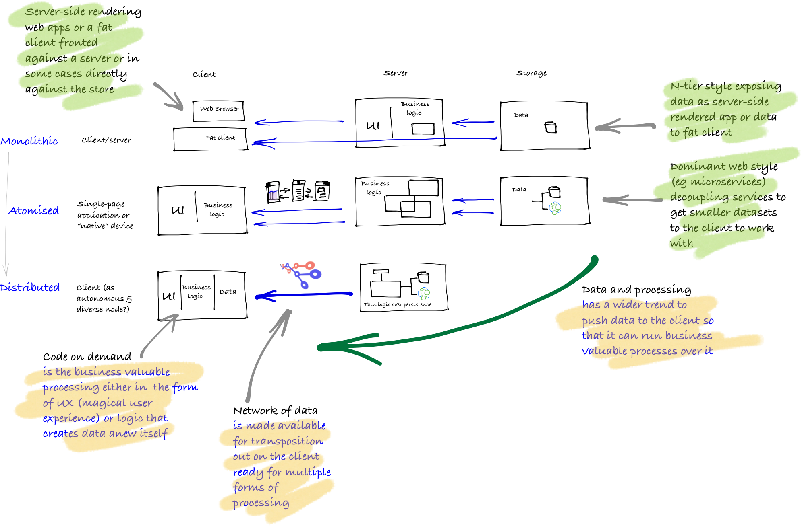

_How to Hypermedia_ is focused on building and consuming hypermedia APIs that are part of a wider trend towards data and business logic being process at the client edge. As such, the API shows an implementation where the construction of the network of data is merely a thin layer over persistence. The client contains an increasing amount of processing logic that has been provided on-demand toward business processes that while may have human intervention operates as though it is a machine-to-machine interaction.

The goal of the API is to allow for the right compromise between adaptability and robustness in the impedance mistmatch between how data is stored and how it is to be consumed. It assumes that the network of data puts together atomic pieces into a larger whole and structures relationships between the parts and how they will work together as a unit, or remain separate. It then can create strength and reduction of errors by providing the constraints in which the client can act.

The client (or clients) in turn need to be able to follow these rules for a desired end. More importantly, the approach is convergent toward an end state through semantic processes. These tutorials show some different implementations that demonstrate this. With convergence, in the tutorials, the implementations demonstrate ways in which data is transposed onto the client ready for processing and then it uses semantic processing around forms as a way to set the new state.

#### Keeping it together by pulling it apart

The version of hypermedia enacted in these tutorials is part of the last wave of informational diversity in a wider trend (actually more a cyclical pattern destined to repeat itself) based on Toffler's three waves explained [here](http://markburgess.org/certainty.html):

 * **Monolithic:** a single, self contained construction, held together strongly by internal coupling of its parts to keep stability and robustness
 * **Atomised:** decouple dynamics by atomising into components (eg microservices), weakly coupling them for greater stability (although at the same time this diversification requires adding coordination and indirection to make them useful for solving business problems, resulting in perhaps a greater level of brittle coupling than expected)—and then note as the atomisation goes too far and uncertainty kicks in there is a swing back to unification
 * **Distributed:** add semantics for balancing simplicity and complexity over multiple scales (the attempt here is to balance atomicity and stability through understanding that instability revolves around two axes of vulnerability: thresholds and intrinsic scales; and misinterpreted and misintentioned messages)—the idea here is to add constraints which helps with a tolerance of diversity and a more effective exploitation of robust growth because the client gets increased responsibility and contextual knowledge
