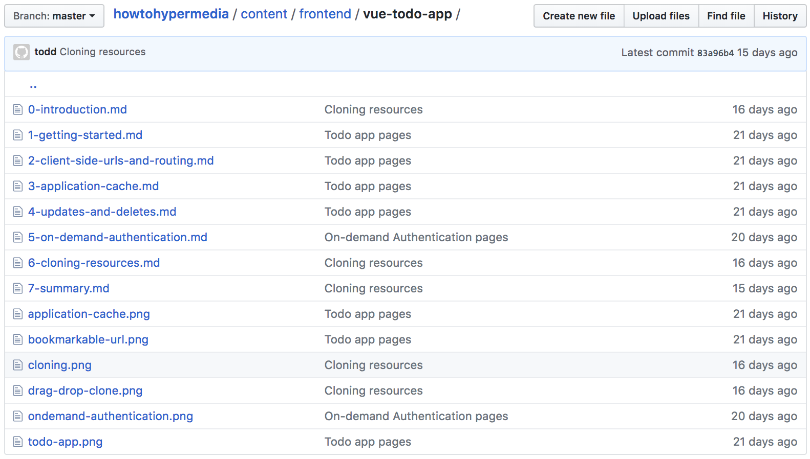
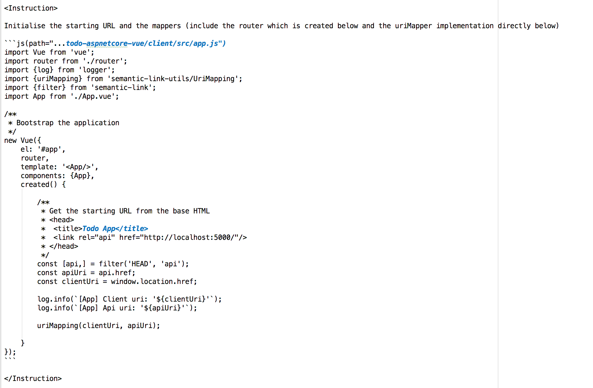
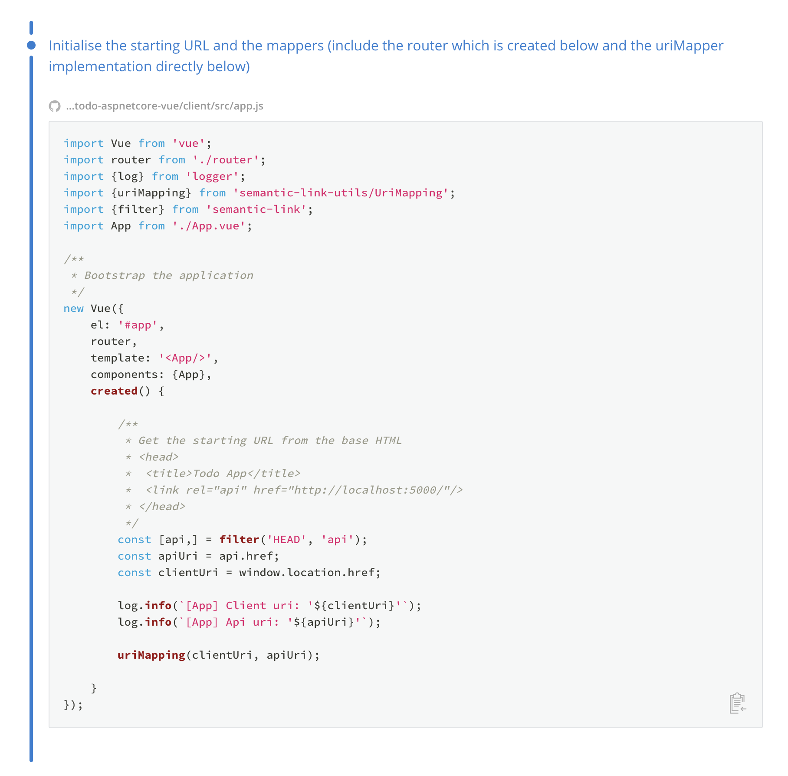

# Writing Guidelines for _How To Hypermedia_ Tutorial Tracks

This document describes writing guidelines and best practices for the **How to Hypermedia** tutorial tracks (frontend + backend). With thanks, these instructions are based on [HowToGraphQL](https://www.howtographql.com).

## As well as adding a tutorial

1. Add an icon for technology stack in `src/assets/icons
2. Add an person image for technology stack in `src/assets/graphics/contributors`
3. Add an author `src/data/authors.ts`
4. Add a stack `src/data/stack.ts` (which includes links to icons and people above)
5. Now, create a new tutorial in either `content/backend` or `content/frontend`

## Document Format

Your tutorial _track_ should be divided into shorter _chapters_. Each chapter needs to be a single markdown document. The name of each document has to be prepended with the index of the chapter, starting at 0.

[Here](https://github.com/semanticlink/howtohypermedia/tree/master/content/frontend/vue-todo-app) is what the example structure for the Vue tutorial looks like:



Also notice that each single chapter needs to have a **frontmatter** with the following information surrounded with dashes '---':

- `title`
- `description`
- `question` 
- `answers`
- `correctAnswer`

`question`, `answers` and `correctAnswer` define the multiple choice question that will be displayed to the reader at the end of each chapter.

[Here](https://github.com/semanticlink/howtohypermedia/blob/master/content/hypermedia/basics/1-minimally-layered-design.md) is an example for the frontmatter:

```
---
title: "Minimally layered design"
pageTitle: "Keep a separation between clients and API"
description: "Learn why hypermedia is a thin layer across persistence that should guide us through the business problem."
question: What is a benefit of a network of data?
answers: ["It should be easy navigated through a browser", "It has fine grained access control", "It can use HTTP as an application protocol", "All of the above!"]
correctAnswer: 3
duration: 5
---

```

> Note: correct answers are 0 indexed.

#### Additional bits

```
videoId: 5kjh67h73g <- youtube ID
authorId: ""
```

Generally, these should not be used and are reserved for the 'hypermedia' section to include videos which are more context and explanatory in nature rather than demonstrating/walking through the relevant code.

## Custom Formatting Rules

### Instruction Block

In your tutorials, you should always speak very directly to the reader. Particularly you have to make it very clear when the reader actually has to do something to move forward with the example project. That's what you're using the concept of an **Instruction Block** for.

Instruction blocks will be visually highlighted on the website. This has two advantages:

1. Fast readers who are only interested in moving forward with the code don't have to spend unnecessary time reading explanations since it's very clear when in the tutorial they're required to perform an action
2. It's less likely that a reader will accidentally miss a part where they were required to do something

You'll use the `<Instruction>` tag to mark a sentence or a paragraph as an instruction. Notice that the **opening and closing tags need to have one line break in between the content**. This is what a simple example looks like:

```
<Instruction>

Inspect the request headers on your browser for your request above (eg in [Chrome](https://www.mkyong.com/computer-tips/how-to-view-http-headers-in-google-chrome/) or [Firefox](https://o7planning.org/en/11637/how-to-view-http-headers-in-firefox)) and look the `Accept` header.

</Instruction>
```

Often times, you'll want to combine a short instruction with a code block that the user has to copy into their project:



This is what a rendered instruction block (including code block) will look like: 



**IMPORTANT**: There are two important notes about using _code blocks_ in an instruction block:

1. One instruction block can only contain at most one code block. If you require multiple code blocks, you need to put them into multiple instruction blocks.
2. Each instruction can only be one paragraph (ie no bullet points)
3. The code block must always come at the very _end_ of an instruction block - otherwise the it won't be rendered properly.

Instruction blocks can only contain _one_ code block. If you need the reader to perform multiple steps in a row, please use multiple instruction blocks!

### Code Blocks

For code blocks, you should include special annotations that provide more context to the reader. This is a list of the possible annotations:

1. adding the filename where that snippet is located (or the directory in the terminal where a command should be executed)
2. adding a "copy"-button (**on by default**) so that the user can easily copy the snippet rather than having to select+copy it
3. highlighting lines in the snippet

### Code Block style guide

The goal is to make the code self explanatory (or well cross referenced) just like real code but realising that it also needs to brief

1. Please include dependency declaration syntax rather than leave out eg `import`, `using`
2. Please include documentation (and/or add to the code itself!). Don't document the code but its assumptions and cross-referencing
3. Where code has been removed where appropriate add an ellipse ('...' [three dots]) on a new line at the correct level of indent
4. HTML code within a code block requires the '<' (left-angle bracket) to be HTML encoded but not the right

This is the syntax for the different annotations:

#### Adding a filename (1)

When adding a filename to indicate that this code can be found as such in a file in the example project, use the following syntax:

<pre><code>```js(path="../todo-aspnetcore-vue/client/src/app.js")
import Vue from 'vue';
import router from './router';
import {log} from 'logger';
import {uriMapping} from 'semantic-link-utils/UriMapping';
import {filter} from 'semantic-link';
import App from './App.vue';

/**
* Bootstrap the application
*/
new Vue({
   el: '#app',
   router,
   template: '<App/>',
   components: {App},
   created() {

       /**
        * Get the starting URL from the base HTML
        * &lt;head>
        *  &lt;title>Todo App</title>
        *  &lt;link rel="api" href="http://localhost:5000/"/>
        * &lt;/head>
        */
       const [api,] = filter('HEAD', 'api');
       const apiUri = api.href;
       const clientUri = window.location.href;

       log.info(`[App] Client uri: '${clientUri}'`);
       log.info(`[App] Api uri: '${apiUri}'`);

       uriMapping(clientUri, apiUri);

   }
});
```
</code></pre>

This information will be displayed on top of the code block and will link to the actual file on GitHub:


#### Adding a filename (2)

When adding a filename (without a slash between the dots and repository) to indicate that this code can be found as such in a file in the example project
that is different to the current tutorial module:

<pre><code>```js(path="...todo-aspnetcore-vue/client/src/components/api/Resource.vue")
&lt;template>

    &lt;b-form>

&lt;template>
```
</code></pre>

This information will be displayed on top of the code block and will link to the actual file on GitHub:

#### Adding a directory path a terminal command

<pre><code>```bash(path=".../todo-aspnetcore-vue/client")
yarn add react-apollo
```
</code></pre>

#### Adding / Hiding the "Copy"-button to a code block

Most of the code blocks in your tutorial will have to be copied by the reader, so a "Copy"-button
 is displayed by default. However, that copy button also _communicates_ that the user should be doing something with this code block. Sometimes, when you don't want the user to do something with a code block because you only include it for illustration purposes, you should remove the "Copy"-button to make it very clear that this code does not belong into the project.

You can use the following syntax for that:

<pre><code>```ts(nocopy)
import {LinkedRepresentation, CollectionRepresentation} from 'semantic-link';

export interface ApiRepresentation extends LinkedRepresentation {
    version: string;
}

export interface TenantCollectionRepresentation extends CollectionRepresentation {
}
```
</code></pre>


#### Highlighting lines in the snippet

You're also able to highlight individual lines inside of a code block to put emphasis on certain parts. Simply include the line numbers in curly braces right after the language statement:

<pre><code>```js{1,43-47}(path="src/index.js")
import {makeAbsolute, toSitePath} from 'semantic-link-utils/UriMapping';

/**
 * Resolves the short-form in-browser-location Api Uri to CurrentUri on the component.
 *
 * Note: each component explicitly must add a 'props' to the component.vue. We then get the
 *       property on `this.apiUri`.
 *
 *  @example:
 *
 *  export default {
 *     props: {
 *         apiUri: {type: String}
 *     },
 *     methods: {
 *         goHome(){
 *            this.$router.push(toSitePath(this.apiUri, '/home/a/'));
 *         }
 *    }
 *  }
 *
 *  Then it can be used in a component:
 *
 *  @example
 *
 *      this.$router.push(toSitePath(this.currentUri, '/about/a/'));
 *    --> #/home/a/tenant/4
 *
 *  Note: you can use the router internal mechanism resolve the view but it will URL encode
 *  the URI. The recommended solution is to use above. See https://github.com/vuejs/vue-router/issues/787
 *
 *  @example
 *
 *      this.$router.push({ name: 'About', params: { apiUri: makeRelative(this.currentUri) }});
 *    --> #/home/a/tenant%2F4
 *
 *  TODO: we could clean this up and centralise the mapping between a view name and site prefix
 *        eg Home --> /home/a/
 *
 * @param {Route} route vue router
 * @return {{apiUri: string}} absolute uri of the current api
 */
function resolve(route) {
    if (route.params.apiUri) {
        return {apiUri: makeAbsolute(route.params.apiUri)};
    }
}

/**
 * Basic construction of the prefix for client-side of the uri that pivots on the '#' and the api uri
 *
 * @example https://example.com/#/todo/a/tenant/1
 *
 * We need to construct the `/todo/a/` part being the client prefix. The input is simply the unique
 * client-side routing, in this case 'todo'. In other cases of nested resources it will be more complex (eg `tenant/todo`)
 *
 *
 * @param clientPath
 * @returns {string}
 */
const makePrefix = clientPath => `/${clientPath}/a/`;
```
</code></pre>


## Style

### Include every step

How to Hypermedia contains detailed step-by-step tutorials where readers start from scratch and work towards the expected outcome. It's important the every single instruction is listed for the reader. You should aim to separate paragraphs with explanatory or illustrative content from those that actually contain instructions since instructions will be visually highlighted. This style of tutorial is code heavy for the reader to piece together how to complete a particular approach/abstraction as a slice through the code base. Put differently, it is the path you would take someone through the code if you were pairing with them.

### Use You/Your/You'll & Command the reader

In many tutorials, authors express instructions by using 1st person plural pronouns like "We", "Us" or "Our". For example: "We will define the a query next" or "Let's define the query next". In the tutorial tracks, you should take a more direct approach where you command and instruct the reader to accomplish a certain task: "You will define the query next".

### Use screenshots 

Screenshots are a great way to reassure the reader that they're on the right track. After a set of instructions, it's helpful to include a screenshot with the expected outcome.

### Link to other resources

You might not be able to cover all the topics that are relevant to your tutorial track in absolute depth since that would exceed the scope of the tutorial (which should be concise and instructive). To make sure the reader still is able to get further information and dive deeper on specific topics, you should link to related articles and tutorials. 

### Explain what's going on in a code block

#### Preferred approach

The preferred approach is that code blocks should be concise and self evident because the code should be organised in such as way and the goal is to show how to piece the code together to stop leaky abstractions. Generally, explain the goals before an instruction block with contxt, then add an instruction block that it more concise in instructional form and then code (with comments). If this doesn't work then quite possibly the code structure itself might need changing!

#### Fallback approach

If, however, there is some code that needs to be shown together and pulled apart then please use a style of numbering. This approach is to put numbers on different parts inside the code block and then explain each step with 1 or 2 short sentences. However, the goal with code blocks is cut-and-paste and not changing which this approach has. For example:


### Write short paragraphs

Your tutorial should be structured in an easily consumable way. Paragraphs should be kept short and contain between one and three sentences. 

### Prefer bullet lists

When you need to explain two or more related concepts, prefer to write them in a bullet list rather than in consecutive full sentences. This improves readability and _scannability_ of the whole tutorial.

### Avoid passive voice

Try to be clear _who_ or _what_ is performing a certain action. For example, write "The `QueryRenderer` composes the query at the root of the Relay container tree" instead of "The query is composed at the root of the Relay tree".


